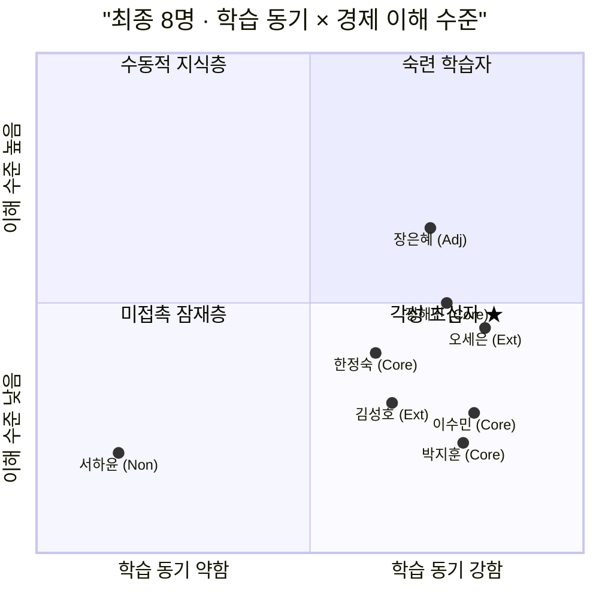
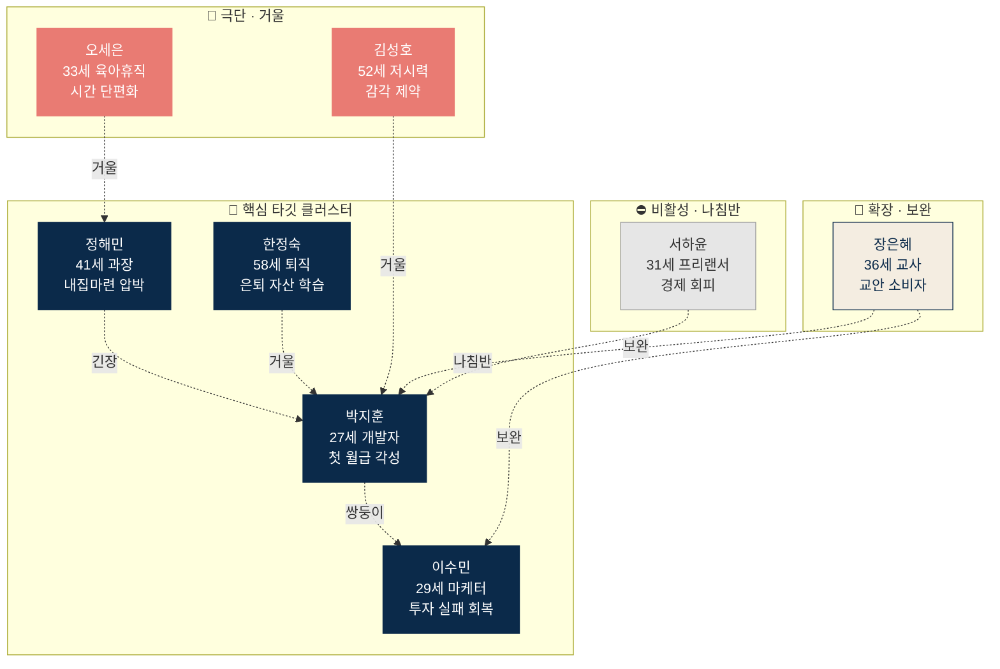
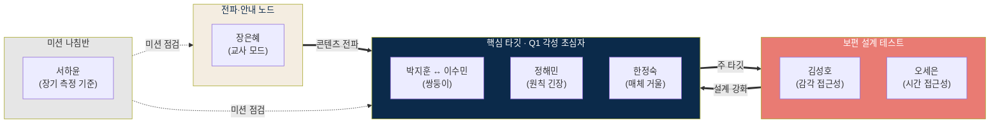
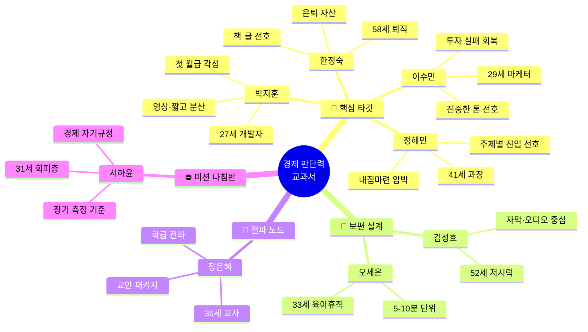

# Persona Spectrum Map — 최종 페르소나 관계 구조화

**작성일**: 2026. 04. 24.
**선행 문서**: 『페르소나 스펙트럼 14인』, 『페르소나 검증 리포트』
**선별 기준**: 4개 평가 기준(현실성·차별성·통찰성·전략성) 평균 **4.0 이상**만 유지
**결과**: 14명 → **8명**으로 압축

---

## 0. 선별 결과

### 유지된 8명 (평균 4.0 이상)

| # | 페르소나 | 유형 | 평균 | 핵심 역할 |
|---|---|---|---|---|
| 1 | Core 2 이수민 | 핵심 | 5.00 | 포지션 정당화 |
| 2 | Adj 1 장은혜 | 확장 | 5.00 | 교사 모드 정당화 |
| 3 | Core 1 박지훈 | 핵심 | 4.75 | Q1-A 주 타깃 대표 |
| 4 | Ext 1 김성호 | 극단 | 4.75 | 접근성 설계 기준 |
| 5 | Core 4 한정숙 | 핵심 | 4.50 | 매체 선택권 검증 |
| 6 | Ext 2 오세은 | 극단 | 4.25 | 시간 단편화 설계 |
| 7 | Non 2 서하윤 | 비활성 | 4.25 | 미션 나침반 |
| 8 | Core 3 정해민 | 핵심 | 4.00 | 원칙 5 긴장 시험대 |

### 제거된 6명 (평균 4.0 미만)

- Core 5 윤가을 (3.50) — 실재성·긴급성 약함
- Adj 2 최민재 (3.50) — Non-Goal 경계 근접
- Adj 3 권도영 (3.00) — 규모 작고 목적 어긋남
- Ext 3 배준혁 (3.00) — 극단성 약함, 원칙 1 긴장
- Non 1 강민철 (3.25) — MVP 기여 없음
- Non 3 조기태 (2.75) — 실재성·전략성 모두 낮음

---

## 1. 최종 8명의 분포 — 사분면 재배치

최종 8명 중 **6명이 Q1(각성 초심자) 사분면**에 집중되어 있습니다. 이 집중은 본 프로젝트의 자원 배분 1순위가 Q1이라는 전략적 결정과 정합적입니다.

---

## 2. 페르소나 간 관계 구조

8명의 페르소나는 독립적 개체가 아니라 서로 관계를 맺고 있습니다. 관계 유형은 다섯 가지로 분류됩니다.

### 2.1 관계 유형 정의

| 관계 유형 | 정의 | 설계 함의 |
|---|---|---|
| **쌍둥이 (Twin)** | 같은 세그먼트의 다른 얼굴. 유사한 Pain을 공유하되 트리거가 다름. | 핵심 타깃의 입체성 확보 |
| **거울 (Mirror)** | 서로 반대 방향의 제약. 한쪽을 풀면 다른 쪽도 풀림. | 보편 설계의 테스트 케이스 |
| **보완 (Complement)** | 서로 다른 역할이 같은 콘텐츠를 이용함. 학습자 ↔ 안내자. | 매체 통합·교사 모드 정당화 |
| **긴장 (Tension)** | 본 프로젝트 원칙과 구조적 충돌. 수용 범위 결정 필요. | 정책 의사결정 시험대 |
| **나침반 (Compass)** | 직접 타깃 아니나 미션 정합성 측정 기준. | 장기 방향 점검 |

### 2.2 8명의 관계망

---

## 3. 페르소나 간 개별 관계 해설

### 3.1 쌍둥이 — 박지훈 ↔ 이수민

**공통**: 둘 다 Q1-A. 20대 후반·디지털 네이티브·체계적 학습 결심 상태.
**차이**: 박지훈은 『아직 실패 전』의 조급함, 이수민은 『실패 후』의 회복 동기.

이 쌍은 Q1-A가 단일 얼굴이 아님을 드러냅니다. 동일한 세그먼트에 속하되 트리거가 다르면 기대 톤·콘텐츠 수용도가 달라집니다. **박지훈은 '시작의 용기'를 필요로 하고, 이수민은 '진중한 회복'을 필요로 합니다.**

설계 함의: 콘텐츠 톤이 어느 한쪽에 치우치면 다른 쪽을 잃습니다. 후킹은 이수민을 떠나게 하고, 지나친 진중함은 박지훈에게 벽이 됩니다. **두 사람 모두를 불편하게 하지 않는 톤**이 본 프로젝트의 브랜드 자산입니다.

### 3.2 거울 — 박지훈 ↔ 한정숙

**공통**: 둘 다 Q1 각성 초심자. 체계적 학습을 원함.
**대립**: 매체 선호·속도·학습 시간 모두 반대 방향.

| 축 | 박지훈 | 한정숙 |
|---|---|---|
| 매체 | 영상 중심, 1.5배속 | 글·책 중심, 천천히 |
| 시간 | 짧고 분산 | 길고 여유 |
| UI | 직관적, 빠른 진입 | 친절한 안내, 큰 글씨 |

이 거울 관계가 드러내는 것은 『같은 콘텐츠를 여러 형태로 제공한다』는 본 프로젝트의 원칙 4(세 매체는 하나의 유기체)의 존재 이유입니다. **한 매체만으로는 두 사람을 동시에 잡을 수 없습니다.**

### 3.3 거울 — 박지훈·정해민 ↔ 극단 2인(김성호·오세은)

김성호의 감각 제약과 오세은의 시간 제약은 극단적이지만, 이 제약들을 해결한 설계는 박지훈·정해민에게도 이익이 됩니다.

- **김성호의 자막·오디오 중심 UI** → 박지훈이 출근길 지하철에서도 소리 없이 볼 수 있음.
- **오세은의 재생 위치 저장·5분 단위 완결** → 정해민이 주말 쪼개기 학습에서도 끊김 없음.

이것이 **접근성이 보편 설계로 이어지는 메커니즘**입니다. 극단 페르소나를 만족시키면 핵심 페르소나도 자동으로 만족합니다.

### 3.4 보완 — 장은혜 ↔ Q1 핵심 4인

장은혜는 학습자가 아니라 **교안 소비자**입니다. 그녀가 수업에 사용하는 순간, 교실의 학생들이 박지훈·이수민의 **다음 세대 버전**이 됩니다. 즉 Adj 1이 교안을 잘 쓰면 Q1-A의 공급이 장기적으로 확대됩니다.

이 보완 관계가 **교사 모드 동시 런칭 결정의 페르소나 수준 증거**입니다. 학습자 모드만 만들면 이 관계가 끊어지고, 장기 확장이 닫힙니다.

### 3.5 긴장 — 정해민 ↔ 원칙 5

정해민은 『주제별 진입』(부동산·금리·세금부터 먼저)을 원합니다. 이는 원칙 5(1편=1교안=1장, 부분 공개 금지)와 부딪힙니다.

이 긴장 자체가 설계의 시험대입니다. **정해민을 수용하려면 원칙 5를 유연화해야 하고, 원칙 5를 지키려면 정해민의 일부를 잃습니다.** 이 결정은 기획서 수준의 의사결정이며, 현재는 Stage 1 파일럿에서 실측으로 판단하는 쪽이 보류된 상태.

### 3.6 나침반 — 서하윤 ↔ 전체

서하윤은 단기 타깃이 아닙니다. 그러나 **본 프로젝트가 미션에서 벗어나고 있는지를 측정하는 기준**으로 기능합니다. 서하윤이 도달 불가능한 상태에 영구히 머문다면, 『기회 격차를 줄인다』는 미션이 작동하지 않고 있다는 신호입니다.

이 나침반 관계는 정량 측정이 어렵지만, **6개월·12개월 주기의 북극성 문서 재검토 시점에 『서하윤 같은 사람이 접근 가능해졌는가』를 질문 항목으로 고정**하는 식으로 운영할 수 있습니다.

---

## 4. 페르소나 클러스터 관점

8명의 페르소나는 네 개의 기능적 클러스터로 묶입니다.

### 클러스터 설명

**핵심 타깃 클러스터 (4명)**
Q1 각성 초심자의 네 얼굴. 이들을 직접 만족시키는 것이 Stage 1 파일럿의 목적. 이 클러스터 내부에도 쌍둥이(박지훈-이수민), 거울(박지훈-한정숙), 긴장(정해민-원칙 5)의 관계가 존재.

**보편 설계 테스트 클러스터 (2명)**
극단 사용자 2명은 직접 타깃이 아니지만, **설계의 품질 게이트 역할**. 이 클러스터가 막힌다면 핵심 타깃에도 잠재적 장벽이 존재한다는 뜻. Stage 0 설계 단계의 필수 검증 대상.

**전파·안내 노드 (1명)**
장은혜는 콘텐츠를 소비하는 동시에 확산시키는 유일한 페르소나. 핵심 타깃으로의 유입 경로이자, 본 프로젝트의 장기 지속가능성의 축.

**미션 나침반 (1명)**
서하윤은 측정 기준. 직접 자원을 투입하지 않지만, 프로젝트의 방향이 미션에서 벗어나는지 확인하는 장치.

---

## 5. Persona Spectrum Map · 통합

---

## 6. 설계 우선순위 — 관계 구조에서 도출

### 6.1 MVP 설계 시 우선적으로 만족시켜야 할 페르소나 (4명)

**박지훈·이수민 + 김성호·오세은**

이 4명을 동시에 만족시키면 나머지 4명도 대부분 자동 만족됩니다. 이유는 관계 구조에 있습니다.

- 박지훈·이수민을 만족시키면 Q1-A 전반이 커버됨.
- 김성호를 만족시키는 UI는 한정숙에게도 이롭고, 정해민의 주말 사용성도 개선.
- 오세은의 짧은 세션 설계는 정해민(주말 쪼개기)과 박지훈(지하철 30분)에게도 적용.

### 6.2 정책 결정이 필요한 페르소나 (1명)

**정해민** — 원칙 5 수용 범위. Stage 1 이전 또는 파일럿 중 결정 필요.

### 6.3 콘텐츠 확산 전략의 핵심 (1명)

**장은혜** — 교사 모드가 실제 작동하면 유입·확산이 자연 발생. 기획서의 교사 모드 설계가 이 페르소나에 정합하는지 별도 점검 필요.

### 6.4 장기 모니터링 대상 (1명)

**서하윤** — 6개월·12개월 재검토 시 질문 항목 고정.

---

## 7. 관계 구조에서 확인된 세 가지 전략 메시지

### 7.1 "대부분의 설계 결정은 4명으로 족하다"

최종 8명이지만, MVP 설계의 거의 모든 판단은 박지훈·이수민·김성호·오세은 4명에 집중하면 해결됩니다. 이 4명이 설계 검증의 **핵심 패널**이 됩니다. 나머지 4명은 **경계 확인용**.

### 7.2 "쌍둥이·거울·보완이 원칙 4의 증거"

세 매체(유튜브·SaaS·책)가 하나의 유기체라는 원칙 4는 추상적 선언이 아닙니다. 박지훈(영상) ↔ 한정숙(책)의 거울, 박지훈·이수민(학습자) ↔ 장은혜(교안 소비자)의 보완은 **이 원칙이 없으면 페르소나 8명 중 절반이 누락된다는 증명**입니다.

### 7.3 "긴장과 나침반은 제거 대상이 아니라 조정 대상"

정해민(긴장)과 서하윤(나침반)은 MVP 설계에서 당장 답을 주지 않지만, **프로젝트가 길을 잃지 않게 하는 두 축**입니다. 정해민은 내부 원칙의 경계를, 서하윤은 외부 미션의 방향을 점검합니다. 둘 다 제거하면 Stage 2·3에서 방향 상실이 발생할 수 있습니다.

---

## 부록. 페르소나 관계 요약표

| 페르소나 | 주 관계 | 대상 | 관계의 의미 |
|---|---|---|---|
| 박지훈 | 쌍둥이 | 이수민 | Q1-A 트리거의 두 얼굴 |
| 박지훈 | 거울 | 한정숙 | 매체·속도의 반대 극 |
| 박지훈 | 거울 | 김성호 | 감각 접근성 공유 |
| 이수민 | 쌍둥이 | 박지훈 | 실패 후/전 대비 |
| 이수민 | 보완 | 장은혜 | 학습자/안내자 |
| 정해민 | 긴장 | 원칙 5 | 주제별 진입 수용 범위 |
| 정해민 | 거울 | 오세은 | 시간 쪼개기 공유 |
| 한정숙 | 거울 | 박지훈 | 책 ↔ 영상 매체 대비 |
| 장은혜 | 보완 | Q1 핵심 4인 | 콘텐츠 전파 노드 |
| 김성호 | 거울 | 박지훈 | 감각 제약 → 보편 설계 |
| 오세은 | 거울 | 정해민 | 시간 제약 → 보편 설계 |
| 서하윤 | 나침반 | 전체 | 미션 정합성 측정 |

---

## 부록. 이 맵의 한계

1. **관계는 설계 가설**이며 Stage 1 실측으로 검증 필요. 예컨대 박지훈-이수민의 쌍둥이 관계가 실제 사용자 행동에서 얼마나 유사한지는 측정되지 않음.
2. **8명은 여전히 합성 프로필**. 실 사용자 인터뷰로 교체되어야 하며, 관계 구조도 그에 따라 재배치될 수 있음.
3. **관계 유형 분류**(쌍둥이·거울·보완·긴장·나침반)는 본 분석의 해석 장치이며, 업계 표준이 아님. 다른 분류 체계가 더 유용할 수도 있음.
4. **시각화 제약**: Mermaid 기반 다이어그램은 본문 중 8명 관계를 모두 한 장에 담기 어려움. 상세 분석은 텍스트에 의존.
