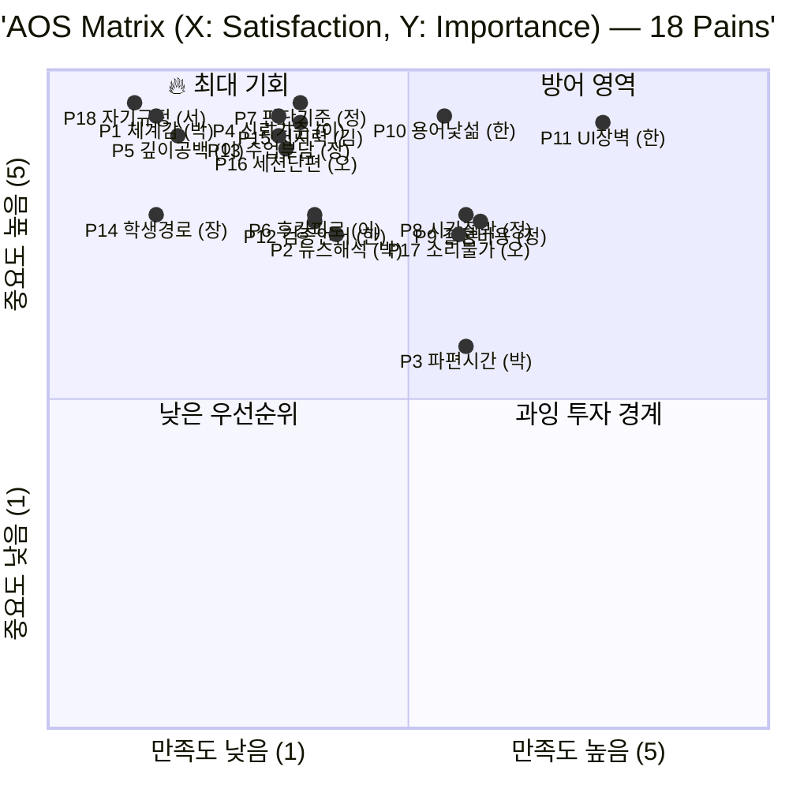

# AOS (Adjusted Opportunity Score) 분석 — 유효 페르소나 8인

**대상 사업**: 경제 판단력 교과서 프로젝트
**분석일**: 2026. 04. 24.
**분석 대상**: 『페르소나 검증 리포트』에서 평균 4.0 이상으로 선별된 유효 페르소나 8인
**선행 문서**: 『Persona Spectrum Map』, 『페르소나 검증 리포트』, 『CJM 핵심 4인』

---

## 0. 분석 프레임 요약

### AOS 정의

AOS(Adjusted Opportunity Score)는 Anthony Ulwick의 ODI(Outcome-Driven Innovation)에서 파생된 기회 평가 지표입니다. 본 분석에서 사용하는 수식:

```
AOS = Importance × (1 − Satisfaction / 5)
```

- **Importance (1~5)**: 해당 Pain이 사용자의 목표 달성에 얼마나 중요한가
- **Satisfaction (1~5)**: 현재 사용 중인 대체 솔루션이 그 Pain을 얼마나 해결하고 있는가
- **AOS 값 범위**: 0 ~ 5. 값이 클수록 『중요하나 충족되지 못한 기회』가 큼

### 해석 가이드

| AOS 값 | 해석 |
|---|---|
| 4.0 이상 | 🔥 **최우선 기회** — 중요도 매우 높고 해결 수준 낮음 |
| 3.0 ~ 3.9 | ⭐ **중요 기회** — 차순위 집중 영역 |
| 2.0 ~ 2.9 | 💡 **선택적 기회** — 리소스 여유 시 검토 |
| 1.0 ~ 1.9 | ⚪ **낮은 우선순위** |
| 1.0 미만 | ❄️ **기회 없음** |

### 분석 대상 8인 구성

| # | 페르소나 | 유형 | 평균 점수 |
|---|---|---|---|
| 1 | 박지훈 (27, 개발자) | 핵심 Q1-A | 4.75 |
| 2 | 이수민 (29, 마케터) | 핵심 Q1-A | 5.00 |
| 3 | 정해민 (41, 과장) | 핵심 Q1-B | 4.00 |
| 4 | 한정숙 (58, 퇴직) | 핵심 Q1-C | 4.50 |
| 5 | 장은혜 (36, 교사) | 확장 | 5.00 |
| 6 | 김성호 (52, 저시력) | 극단 | 4.75 |
| 7 | 오세은 (33, 육아휴직) | 극단 | 4.25 |
| 8 | 서하윤 (31, 회피층) | 비활성 | 4.25 |

> **8인 포함의 의미**: 학습자 4인뿐 아니라 안내자(장은혜)·접근성 제약자(김성호·오세은)·미진입자(서하윤)의 Pain도 AOS에 포함됩니다. 각 그룹의 Pain은 여정 구조가 달라도 본 프로젝트가 대응해야 할 시장 수요라는 점에서 병렬 비교가 유효합니다.

---

# ① Pain 리스트 정리

각 페르소나의 주요 Pain과 대응 Goal을 정리합니다. 페르소나당 2~3개씩, 총 18개 Pain을 도출했습니다.

## 1.1 Pain List

### 핵심 (Core) — 12 Pains

| ID | 페르소나 | Pain (불편·고통) | Goal (진보 욕구) |
|---|---|---|---|
| **P1** | 박지훈 | AI·유튜브로 파편 답은 받지만 『배우고 있다』는 감각이 없다 | 체계적으로 쌓이는 학습 여정을 느끼고 싶다 |
| **P2** | 박지훈 | 뉴스를 봐도 해석이 안 되고, 월급 관리조차 블랙박스 | 뉴스·실생활 경제 판단에 자신감을 얻고 싶다 |
| **P3** | 박지훈 | 지하철 30분, 출퇴근 환경의 파편화된 학습 시간 | 짧은 세션이 누적되는 구조를 갖고 싶다 |
| **P4** | 이수민 | 투자 실패 후 신뢰 기준 부재. 어디서부터 시작해야 할지 모름 | 과장 없는 진중한 톤의 학습 경로를 찾고 싶다 |
| **P5** | 이수민 | 경제학 책 50페이지에서 반복 이탈 — 깊이와 접근성의 공백 | 깊이 있되 혼자 완주 가능한 텍스트 경로 |
| **P6** | 이수민 | 후킹·과장 콘텐츠에 대한 강한 거부감과 피로 | 신뢰할 수 있는 제작자의 일관된 톤 |
| **P7** | 정해민 | 부동산·금리 정보의 상충. 판단 기준 부재 | 내 의사결정에 적용 가능한 판단 근거 |
| **P8** | 정해민 | 시간 절박 — 주말 1~2시간이 유일한 학습창 | 필요 주제로 빠르게 진입하는 경로 |
| **P9** | 정해민 | 잘못된 결정의 비용이 큼 — 가족 자산 규모의 책임 | 전문가에 휘둘리지 않고 직접 판단 |
| **P10** | 한정숙 | 퇴직금·연금·상속 용어 자체가 낯섦 | 기본 용어와 구조를 천천히 이해 |
| **P11** | 한정숙 | 영상 속도 부담, 디지털 UI 진입 자체가 장벽 | 글·책·큰 글씨 등 매체 선택권 |
| **P12** | 한정숙 | 전문가·금융기관에 휘둘리지 않을 최소 언어 필요 | 직접 질문·검증 가능한 수준 도달 |

### 확장 (Adjacent) — 2 Pains

| ID | 페르소나 | Pain | Goal |
|---|---|---|---|
| **P13** | 장은혜 | 영상·교안·OX·판서 자료를 각기 다른 곳에서 모아 조립해야 함. 수업 한 차시 준비에 2시간 이상 | 수업에 바로 쓸 수 있는 단일 패키지 |
| **P14** | 장은혜 | 교사 개인 역량에 따라 경제 수업 품질이 크게 달라지는 구조 | 학생이 교실 밖에서도 스스로 탐색 가능한 경로 제공 |

### 극단 (Extreme) — 3 Pains

| ID | 페르소나 | Pain | Goal |
|---|---|---|---|
| **P15** | 김성호 | 대부분 경제 영상의 자막·UI가 저시력에 부적합. 『경제 교육은 눈 좋은 사람 전용』이라는 소외감 | 오디오·큰 글씨·자막 조절로 학습 완결 |
| **P16** | 오세은 | 5~10분 단위로 끊기는 환경. 긴 영상은 시작조차 어려움 | 재개 가능한 짧은 세션으로 누적 학습 |
| **P17** | 오세은 | 소리 내기 어려운 환경 (수유 중·야간). 오디오 의존 불가 | 소리 없이도 핵심이 전달되는 자막·텍스트 |

### 비활성 (Non-user) — 1 Pain

| ID | 페르소나 | Pain | Goal |
|---|---|---|---|
| **P18** | 서하윤 | 『경제는 나와 안 맞다』는 자기규정. 예기 불안으로 진입 자체 거부 | 자기규정을 깰 수 있는 접촉점·진입 장벽 재설계 |

---

# ② Importance 평가

## 2.1 평가 척도

| 점수 | 의미 |
|---|---|
| 5 | 이 Pain 없이는 목표 달성 불가능 |
| 4 | 목표 달성에 결정적 영향 |
| 3 | 목표 달성에 의미 있는 영향 |
| 2 | 부수적 영향 |
| 1 | 미미한 영향 |

## 2.2 Importance Table

| ID | Pain 요약 | 페르소나 | Importance | 근거 |
|---|---|---|---|---|
| **P1** | 체계감 부재 | 박지훈 | **5** | 본 프로젝트 미션의 핵심 동기 |
| **P2** | 뉴스 해석 불능 | 박지훈 | **4** | 실생활 활용 핵심이나 P1 해결 시 간접 해결 |
| **P3** | 파편화된 학습 시간 | 박지훈 | **3** | 중요하나 필수 조건은 아님 |
| **P4** | 신뢰 기준 부재 | 이수민 | **5** | 투자 실패 경험자 재진입 전제 |
| **P5** | 깊이·접근성 공백 | 이수민 | **5** | 학습 지속성의 핵심. 반복 이탈 원인 |
| **P6** | 후킹 피로 | 이수민 | **4** | 지속 이탈 방지 요인. P4에 연동 |
| **P7** | 판단 기준 부재 | 정해민 | **5** | 의사결정 자체의 본질 |
| **P8** | 시간 절박 | 정해민 | **4** | 실현 가능성 좌우 |
| **P9** | 결정 비용 부담 | 정해민 | **4** | 동기의 근원. 학습 기능은 아님 |
| **P10** | 용어·구조 낯섦 | 한정숙 | **5** | 진입 자체의 전제 |
| **P11** | 매체·UI 장벽 | 한정숙 | **5** | 이 장벽 못 넘으면 학습 시작 불가 |
| **P12** | 검증 언어 필요 | 한정숙 | **4** | 최종 목표. P10·P11 선행 필요 |
| **P13** | 수업 준비 부담 | 장은혜 | **5** | 교사 모드 존재 이유의 근원 |
| **P14** | 학생 자기학습 경로 부재 | 장은혜 | **4** | 교사의 간접 Goal. P13 해결 후 확장 |
| **P15** | 저시력 접근성 | 김성호 | **5** | 학습 기회 자체의 전제 |
| **P16** | 세션 단편화 | 오세은 | **5** | 학습 가능 여부 자체 결정 |
| **P17** | 소리 의존 불가 | 오세은 | **4** | P16에 종속적이나 독립적 제약 |
| **P18** | 자기규정 거부 | 서하윤 | **5** | 학습 진입 자체의 전제. 미션 관점 최상위 |

## 2.3 그룹별 평균 Importance

| 그룹 | 평균 Importance |
|---|---|
| 핵심 (Core) — 12 Pains | 4.50 |
| 확장 (Adjacent) — 2 Pains | 4.50 |
| 극단 (Extreme) — 3 Pains | 4.67 |
| 비활성 (Non-user) — 1 Pain | 5.00 |

---

# ③ Satisfaction 평가

## 3.1 평가 척도

| 점수 | 의미 |
|---|---|
| 5 | 대체 솔루션이 Pain을 거의 완벽히 해결 |
| 4 | 상당 부분 해결, 보완 여지 |
| 3 | 부분적 해결, 명확한 한계 |
| 2 | 미미한 해결, 대부분 남아있음 |
| 1 | 거의 해결 못함 |

## 3.2 Satisfaction Table

| ID | Pain 요약 | 주요 대체 솔루션 | Satisfaction | 근거 |
|---|---|---|---|---|
| **P1** | 체계감 부재 | AI·유튜브·책 파편 | **1** | 구조적 공백 |
| **P2** | 뉴스 해석 불능 | AI·뉴스 앱·해설 유튜브 | **2** | 일관된 해석 기준 학습 어려움 |
| **P3** | 파편화 시간 | 숏폼·팟캐스트 | **3** | 길이 맞지만 체계·누적 없음 |
| **P4** | 신뢰 기준 부재 | 경제학 입문서·제작자 구독 | **2** | 무엇이 『제대로』인지 판단 부재 |
| **P5** | 깊이·접근성 공백 | 경제학원론·유튜브·유료 강의 | **1** | 중간이 없음 |
| **P6** | 후킹 피로 | 구독 제한·광고 차단 | **2** | 발견 경로 대부분이 후킹형 |
| **P7** | 판단 기준 부재 | 부동산 유튜버·은행 상담·지인 | **2** | 상충 정보로 기준 형성 어려움 |
| **P8** | 시간 절박 | 요약·카드뉴스 | **3** | 시간 완화되나 깊이 부족 |
| **P9** | 결정 비용 부담 | 전문가 상담 | **3** | 상담 가능하나 본인 판단력 축적 안됨 |
| **P10** | 용어·구조 낯섦 | 종이책·도서관 강좌·PB | **3** | 오프라인 일부 해결. 시간·접근 제약 |
| **P11** | 매체·UI 장벽 | 종이책·신문·TV | **4** | 전통 매체는 잘 맞음. 최신성·상호작용 부족 |
| **P12** | 검증 언어 필요 | 지인·PB 상담 | **2** | 언어 축적 안되고 의존 지속 |
| **P13** | 수업 준비 부담 | EBS·교육청 자료·인디스쿨·유튜브 조립 | **2** | 패키지 단일화가 거의 불가 |
| **P14** | 학생 자기학습 경로 부재 | 교과서 링크·QR 자작 | **1** | 영상+교안 정렬된 무료 경로 없음 |
| **P15** | 저시력 접근성 | 팟캐스트·오디오북·일반 보조 앱 | **2** | 경제 특화 오디오는 매우 부족 |
| **P16** | 세션 단편화 | 숏폼·카드뉴스·인스타 | **2** | 짧지만 체계 누적 없음 |
| **P17** | 소리 의존 불가 | 자막 기본 지원 앱 | **3** | 대부분 자막은 있지만 핵심만 전달되는 설계 드묾 |
| **P18** | 자기규정 거부 | — (자발 대체재 거의 없음) | **1** | 진입 자체 거부. 대체 솔루션 거의 없음 |

## 3.3 그룹별 평균 Satisfaction

| 그룹 | 평균 Satisfaction | 해석 |
|---|---|---|
| 핵심 | 2.33 | 낮음 — 기회 영역 큼 |
| 확장 | 1.50 | **매우 낮음** — 즉시 기회 |
| 극단 | 2.33 | 중간. 보편 설계로 접근 |
| 비활성 | 1.00 | **최하** — 단 도달 자체가 과제 |

---

# ④ AOS 계산

## 4.1 AOS Table (내림차순)

| 순위 | ID | Pain 요약 | 페르소나 | Imp | Sat | **AOS** | 해석 |
|---|---|---|---|---|---|---|---|
| 🥇 1 | **P14** | 학생 자기학습 경로 부재 | 장은혜 | 5 | 1 | **4.00** | 🔥 최우선 |
| 🥇 1 | **P18** | 자기규정 거부 | 서하윤 | 5 | 1 | **4.00** | 🔥 최우선 |
| 🥇 1 | **P1** | 체계감 부재 | 박지훈 | 5 | 1 | **4.00** | 🔥 최우선 |
| 🥇 1 | **P5** | 깊이·접근성 공백 | 이수민 | 5 | 1 | **4.00** | 🔥 최우선 |
| 5 | **P13** | 수업 준비 부담 | 장은혜 | 5 | 2 | **3.00** | ⭐ 중요 |
| 5 | **P4** | 신뢰 기준 부재 | 이수민 | 5 | 2 | **3.00** | ⭐ 중요 |
| 5 | **P7** | 판단 기준 부재 | 정해민 | 5 | 2 | **3.00** | ⭐ 중요 |
| 5 | **P15** | 저시력 접근성 | 김성호 | 5 | 2 | **3.00** | ⭐ 중요 |
| 5 | **P16** | 세션 단편화 | 오세은 | 5 | 2 | **3.00** | ⭐ 중요 |
| 10 | **P6** | 후킹 피로 | 이수민 | 4 | 2 | **2.40** | 💡 선택적 |
| 10 | **P2** | 뉴스 해석 불능 | 박지훈 | 4 | 2 | **2.40** | 💡 선택적 |
| 10 | **P12** | 검증 언어 필요 | 한정숙 | 4 | 2 | **2.40** | 💡 선택적 |
| 13 | **P10** | 용어·구조 낯섦 | 한정숙 | 5 | 3 | **2.00** | 💡 선택적 |
| 14 | **P17** | 소리 의존 불가 | 오세은 | 4 | 3 | **1.60** | ⚪ 낮음 |
| 14 | **P9** | 결정 비용 부담 | 정해민 | 4 | 3 | **1.60** | ⚪ 낮음 |
| 14 | **P8** | 시간 절박 | 정해민 | 4 | 3 | **1.60** | ⚪ 낮음 |
| 17 | **P3** | 파편화 시간 | 박지훈 | 3 | 3 | **1.20** | ⚪ 낮음 |
| 18 | **P11** | 매체·UI 장벽 | 한정숙 | 5 | 4 | **1.00** | ⚪ 낮음 |

## 4.2 페르소나별 평균 AOS

| 페르소나 | 유형 | 평균 AOS | 순위 |
|---|---|---|---|
| 서하윤 | 비활성 | **4.00** | 🥇 1위 |
| 장은혜 | 확장 | **3.50** | 🥈 2위 |
| 이수민 | 핵심 | **3.13** | 🥉 3위 |
| 김성호 | 극단 | **3.00** | 4위 |
| 박지훈 | 핵심 | **2.53** | 5위 |
| 오세은 | 극단 | **2.30** | 6위 |
| 정해민 | 핵심 | **2.07** | 7위 |
| 한정숙 | 핵심 | **1.80** | 8위 |

---

# ⑤ (Adjusted) Opportunity Score Matrix

## 5.1 기회 매트릭스 시각화

X축(Satisfaction) × Y축(Importance) 평면에 18개 Pain을 배치합니다. 좌표 값은 5점 척도를 0~1 범위로 정규화.



## 5.2 사분면별 해석

### 🔥 Q2 · 최대 기회 (중요 ↑ + 만족 ↓) — 12개

이 사분면이 본 프로젝트의 핵심 공략 영역입니다.

**AOS 4.00 (최우선) · 4개**

| ID | Pain | 페르소나 | AOS |
|---|---|---|---|
| P1 | 체계감 부재 | 박지훈 | 4.00 |
| P5 | 깊이·접근성 공백 | 이수민 | 4.00 |
| P14 | 학생 자기학습 경로 부재 | 장은혜 | 4.00 |
| P18 | 자기규정 거부 | 서하윤 | 4.00 |

**AOS 3.00 (중요) · 5개**

| ID | Pain | 페르소나 | AOS |
|---|---|---|---|
| P4 | 신뢰 기준 부재 | 이수민 | 3.00 |
| P7 | 판단 기준 부재 | 정해민 | 3.00 |
| P13 | 수업 준비 부담 | 장은혜 | 3.00 |
| P15 | 저시력 접근성 | 김성호 | 3.00 |
| P16 | 세션 단편화 | 오세은 | 3.00 |

**AOS 2.40 (선택적) · 3개**

| ID | Pain | 페르소나 | AOS |
|---|---|---|---|
| P6 | 후킹 피로 | 이수민 | 2.40 |
| P2 | 뉴스 해석 불능 | 박지훈 | 2.40 |
| P12 | 검증 언어 필요 | 한정숙 | 2.40 |

### 💡 Q4 · 과잉 투자 경계 (중요 ↑ + 만족 중간~↑) — 5개

이미 대체 솔루션이 부분 작동. 한계 효용 낮음.

| ID | Pain | 페르소나 | AOS |
|---|---|---|---|
| P10 | 용어·구조 낯섦 | 한정숙 | 2.00 |
| P17 | 소리 의존 불가 | 오세은 | 1.60 |
| P9 | 결정 비용 부담 | 정해민 | 1.60 |
| P8 | 시간 절박 | 정해민 | 1.60 |
| P11 | 매체·UI 장벽 | 한정숙 | 1.00 |

### ⚪ Q3 · 낮은 우선순위 — 1개

| ID | Pain | 페르소나 | AOS |
|---|---|---|---|
| P3 | 파편화 시간 | 박지훈 | 1.20 |

### 방어 영역 · Q1 — 0개

해당 항목 없음.

## 5.3 AOS 4.00 4개 Pain 심층

### 🥇 P1 · 체계감 부재 (박지훈) — AOS 4.00

**구조**: 중요도 최상 × 만족도 최하. AI·유튜브·책 조합으로 구조적 해결 불가.
**본 프로젝트 대응**: 원칙 5(1편=1교안=1장), 진주 스탬프 맵, 105편 완결 구조.
**기회의 크기**: Q1-A 전체가 공유하는 Pain. Strict SAM의 가장 넓은 불만족 지점.

### 🥇 P5 · 깊이·접근성 공백 (이수민) — AOS 4.00

**구조**: 경제학원론은 너무 무겁고 유튜브는 너무 얕음. **시장의 물리적 공백**.
**본 프로젝트 대응**: 원칙 1(이해가 먼저), 영상·글·책 3매체 동시 제공.
**기회의 크기**: 입문~중급 학습자 전반의 공통 공백. 5 Forces의 『구조적 공백』이 압축됨.

### 🥇 P14 · 학생 자기학습 경로 부재 (장은혜) — AOS 4.00

**구조**: 교사가 학생에게 주려고 해도 『영상+교안이 정렬된 무료 경로』가 시장에 거의 없음.
**본 프로젝트 대응**: 교사 모드 동시 런칭, QR 코드 교안 1페이지 명기, 레슨 ID 체계.
**기회의 크기**: 교사 TAM 약 20만 명. 교사 모드의 존재 이유가 이 Pain에 집약됨.

### 🥇 P18 · 자기규정 거부 (서하윤) — AOS 4.00

**구조**: 『경제는 나와 안 맞다』의 자기규정. 대체 솔루션이 거의 없음(만족도 1).
**본 프로젝트 대응**: **단기 타깃은 아님**. 미션 본질의 장기 타깃.
**기회의 크기**: Q4 미접촉 잠재층 + Broad SAM 바깥 잠재층. 수백만 명 규모이지만 도달 자체가 과제.

> **주의**: P18의 AOS 4.00은 **『중요하고 아무도 풀고 있지 않다』는 의미**이지 『지금 풀 수 있다』는 뜻이 아님. 단기 MVP 투입 대상이 아니라 **장기 미션의 나침반**으로만 활용.

---

# 6. 종합 해석 — 이 분석에서 읽을 것

## 6.1 AOS 상위 4개의 구조적 의미

| 페르소나 | AOS 4.00 Pain | 유형 | 시간 창 |
|---|---|---|---|
| 박지훈 | P1 체계감 | 핵심 | 단기 (Stage 1) |
| 이수민 | P5 깊이 공백 | 핵심 | 단기 (Stage 1) |
| 장은혜 | P14 학생 경로 | 확장 | 중기 (Stage 1~2) |
| 서하윤 | P18 자기규정 | 비활성 | **장기 (Stage 3 이후)** |

네 Pain 모두 AOS 4.00으로 동률이지만 **시간 창이 다릅니다**. P1·P5는 Stage 1 파일럿에서 직접 대응, P14는 교사 모드 동시 런칭으로 커버, P18은 미션 나침반으로만 운영.

**AOS 수치만 보고 우선순위를 결정하면 안 됩니다** — 시간 창과 본 프로젝트의 도달 가능성을 함께 봐야 합니다.

## 6.2 페르소나별 AOS 해석의 반전

**서하윤(AOS 4.00)이 페르소나 검증에서는 4.25로 5위였지만 AOS에서는 1위**. 반대로 **한정숙(AOS 1.80)은 검증 리포트에서 4위였지만 AOS에서는 8위**. 이 차이의 의미:

- 서하윤의 Pain은 아무도 안 풀고 있음 → AOS 극대
- 한정숙의 Pain은 종이책·신문·PB가 부분 해결 중 → Satisfaction 상대적 높음 → AOS 낮음

→ **AOS는 시장의 기회 크기를 보여주지만 페르소나의 설계 가치를 반영하지 못함**. 한정숙은 AOS는 낮지만 『보편 설계의 기준』으로서 여전히 핵심.

## 6.3 MVP 집중 영역 — AOS 3.0 이상 9개 Pain

현실적으로 Stage 1~2에서 대응 가능한 Pain 묶음:

| 페르소나 | 대응 Pain | AOS |
|---|---|---|
| 박지훈 | P1 | 4.00 |
| 이수민 | P5, P4 | 4.00 / 3.00 |
| 정해민 | P7 | 3.00 |
| 장은혜 | P14, P13 | 4.00 / 3.00 |
| 김성호 | P15 | 3.00 |
| 오세은 | P16 | 3.00 |

**P18(서하윤)은 MVP 범위에서 제외**. 장기 모니터링만.

## 6.4 원칙의 정당성을 AOS가 수치로 증명

| 기획서 원칙 | 직접 대응 Pain | AOS |
|---|---|---|
| 원칙 1 이해가 먼저 | P5 깊이·P7 판단 | 4.00, 3.00 |
| 원칙 3 속도보다 신뢰 | P4 신뢰·P6 후킹 | 3.00, 2.40 |
| 원칙 4 3매체 유기체 | P1 체계·P15 접근성 | 4.00, 3.00 |
| 원칙 5 1편=1교안=1장 | P1 체계·P14 학생경로 | 4.00, 4.00 |

**기존 원칙이 감정적 선언이 아니라 AOS 상위 Pain 대응이었음을 수치가 증명**. 특히 원칙 5가 P1·P14 양쪽(AOS 4.00)에 동시 대응한다는 사실이 교사 모드 동시 런칭 결정의 정량 근거가 됩니다.

---

# 7. 전략적 함의

## 7.1 Stage 1 파일럿의 성공 기준 재정의

AOS 4.00 × 4개 Pain 중 **최소 3개에서 체감 변화 응답률 60% 이상** 확보가 Stage 1의 성공 기준이 될 수 있습니다:

- P1 (박지훈): "학습되는 감각이 쌓이나?"
- P5 (이수민): "깊이 있되 완주 가능한가?"
- P14 (장은혜): "수업에 바로 쓸 수 있나?"

P18(서하윤)은 Stage 1에서 제외. 측정 자체가 불가능한 타깃.

## 7.2 Q4 과잉 투자 경계 영역 주의

한정숙의 P11(UI 장벽, AOS 1.00)과 정해민의 P8·P9(시간·결정 비용, AOS 1.60)는 **이미 시장 대체재가 작동하는 영역**. 본 프로젝트가 이 영역에 직접 투입하면 ROI 낮음.

→ 한정숙은 AOS 낮은 Pain(P11) 대신 **P12 검증 언어(AOS 2.40)**를 통해 접근하는 것이 효율적.
→ 정해민은 **P7 판단 기준(AOS 3.00)**에 집중하고 P8·P9는 대응하지 않음.

## 7.3 AOS 2.40 그룹 = 『파생 Pain』

P6·P2·P12는 모두 AOS 2.40. 이들은 **본 Pain(P4·P1·P10) 해결 시 부수적으로 해결**됩니다. 직접 리소스 투입 대신 상위 Pain 해결의 파급 효과로 다루는 것이 효율적.

## 7.4 교사 모드의 AOS 정량 근거

장은혜의 두 Pain(P13 3.00, P14 4.00)은 평균 3.50으로 페르소나별 2위. **교사 모드 동시 런칭 결정의 정량 근거가 이 수치로 뒷받침**됩니다. 교사 모드를 Phase 1로 미뤘을 때 놓치는 AOS 가치가 수치화됨.

---

## 부록. 이 분석의 한계

1. **Importance·Satisfaction은 합성 페르소나 기반 평가**. 실제 리커트 척도 응답으로 교체 필요.
2. **AOS 수치는 상대 비교용**. 4.00과 3.00의 차이는 의미 있으나 3.00과 2.40의 차이는 측정 노이즈 범위 가능.
3. **서하윤 P18의 AOS 4.00은 특수 해석 필요**. 높은 기회 = 지금 투입 대상이 아님. 시간 창 고려 필수.
4. **18개 Pain은 페르소나당 1~3개로 압축된 결과**. 실제 인터뷰에서 새 Pain이 등장하면 AOS 전체가 재정렬될 수 있음.
5. **파일럿 이후 재평가 필수**. Stage 1 실측 데이터로 교정.
