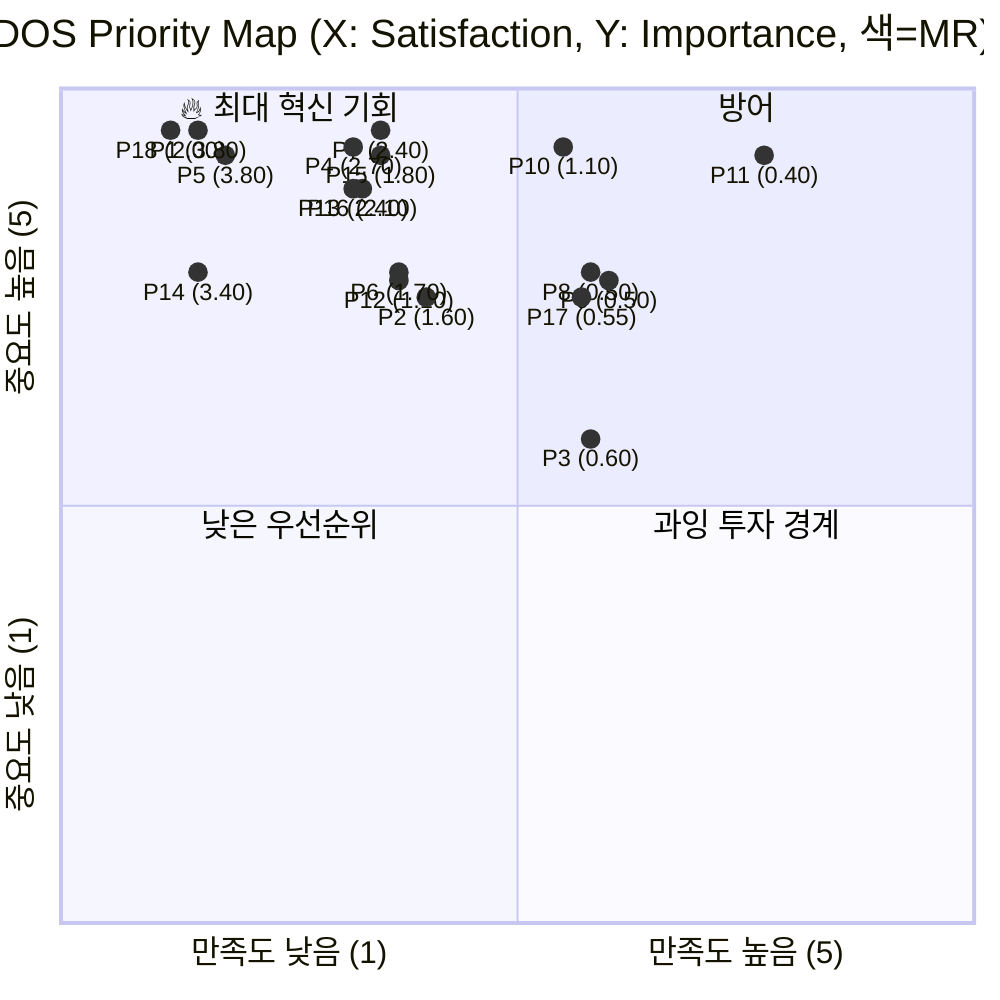

# DOS (Differentiated Opportunity Score) 분석 — 18 Pains

**대상 사업**: 경제 판단력 교과서 프로젝트
**분석일**: 2026. 04. 24.
**분석 대상**: 유효 페르소나 8인의 18개 Pain (AOS 분석과 동일 범위)
**선행 문서**: 『AOS 분석』, 『Persona Spectrum Map』

---

## 0. 분석 프레임

### DOS 정의 및 AOS와의 차이

```
DOS = (Importance − Satisfaction) × Market Relevance
```

- **Importance (1~5)**: 목표 달성에 얼마나 중요한가 (AOS와 동일)
- **Satisfaction (1~5)**: 대체 솔루션의 해결 수준 (AOS와 동일)
- **Market Relevance (0.1~1.0)**: 시장 차원의 기회 가치 — TAM, 성장률, 채택 난이도, 확산성 종합

**AOS는 개인 단위 기회**를 측정하고, **DOS는 시장 단위 기회 + 확산 가능성**을 반영합니다. 같은 개인 Pain(AOS 4.00)이라도 시장 규모와 확산성이 다르면 DOS는 크게 벌어집니다.

### Market Relevance 평가 기준

| 점수 | TAM | 성장률 | 채택 난이도 | 확산성 |
|---|---|---|---|---|
| 0.9~1.0 | 수백만 명 이상 | 빠름 | 낮음 (쉬움) | 자발 전파 강함 |
| 0.7~0.8 | 수십만~수백만 | 완만 | 중간 | 추천 기반 전파 |
| 0.5~0.6 | 수만~수십만 | 완만 | 중간 | 개별 도달 |
| 0.3~0.4 | 수천~수만 | 낮음 | 높음 | 특수 채널 필요 |
| 0.1~0.2 | 틈새 | 정체 | 매우 높음 | 거의 없음 |

### DOS 값 범위와 해석

- 이론상 최대: (5−1) × 1.0 = **4.0**
- 이론상 최소: 음수 또는 0 (단, 본 분석은 Satisfaction ≤ Importance 가정)

| DOS | 해석 |
|---|---|
| 3.0 이상 | 🔥 **최대 혁신 기회** |
| 2.0~2.9 | ⭐ **중요 기회** |
| 1.0~1.9 | 💡 **선택적 기회** |
| 0.5~0.9 | ⚪ **낮은 우선순위** |
| 0.5 미만 | ❄️ **기회 없음** |

---

## 1. Pain별 Market Relevance 평가 근거

AOS 분석에서 이미 Importance·Satisfaction은 확정했으므로, 본 분석의 핵심은 **Market Relevance(MR) 평가**입니다.

### 1.1 MR 평가 프레임

각 Pain의 MR은 다음 네 요소의 가중 평균입니다.

1. **TAM 규모** — 이 Pain을 가진 사람의 시장 크기
2. **성장률** — 해당 Pain의 확산 또는 축소 추세
3. **채택 난이도** — 본 프로젝트가 이 Pain을 풀 때 넘어야 할 진입 장벽
4. **확산성** — 해결된 사용자가 타인에게 전파할 가능성

### 1.2 그룹별 MR 개요

| 그룹 | 대표 TAM | MR 특징 |
|---|---|---|
| 핵심 Q1-A (박지훈·이수민) | 40~70만 명씩, Q1-A 전체 120~200만 명 | MR **높음**. 20대 청년층·디지털 네이티브. 자발 전파 강함. |
| 핵심 Q1-B (정해민) | 40~70만 명 | MR **중상**. 의사결정 중심이라 확산성 제한적. |
| 핵심 Q1-C (한정숙) | 20~40만 명 | MR **중간**. 디지털 채택 난이도 높음. |
| 확장 (장은혜) | 교사 약 20만 명 + 학부모·리더 | MR **중상**. 교사 실사용 채택 난이도 높으나 확산성은 매우 높음. |
| 극단 (김성호·오세은) | 수만~수십만 | MR **중하**. TAM 제한적이나 보편 설계 파급 효과 존재. |
| 비활성 (서하윤) | 수백만 명 (Broad SAM 외부) | MR **특수**. TAM은 크나 채택 난이도 **최상**. 도달 자체가 장기 과제. |

---

## 2. DOS 계산 테이블 (내림차순 정렬)

| 순위 | Pain/Goal | Importance | Satisfaction | Market Relevance | **DOS** | 기회 해석 (Insight) |
|---|---|---|---|---|---|---|
| 🥇 1 | **P1 체계감 부재 (박지훈)** | 5 | 1 | **0.95** | **3.80** | Q1-A 전체가 공유하는 Pain이며 AI 대체재 침투가 가장 빠른 영역. 시장 규모·긴급성·확산성 모두 최상. **MVP 첫 번째 방어선**. |
| 🥇 1 | **P5 깊이·접근성 공백 (이수민)** | 5 | 1 | **0.95** | **3.80** | "경제학원론은 무겁고 유튜브는 얕다"는 시장의 물리적 공백. 입문~중급 전반에 공통. 5 Forces『구조적 공백』의 핵심. **포지션 선언의 근거**. |
| 3 | **P14 학생 자기학습 경로 부재 (장은혜)** | 5 | 1 | **0.85** | **3.40** | 교사 TAM 20만 명 + 학부모·리더 확장. 교사 한 명이 학생 20~30명에게 전파하는 **배수 확산 구조**. 교사 모드 동시 런칭의 정량 근거. |
| 4 | **P4 신뢰 기준 부재 (이수민)** | 5 | 2 | **0.90** | **2.70** | 투자 실패 경험자 수백만 명 규모(하나금융 조사 71% 손실). 본 프로젝트의 『후킹 없는 톤』이 직접 대응. 브랜드 메시지의 앵커. |
| 5 | **P7 판단 기준 부재 (정해민)** | 5 | 2 | **0.80** | **2.40** | Q1-B 40~70만 명. 확산성은 제한적이나(의사결정 후 이탈) 시장 규모와 지불 의지 강함. 판단력 브랜드 정체성과 정합. |
| 5 | **P13 수업 준비 부담 (장은혜)** | 5 | 2 | **0.80** | **2.40** | 교사 시장의 공통 Pain. 한 번 패키지가 작동하면 **연쇄 채택** 가능. 단 개별 교사 설득 난이도는 중간 이상. |
| 7 | **P16 세션 단편화 (오세은)** | 5 | 2 | **0.70** | **2.10** | 육아휴직·재택·통근자 등 확장 가능. TAM은 제한적이나 **보편 설계 파급**으로 핵심 4인에게도 이익. 설계 체크리스트화 가능. |
| 8 | **P18 자기규정 거부 (서하윤)** | 5 | 1 | **0.50** | **2.00** | TAM은 수백만 명으로 매우 큼(미션의 궁극 타깃)이나 **채택 난이도 최상**. MR을 0.5로 제약. **장기 미션 나침반이지 MVP 대상 아님**. |
| 9 | **P15 저시력 접근성 (김성호)** | 5 | 2 | **0.60** | **1.80** | TAM 제한적이나 **미션 정합성 최상**(기회 격차 감소). 보편 설계 파급 효과로 간접 가치 큼. 설계 품질 게이트. |
| 10 | **P6 후킹 피로 (이수민)** | 4 | 2 | **0.85** | **1.70** | AOS 2.40이지만 시장 확산성이 강해 DOS는 상승. 브랜드 톤 마케팅 메시지로 전환 가능. |
| 11 | **P2 뉴스 해석 불능 (박지훈)** | 4 | 2 | **0.80** | **1.60** | Q1-A 공통 부수 Pain. P1 해결의 파생 효과로 80% 해결 가능. 단독 투자 비효율. |
| 12 | **P12 검증 언어 필요 (한정숙)** | 4 | 2 | **0.55** | **1.10** | Q1-C 특유의 최종 목표이나 시장 규모 제한적. 한정숙 세그먼트 내 가치 있으나 전체 MR 낮음. |
| 13 | **P10 용어·구조 낯섦 (한정숙)** | 5 | 3 | **0.55** | **1.10** | Pain은 크나 종이책·PB·도서관 강좌가 부분 해결 중. 본 프로젝트 대체 가치 제한적. |
| 14 | **P17 소리 의존 불가 (오세은)** | 4 | 3 | **0.55** | **0.55** | P16에 종속적 제약. 자막 기본 설계로 해결. 단독 기회 크기 낮음. |
| 15 | **P9 결정 비용 부담 (정해민)** | 4 | 3 | **0.50** | **0.50** | 전문가 상담이라는 대체재가 상당히 작동. 본 프로젝트 개입 여지 제한적. |
| 16 | **P8 시간 절박 (정해민)** | 4 | 3 | **0.50** | **0.50** | 요약 콘텐츠·카드뉴스가 시간 문제 일부 완화. 본 프로젝트 차별성 확보 어려움. |
| 17 | **P3 파편화 시간 (박지훈)** | 3 | 3 | **0.60** | **0.60** | 보편 설계로 자연 해결. 단독 투자 대상 아님. |
| 18 | **P11 매체·UI 장벽 (한정숙)** | 5 | 4 | **0.40** | **0.40** | 전통 매체(책·신문)가 이미 잘 작동. 본 프로젝트의 디지털 UI로는 **역행** 가능. 책 완결 시점까지 대응 불가. |

---

## 3. DOS와 AOS 순위 비교

같은 Pain이 두 지표에서 어떻게 위치가 달라지는지 드러냅니다.

| Pain | AOS 순위 | DOS 순위 | 변화 | 해석 |
|---|---|---|---|---|
| P1 체계감 (박지훈) | 공동 1위 | 공동 1위 | = | AOS와 DOS 모두 최상. **MVP의 핵심** |
| P5 깊이공백 (이수민) | 공동 1위 | 공동 1위 | = | 시장 공백 + 개인 기회 모두 최상 |
| P14 학생경로 (장은혜) | 공동 1위 | 3위 | ↓2 | 확산성 높지만 교사 개별 채택 난이도로 MR 0.85 |
| P18 자기규정 (서하윤) | 공동 1위 | 8위 | **↓7** | 🚨 **가장 큰 순위 변동**. 채택 난이도가 DOS에서 크게 반영. AOS만 봤으면 오판할 뻔한 Pain |
| P4 신뢰기준 (이수민) | 공동 5위 | 4위 | ↑1 | 확산성·TAM으로 DOS에서 상승 |
| P7 판단기준 (정해민) | 공동 5위 | 공동 5위 | = | 안정적 중요 기회 |
| P13 수업부담 (장은혜) | 공동 5위 | 공동 5위 | = | 안정적 |
| P15 저시력 (김성호) | 공동 5위 | 9위 | ↓4 | 미션 정합성 최상이나 TAM으로 MR 제약 |
| P16 세션단편 (오세은) | 공동 5위 | 7위 | ↓2 | 보편 설계 파급 효과 반영해 MR 0.70 |
| P11 UI장벽 (한정숙) | 18위 | 18위 | = | 두 지표 모두 최하 |

### 핵심 발견 — AOS만 봤을 때 놓칠 뻔한 것

1. **P18(서하윤)의 AOS 1위가 DOS에서 8위로 급락**. AOS만 보면 『최우선 공략 대상』으로 보이지만, 채택 난이도가 극도로 높아 MR 0.5로 반토막. **DOS가 정량 감시 장치**로 작동한 사례.

2. **P15(김성호)·P16(오세은)도 AOS 상위에서 DOS 중하위로 이동**. TAM 제한이 MR에 반영됨. 단 **보편 설계 파급 효과**를 간접 가치로 보면 투자 가치 여전히 있음.

3. **P14(장은혜 학생 경로)는 DOS에서도 3위 유지**. 교사 한 명당 학생 20~30명 배수 확산 구조가 MR을 0.85로 높게 유지. 교사 모드 동시 런칭의 강력한 정량 근거.

---

## 4. DOS 상위 3개 Pain 심층 해석

### 🥇 P1 체계감 부재 / P5 깊이 공백 (공동 1위, DOS 3.80)

두 Pain 모두 **Importance 5 × Satisfaction 1 × MR 0.95**의 동일 구조. 시장의 구조적 공백이 가장 명확히 드러나는 두 Pain이며, 이를 풀지 못하면 본 프로젝트의 존재 이유가 성립하지 않습니다.

**시장 수준의 의미**:
- **P1**: "AI 시대에 왜 인간 제작 콘텐츠가 필요한가"에 대한 유일한 답이 『체계적 학습 여정』. 대체재(AI·유튜브)가 본질적으로 풀 수 없는 영역.
- **P5**: "경제 입문 시장의 중간 지대가 비어 있다"는 진단. 경제학원론과 유튜브 사이의 공백은 시장 차원의 포지션 공간.

**전략적 함의**: Stage 1 파일럿의 성공은 이 두 Pain에서의 체감 변화로 판정해야 함.

### 🥉 P14 학생 자기학습 경로 부재 (3위, DOS 3.40)

**핵심 차별점**: 다른 모든 Pain은 1:1(사용자:콘텐츠)이지만 P14는 **1:N(교사:학생) 배수 구조**. 교사 한 명이 수업에 도입하면 학생 20~30명이 동시 접근. 이는 MR을 0.85로 높게 유지하는 핵심 근거.

**시장 수준의 의미**: 공교육 인프라로의 연결 가능성. Vision 도달 기준 중 『공교육·가정에서 교안이 실제 수업에 쓰인 사례』가 이 Pain 해결의 산물.

**전략적 함의**: 교사 모드를 Phase 1로 미뤘다면 놓쳤을 DOS 3.40의 기회. 동시 런칭 결정의 강력한 수치 근거.

---

## 5. 종합 전략 맵



---

## 6. Stage 1 MVP 집중 영역 확정

### DOS 2.0 이상 7개 Pain (Stage 1~2 투입 대상)

| 순위 | Pain | 페르소나 | DOS | 대응 장치 |
|---|---|---|---|---|
| 1 | P1 체계감 | 박지훈 | 3.80 | 105편 완결 · 스탬프 맵 · 원칙 5 |
| 1 | P5 깊이공백 | 이수민 | 3.80 | 원칙 1 · 3매체 통합 |
| 3 | P14 학생경로 | 장은혜 | 3.40 | 교사 모드 · QR · 레슨 ID |
| 4 | P4 신뢰기준 | 이수민 | 2.70 | 후킹 없는 톤 · 출처 명시 |
| 5 | P7 판단기준 | 정해민 | 2.40 | 판단력 브랜드 · 원칙 1 |
| 5 | P13 수업부담 | 장은혜 | 2.40 | 단일 교안 · 개정 이력 |
| 7 | P16 세션단편 | 오세은 | 2.10 | 재생 상태 저장 · 짧은 단위 |

### DOS 2.0 미만 (자연 해결 또는 제외)

- **DOS 1.0~1.9 (5개)**: P18·P15·P6·P2·P12·P10. **파생 해결** 또는 **장기 모니터링**.
- **DOS 1.0 미만 (6개)**: P17·P9·P8·P3·P11. **직접 투입 제외**. 이미 대체재 작동 또는 파급 효과로 해결.

---

## 7. 핵심 결론

### 7.1 DOS가 AOS를 보완하는 세 가지 방식

1. **채택 난이도의 정량화** — P18처럼 "중요하지만 도달 불가"인 Pain을 순위에서 현실적으로 낮춤.
2. **TAM 차등화** — P15·P16처럼 개인 AOS는 높지만 시장 규모가 제한적인 Pain의 상대적 가치 하락.
3. **확산성 반영** — P14처럼 1:N 배수 구조를 가진 Pain의 가치 유지.

### 7.2 MVP 집중 7개 Pain은 기존 원칙과 1:1 대응

| 원칙 | 직접 대응 Pain | DOS |
|---|---|---|
| 원칙 1 (이해가 먼저) | P5, P7 | 3.80, 2.40 |
| 원칙 3 (속도보다 신뢰) | P4 | 2.70 |
| 원칙 4 (3매체 유기체) | P1, P16 | 3.80, 2.10 |
| 원칙 5 (1편=1교안=1장) | P1, P14 | 3.80, 3.40 |

**원칙 5가 DOS 합계 7.20으로 가장 큰 기회 값**을 가짐. 이는 기획서의 교사 모드 동시 런칭 결정과 원칙 5의 강도를 정량적으로 뒷받침.

### 7.3 DOS 분석 후 Stage 1 Exit 기준 재제안

Stage 1 파일럿 성공 판정 시 다음을 모두 충족해야 함:

1. **DOS 3.0 이상 Pain(P1·P5·P14) 중 2개 이상에서 체감 변화 응답률 60% 이상**
2. **DOS 2.0~2.9 Pain(P4·P7·P13·P16) 중 최소 1개에서 긍정 신호**
3. **DOS 2.0 미만 Pain에는 측정 압력 걸지 않음** — 파급 효과로 자연 확인

---

## 부록. 이 분석의 한계

1. **Market Relevance는 합성 페르소나 기반의 정성 평가**. 실제 사용자 데이터로 재교정 필요.
2. **MR 가중 요소 간 우선순위는 본 분석에서 균등 가정**. TAM에 더 큰 가중을 주면 순위가 변할 수 있음.
3. **DOS 수치 자체는 상대 비교용**. 3.80과 3.40의 차이는 의미 있으나 2.40과 2.10의 차이는 측정 노이즈 범위 가능.
4. **파일럿 이후 재평가 필수**. 실측 TAM·확산성 데이터로 MR 재계산.
5. **서하윤(P18)의 DOS 2.00은 보수적 추정**. 공교육 채널 확보 시 MR 0.5 → 0.7~0.8 상승 가능성.
