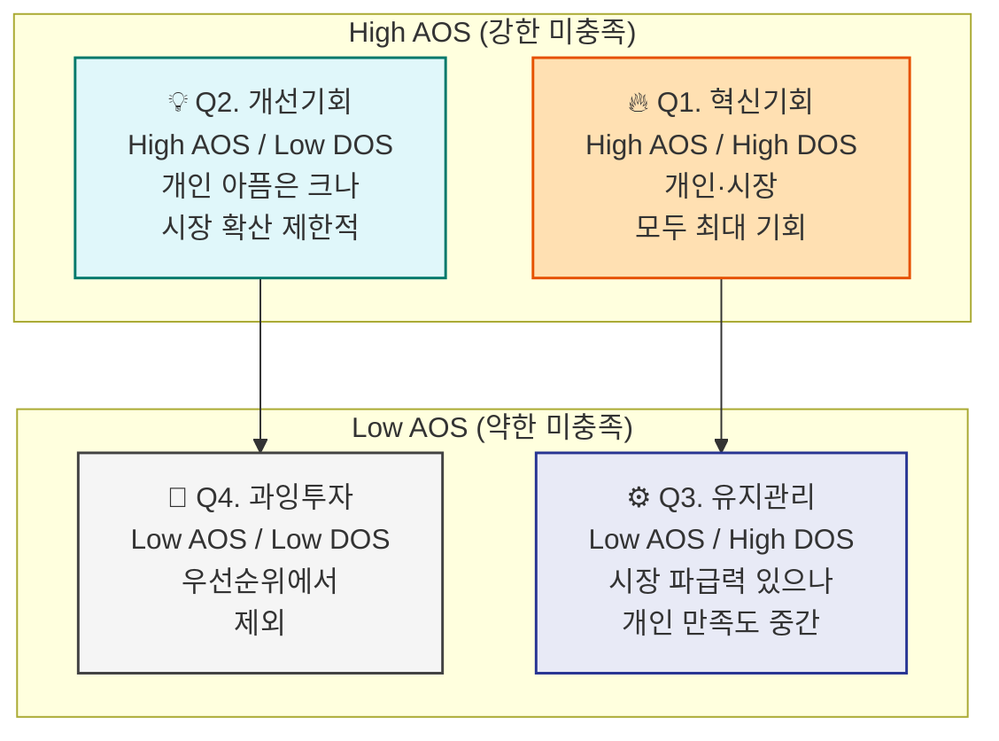
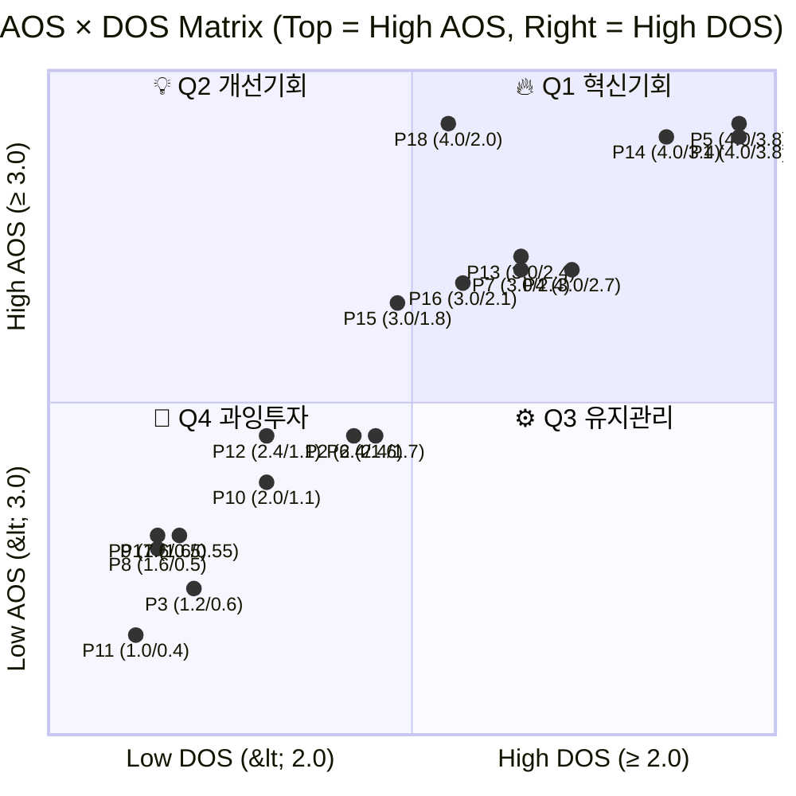

# AOS × DOS 매트릭스 분석 — 18 Pains

**대상 사업**: 경제 판단력 교과서 프로젝트
**분석일**: 2026. 04. 24.
**분석 대상**: 유효 페르소나 8인의 18개 Pain
**선행 문서**: 『AOS 분석』, 『DOS 분석』

---

## 0. 분석 프레임

### AOS와 DOS의 차이 (요약)

| 구분 | AOS | DOS |
|---|---|---|
| 계산식 | Importance × (1 − Satisfaction/5) | (Importance − Satisfaction) × Market Relevance |
| 시각 | 고객 체감 중심 | 시장 가중 중심 |
| 측정 | 한 명의 미충족 강도 | 시장 전체의 확산 가능성 |
| 값 범위 | 0 ~ 5 | -4 ~ 4 (음수 가능) |

**AOS**는 "이 Pain이 개별 고객에게 얼마나 아픈가"를, **DOS**는 "그 아픔이 시장에서 얼마나 큰 기회인가"를 측정합니다. 두 지표가 일치하지 않을 때 **전략적 판단이 필요한 지점**이 드러납니다.

### 매트릭스 임계값 설정

| 지표 | High 기준 | Low 기준 |
|---|---|---|
| AOS | ≥ 3.0 (Top 8) | < 3.0 |
| DOS | ≥ 2.0 (Top 7) | < 2.0 |

> **임계값 근거**: AOS 3.0 이상은 분석상 "중요 기회" 등급, DOS 2.0 이상은 "중요 기회" 등급. 임계값은 상대 비교를 위한 것이며 절대 기준은 아닙니다.

### 사분면 정의



---

## 1. AOS × DOS 통합 매트릭스 테이블

### 1.1 18 Pains 배치 (DOS 내림차순)

| Pain/Goal | AOS | DOS | Quadrant | 페르소나 | 유형 | 전략 |
|---|---|---|---|---|---|---|
| P1 체계감 부재 | 4.00 | 3.80 | **🔥 Q1** | 박지훈 | Core | **타게팅 1순위** — MVP 핵심 방어선 |
| P5 깊이·접근성 공백 | 4.00 | 3.80 | **🔥 Q1** | 이수민 | Core | **타게팅 1순위** — 포지션 선언의 근거 |
| P14 학생 자기학습 경로 부재 | 4.00 | 3.40 | **🔥 Q1** | 장은혜 | Adjacent | **타게팅 1순위** — 교사 모드 동시 런칭 정당화 |
| P4 신뢰 기준 부재 | 3.00 | 2.70 | **🔥 Q1** | 이수민 | Core | 타게팅 2순위 — 브랜드 톤의 앵커 |
| P7 판단 기준 부재 | 3.00 | 2.40 | **🔥 Q1** | 정해민 | Core | 타게팅 2순위 — 판단력 브랜드 정체성 |
| P13 수업 준비 부담 | 3.00 | 2.40 | **🔥 Q1** | 장은혜 | Adjacent | 타게팅 2순위 — 교사 모드 기능 설계 |
| P16 세션 단편화 | 3.00 | 2.10 | **🔥 Q1** | 오세은 | Extreme | 타게팅 2순위 — 보편 설계 체크리스트 |
| P18 자기규정 거부 | 4.00 | 2.00 | **💡 Q2** | 서하윤 | Non-user | **장기 나침반** — 단기 투입 금지, 미션 모니터링 |
| P15 저시력 접근성 | 3.00 | 1.80 | **💡 Q2** | 김성호 | Extreme | **개선 대상** — 보편 설계 파급으로 간접 투자 |
| P6 후킹 피로 | 2.40 | 1.70 | **🚫 Q4** | 이수민 | Core | P4 해결의 파생 효과로 자연 해결 |
| P2 뉴스 해석 불능 | 2.40 | 1.60 | **🚫 Q4** | 박지훈 | Core | P1 해결의 파생 효과로 자연 해결 |
| P12 검증 언어 필요 | 2.40 | 1.10 | **🚫 Q4** | 한정숙 | Core | P10 해결의 파생 효과로 자연 해결 |
| P10 용어·구조 낯섦 | 2.00 | 1.10 | **🚫 Q4** | 한정숙 | Core | 대체재(종이책·PB) 작동 중 — 보류 |
| P3 파편화 시간 | 1.20 | 0.60 | **🚫 Q4** | 박지훈 | Core | 보편 설계로 자연 해결 — 보류 |
| P17 소리 의존 불가 | 1.60 | 0.55 | **🚫 Q4** | 오세은 | Extreme | 자막 기본 설계로 해결 — 보류 |
| P9 결정 비용 부담 | 1.60 | 0.50 | **🚫 Q4** | 정해민 | Core | 전문가 상담 대체재 강함 — 보류 |
| P8 시간 절박 | 1.60 | 0.50 | **🚫 Q4** | 정해민 | Core | 요약 콘텐츠 대체재 작동 — 보류 |
| P11 매체·UI 장벽 | 1.00 | 0.40 | **🚫 Q4** | 한정숙 | Core | 전통 매체(책·신문) 이미 작동 — 보류 |

### 1.2 사분면별 집계

| 사분면 | 개수 | Pain IDs | 공통 전략 |
|---|---|---|---|
| 🔥 Q1 혁신기회 | 7 | P1, P5, P14, P4, P7, P13, P16 | **타게팅 1~2순위, MVP 집중** |
| 💡 Q2 개선기회 | 2 | P18, P15 | **간접 투자, 장기 모니터링** |
| ⚙️ Q3 유지관리 | 0 | — | (해당 없음) |
| 🚫 Q4 과잉투자 | 9 | P6, P2, P12, P10, P3, P17, P9, P8, P11 | **직접 투입 제외, 파급 효과로 자연 해결** |

---

## 2. 2D 산점도 시각화



---

## 3. 사분면별 심층 해석

### 🔥 Q1 · 혁신기회 (7개) — MVP의 전부

**개인 아픔이 크고 시장 확산 가능성도 큰 영역**. 이 7개 Pain이 Stage 1~2의 투입 대상이며, MVP의 80~90%를 차지합니다.

**1순위 (DOS ≥ 3.0) — 3개**

| Pain | 페르소나 | 핵심 메시지 |
|---|---|---|
| P1 체계감 부재 | 박지훈 | "파편 답이 아닌 여정의 감각" |
| P5 깊이·접근성 공백 | 이수민 | "무겁지도 얕지도 않은 중간" |
| P14 학생 자기학습 경로 | 장은혜 | "교사-학생 배수 확산 구조" |

**2순위 (DOS 2.0~2.9) — 4개**

| Pain | 페르소나 | 연결 원칙 |
|---|---|---|
| P4 신뢰 기준 부재 | 이수민 | 원칙 3 (속도보다 신뢰) |
| P7 판단 기준 부재 | 정해민 | 원칙 1 (이해가 먼저) |
| P13 수업 준비 부담 | 장은혜 | 원칙 5 (1편=1교안=1장) |
| P16 세션 단편화 | 오세은 | 원칙 4 (3매체 유기체) |

### 💡 Q2 · 개선기회 (2개) — 간접 투자 대상

**개인 아픔은 크나 시장 확산이 제한적인 영역**. 직접 타겟팅은 비효율이나 **간접 투자 또는 파급 효과**로 가치 확보 가능.

#### P18 자기규정 거부 (서하윤, AOS 4.0 / DOS 2.0)

**해석**: 본 프로젝트 미션의 궁극 타깃이지만 채택 난이도가 극상. AOS만 보면 1순위처럼 보이나 DOS가 가드레일 역할. **단기 투입 금지, 장기 미션 나침반으로만 활용**.

**전략**:
- Stage 1~2에서 직접 측정 대상 아님
- 6개월·12개월 북극성 재검토 시 접근 가능성 재평가
- 공교육·가정·도서관 채널 확보 후 Stage 3~4에서 접근 검토

#### P15 저시력 접근성 (김성호, AOS 3.0 / DOS 1.8)

**해석**: 미션 정합성(기회 격차 감소) 최상이나 TAM이 제한적. 그러나 **보편 설계 파급 효과**로 간접 투자 가치 큼.

**전략**:
- 별도 기능으로 개발하지 않고 **모든 페이지의 기본 접근성 체크리스트**에 포함
- WCAG AA 준수 · 자막 · 큰 글씨 · 오디오 대체 경로
- 이 기준을 충족하면 핵심 4인(박지훈·이수민·정해민·한정숙)에게도 이익

### ⚙️ Q3 · 유지관리 (0개) — 해당 없음

**시장 파급력은 있으나 개인 만족도는 중간 이상인 영역**. 본 분석에서는 해당 Pain이 도출되지 않았습니다.

**해당 없음의 의미**: 본 프로젝트 관련 Pain 중 "시장 확산성은 크나 이미 상당 부분 해결된" Pain은 없습니다. 시장 전반에 미충족이 광범위하게 존재한다는 시장 구조의 반영입니다.

### 🚫 Q4 · 과잉투자 (9개) — 직접 투입 제외

**개인·시장 모두 기회 값이 낮은 영역**. 직접 리소스 투입 없이 파급 효과 또는 대체재에 맡김.

**파생 해결 대상 (3개)**: P6·P2·P12는 각각 상위 Pain(P4·P1·P10) 해결 시 자연 해결.

**대체재 작동 영역 (5개)**: P10·P3·P17·P9·P8은 이미 시장 대체재가 작동 중. 본 프로젝트 개입 한계 효용 낮음.

**역행 위험 (1개)**: P11은 한정숙의 UI 장벽이지만 전통 매체(책·신문)가 더 잘 작동. 본 프로젝트의 디지털 UI로는 **오히려 역행 가능성**. 책 완결 시점까지 대응 불가.

---

## 4. AOS vs DOS 괴리가 드러내는 세 가지 전략 판단

### 4.1 P18의 AOS-DOS 괴리 (ΔRank = -7)

| 지표 | 값 | 순위 |
|---|---|---|
| AOS | 4.00 | 공동 1위 |
| DOS | 2.00 | 8위 |

**AOS만 봤을 때 놓칠 위험**: 『서하윤을 1순위로 공략』이라는 잘못된 판단.
**DOS가 보여주는 진실**: 도달 불가능한 타깃에 리소스 투입 시 실패.
**전략 결정**: Q2(개선기회)에 배치하여 간접 투자·장기 모니터링.

### 4.2 P15·P16의 AOS-DOS 괴리

두 Pain 모두 AOS 3.0이지만 DOS는 P15가 1.8, P16이 2.1. 같은 극단 페르소나 Pain인데 왜 갈라졌나?

**이유**: P16(세션 단편화)는 육아휴직·통근·재택 모두에 확장 가능해 TAM이 더 큼. P15(저시력)는 TAM이 제한적.

**전략 결정**:
- P16은 Q1에 배치하여 직접 기능 설계(재생 위치 저장 등)
- P15는 Q2에 배치하여 보편 설계 파급에 기대

### 4.3 Q1 내부의 DOS 층화

Q1 7개 Pain도 DOS로 재층화됩니다.

- **DOS 3.0+ (3개)**: 콘텐츠·메시지의 핵심 앵커. 브랜드 선언 근거.
- **DOS 2.0~2.9 (4개)**: 제품 기능의 구체적 설계 요구사항.

→ **Stage 1 파일럿 KPI는 DOS 3.0+ 3개로 한정**, 2.0~2.9는 부수 관찰.

---

## 5. MVP 집중 영역 — 최종 확정

### 5.1 Stage 1 파일럿 직접 투입 Pain (Q1 · 7개)

| 우선순위 | Pain ID | 페르소나 | 대응 장치 |
|---|---|---|---|
| 1 | P1 | 박지훈 | 105편 완결 · 진주 스탬프 맵 · 원칙 5 |
| 1 | P5 | 이수민 | 원칙 1 · 3매체 통합 · 원칙 4 |
| 1 | P14 | 장은혜 | 교사 모드 · QR · 레슨 ID 체계 |
| 2 | P4 | 이수민 | 후킹 없는 톤 · 출처 명시 · 원칙 3 |
| 2 | P7 | 정해민 | 판단력 브랜드 · 원칙 1 |
| 2 | P13 | 장은혜 | 단일 교안 · 개정 이력 |
| 2 | P16 | 오세은 | 재생 상태 저장 · 짧은 단위 · 자막 기본 |

### 5.2 간접 투자 Pain (Q2 · 2개)

| Pain ID | 페르소나 | 간접 투자 방식 |
|---|---|---|
| P15 | 김성호 | 보편 설계 체크리스트(WCAG AA·자막·오디오) |
| P18 | 서하윤 | 6개월 단위 미션 정합성 측정 항목 |

### 5.3 자원 배분 가이드

- **Q1 7개 Pain**: 제작 리소스의 **80%** 집중
- **Q2 2개 Pain**: 보편 설계 체크리스트로 **10%**
- **Q4 9개 Pain**: 직접 투입 **0%**. 파급 효과 기대
- **나머지 10%**: 실측 재평가·리스크 대응 여유

---

## 6. Stage 1 Exit 기준 제안 (DOS 기반 최종)

```
1. DOS ≥ 3.0 Pain (P1·P5·P14) 중 2개 이상에서
   체감 변화 응답률 60% 이상

2. DOS 2.0~2.9 Pain (P4·P7·P13·P16) 중 1개 이상에서
   긍정 신호

3. Q2 Pain (P15·P18)은 성공 판정 지표에서 제외
   (단 설계 체크리스트 충족 여부는 별도 확인)

4. Q4 Pain은 측정 대상 아님
```

---

## 7. 핵심 결론 — 이 분석이 주는 세 가지 메시지

### 7.1 "AOS만으로는 위험하다"

P18 사례가 보여주듯 AOS 상위 Pain이 반드시 MVP 대상은 아닙니다. **DOS가 정량 가드레일**로 작동하여 시장 도달성을 반영합니다. 특히 미션이 강한 프로젝트(본 프로젝트처럼 『기회 격차 해소』)에서는 AOS와 미션 정합성이 DOS를 압도할 위험이 있으므로, DOS의 냉정한 반영이 필수.

### 7.2 "Q1 7개 Pain이 기획서 원칙과 1:1 대응"

| 원칙 | 대응 Q1 Pain | DOS 합계 |
|---|---|---|
| 원칙 1 (이해가 먼저) | P5, P7 | 6.20 |
| 원칙 3 (속도보다 신뢰) | P4 | 2.70 |
| 원칙 4 (3매체 유기체) | P1, P16 | 5.90 |
| 원칙 5 (1편=1교안=1장) | P1, P14 | 7.20 |

**원칙 5가 DOS 합계 최상위(7.20)**. 교사 모드 동시 런칭 결정의 강도가 여기서 확인됩니다.

### 7.3 "Q3 영역 공백 = 시장 구조의 증거"

Q3(시장 파급력 큰데 이미 해결됨) 항목이 0개라는 사실은, 본 프로젝트 관련 시장이 여전히 **광범위한 미충족 상태**에 있음을 보여줍니다. 이는 기획서의 시장 공백 전략이 실증적으로 뒷받침되고 있다는 의미이기도 하고, 동시에 **경쟁자가 빠르게 진입할 시간 창이 존재**한다는 긴장감을 상기시킵니다.

---

## 부록. 이 분석의 한계

1. **임계값(AOS 3.0, DOS 2.0)은 상대 비교 기준**이며 절대 경계가 아님. 임계값을 다르게 잡으면 사분면 이동 발생.
2. **P13이 DOS 2.40으로 Q1 경계선**. 2순위와 3순위 사이에서 민감. 파일럿 실측으로 교정 필요.
3. **Q3 공백은 이번 Pain 셋 기준**. 사용자 인터뷰에서 새 Pain이 추가되면 Q3이 발생할 수 있음.
4. **파일럿 이후 재평가 필수**. Stage 1 실측으로 AOS·DOS·사분면 배치 전면 재확인.
