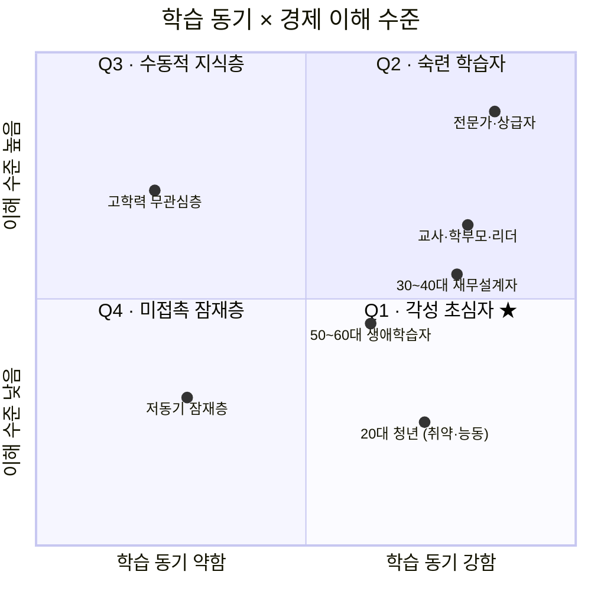
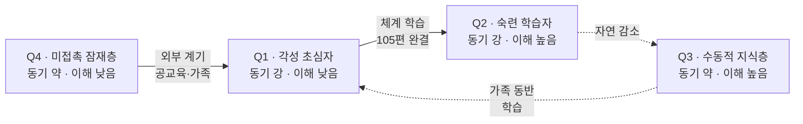

# Market Segment Map — 학습 동기 × 경제 이해 수준

**대상 사업**: 경제 판단력 교과서 프로젝트
**분석일**: 2026. 04. 24.
**선행 문서**: 『SAM 심화분석』
**관점**: Strict SAM(약 300~450만 명) 내부를 두 축으로 분할하여, 각 사분면의 성격·진입 장벽·본 프로젝트의 대응 전략을 구분한다.

---

## 0. 축 정의

### X축 — 학습 동기 강도

경제를 배우고자 하는 **내재적 동기의 크기**. 외부 강제(직장 의무교육 등)가 아닌 자발적 학습 의지를 기준으로 한다.

- **약함**: "언젠가 배워야겠다"는 인식은 있으나 행동으로 옮기지 못하는 상태. 시작 계기가 외부에 있어야 움직임.
- **강함**: 적극적으로 영상·책·강의를 탐색하고 소비하는 상태. 내부 트리거로 움직임.

### Y축 — 경제 이해 수준

현재 시점에서 개인이 가지고 있는 **경제 지식·판단력의 수준**. 2024 전국민 금융이해력 조사 등 공식 지표의 분포를 참고.

- **낮음**: OECD 최소목표점수 미달 수준. 기본 용어·인플레이션·금리 구조에 대한 이해가 부족하거나 파편적.
- **높음**: 기본 개념을 넘어 뉴스·의사결정에 활용 가능한 수준. 전체 성인의 약 절반 수준에 해당.

---

## 1. Segment Map

> **범례**: 각 점의 좌표는 해당 세그먼트의 평균적 위치를 나타내며, 실제 세그먼트 내부에는 분산이 존재함.

---

## 2. 사분면별 특징

### Q1 — 각성 초심자 (Motivated Beginner) ★ 본 프로젝트의 1순위 타깃

**좌표**: 학습 동기 강함 × 경제 이해 수준 낮음
**규모 추정**: Strict SAM 내 **약 40~50%**, 즉 **120~200만 명**
**대표 세그먼트**: 20대 청년 학습자 · 30~40대 초기 재무설계자의 상당수

**특징**
- 최근 뉴스·인생 이벤트(취업·내집마련·결혼·출산)를 계기로 "제대로 배우겠다"는 결심에 도달한 상태.
- 공식 지표와 일치 — 2024 금융이해력 조사에서 20대 청년층 금융이해력 점수가 금융행위를 중심으로 상대적으로 낮게 나타난 반면, 동일 연령층의 독서율은 78%대로 가장 높음. 『능동성은 있으나 지식이 부족한』 전형적 조합.
- AI에게 질문을 던지거나 유튜브를 소비하지만, 파편적 답의 누적이 이해로 이어지지 않아 좌절을 반복.
- 『문제정의서 학습자관점』의 세 층위(인지·여정·판단) 모두를 가장 강하게 경험하는 사분면.

**본 프로젝트의 적합도**: 매우 높음. 체계적 커리큘럼·스탬프 맵·완결 구조가 이 사분면의 불편을 정면으로 해결.

**접근 전략**
- Stage 1 파일럿의 주 타깃. Early SAM(100~200만 명)의 절대다수가 이 사분면에 존재.
- 진입점 설계는 세그먼트 내 세부 동기(취업 대비 / 내집 마련 / 투자 시작)에 따라 첫 10편을 조합.
- 후킹 없는 체계적 구성이 오히려 차별점으로 인식되는 유일한 사분면. 다른 사분면에서는 '지루함'으로 해석될 위험.

---

### Q2 — 숙련 학습자 (Skilled Learner)

**좌표**: 학습 동기 강함 × 경제 이해 수준 높음
**규모 추정**: Strict SAM 내 **약 15~20%**, 즉 **45~90만 명**
**대표 세그먼트**: 전문가·상급자 · 교사 중 전공자 · 오랜 학습 이력을 가진 30~50대

**특징**
- 이미 기본 개념을 갖추고 있으며, 심화·최신 동향·전문 영역을 찾는 상태.
- 금융이해력 OECD 최소목표점수 달성자(약 절반) 중에서도 상위층.
- 경제신문·전문 서적·유료 강의·리서치 리포트의 주 고객층.
- 본 프로젝트의 『입문~중급』 포지션에는 내용의 깊이가 부족하다고 느낄 수 있음.

**본 프로젝트의 적합도**: 낮음~중간. 입문 타깃 구성상 이 사분면을 주 타깃으로 설계하지 않음.

**접근 전략**
- 주 타깃 아님. 다만 이 사분면의 일부가 **교사·학부모 역할로 Q1의 학습자를 안내**하는 가교 역할을 수행. 교사 모드의 의미가 여기서 발생.
- 본인 학습보다는 **타인 추천자** 또는 **콘텐츠 품질 검증자**로 기능. 초기 레퍼런스 확보에 중요한 집단.
- 포지션 혼선 방지를 위해 "입문~판단력"이라는 범위를 명시적으로 선언. 과도한 심화 요청을 원칙적으로 거절하는 것이 원칙 1(『이해가 먼저』)과 일치.

---

### Q3 — 수동적 지식층 (Passive Knowers)

**좌표**: 학습 동기 약함 × 경제 이해 수준 높음
**규모 추정**: Strict SAM 내 **약 10~15%**, 즉 **30~70만 명**
**대표 세그먼트**: 고학력 무관심층 · 직업 특성상 기본 지식을 갖춘 무동기층

**특징**
- 학교 교육·직업 경험으로 일정 수준의 경제 지식을 이미 갖춘 상태이나, 추가 학습 동기는 없음.
- 뉴스는 소비하지만 체계적 학습을 의도하지 않음. 『알 만큼 안다』는 자기 인식이 동기를 약화시킴.
- 본 프로젝트의 『이해가 먼저』 포지션이 이 사분면에는 자극이 되지 않음. 이미 '이해했다고 생각'하기 때문.

**본 프로젝트의 적합도**: 낮음. 강제 활성화는 원칙 3(『속도보다 신뢰』)과 Non-Goal(후킹 금지)에 맞지 않음.

**접근 전략**
- 적극적 활성화 대상 아님. **자연 노출에 의한 우연 재진입**만 기대.
- 다만 이 층의 일부는 **자녀·가족의 학습 계기로 재유입**될 가능성 존재. 교사 모드와 책(종이책)이 이 경로에 대응.
- 단기 KPI 기대치를 두지 않음. 장기적으로 Stage 4(보급 단계)에서 『가족 동반 학습』 경로로 유입될 수 있음.

---

### Q4 — 미접촉 잠재층 (Dormant Potential)

**좌표**: 학습 동기 약함 × 경제 이해 수준 낮음
**규모 추정**: Strict SAM 내 **약 20~30%**, 즉 **60~135만 명** (Broad SAM 기준으로는 **수백만 명 규모**)
**대표 세그먼트**: 저동기 잠재층 · 경제를 두려워하는 무경험자 · 학습 진입 장벽이 큰 성인

**특징**
- 경제 이해 수준이 낮은 동시에 학습 의욕도 약함. 『경제는 나에게 맞지 않는다』는 자기 규정을 가진 경우가 많음.
- 본 프로젝트의 미션 『경제 이해의 기회 격차를 줄인다』가 가장 직접적으로 대응하는 층.
- 자발적 진입이 거의 없으며, **외부 계기(공교육·가족 권유·직장 상황 변화)**에 의존.
- Broad SAM 기준으로는 이 사분면 외부에 위치하지만 잠재적으로 Strict SAM으로 이동 가능한 약 500~800만 명이 추가 존재.

**본 프로젝트의 적합도**: 미션 정합성 최고, 단기 도달성 최저.

**접근 전략**
- **단기 타깃 아님. 장기 미션 타깃.** Stage 1~3에서는 직접 겨냥하지 않음.
- 활성화 경로는 **비(非)자발적 진입 채널**에 의존 — 공교육 수업, 도서관 비치, 가정 내 학부모·자녀 학습.
- Vision 도달 기준 중 『공교육·가정에서 교안이 실제 수업에 쓰인 사례』가 이 사분면의 활성화 신호.
- 이 층을 위한 별도 마케팅 드라이브는 Non-Goal(후킹 금지)과 충돌하므로, **콘텐츠 자체의 접근성**을 통해 자연 유입되도록 설계.

---

## 3. 사분면 간 이동 경로

세그먼트 분석에서 중요한 것은 사분면의 고정이 아니라 **학습자가 시간에 따라 이동하는 경로**입니다. 본 프로젝트는 아래 이동을 촉진하도록 설계됩니다.

**본 프로젝트가 촉진하고자 하는 핵심 이동**: Q4 → Q1 → Q2.
**본 프로젝트가 방어해야 하는 이탈**: Q1에서 체계 학습을 포기하고 다시 Q4로 돌아가는 경로. 이것이 『학습자 관점 문제 정의서』의 6단계 여정 중 5~6단계(회의·이탈)에 해당합니다.

---

## 4. 사분면별 자원 배분 권고

Stage 1~3의 유한한 자원을 네 사분면에 어떻게 배분할 것인가.

| 사분면 | 우선순위 | 자원 배분 | 단계별 전략 |
|---|---|---|---|
| **Q1 각성 초심자** | 1순위 | **70~80%** | Stage 1 파일럿의 전면 타깃. 첫 10편 진입점 설계의 중심. |
| **Q2 숙련 학습자** | 2순위 | **10~15%** | 교사·학부모·초기 레퍼런스로 활용. 콘텐츠 품질 검증. |
| **Q4 미접촉 잠재층** | 3순위 (장기) | **5~10%** | Stage 3~4의 비자발 채널 설계. 단기 KPI 기대치 두지 않음. |
| **Q3 수동적 지식층** | 4순위 | **0~5%** | 자연 노출만. 적극 활성화 시도하지 않음. |

이 배분은 원칙 3(『속도보다 신뢰』)과 정합적입니다. 한 사분면을 실체로 잡은 뒤에야 다음 사분면으로 확장하는 구조이며, Q1의 성공 없이 다른 사분면에 자원을 분산하는 것은 원칙 1(『이해가 먼저』)에도 어긋납니다.

---

## 5. 경쟁 환경의 사분면 점유 구조

5 Forces 분석에서 경쟁 축이 분열되어 있다는 진단을 이 맵에 투영하면, 각 사분면을 누가 점유하고 있는지가 드러납니다.

- **Q1 각성 초심자**: 부분 점유 — 후킹형 유튜버들이 일부 점유하나, 체계적 커리큘럼 기반 점유자는 거의 없음. **본 프로젝트가 비집고 들어갈 공백**.
- **Q2 숙련 학습자**: 포화 — 경제 신문·전문 서적·유료 강의 플랫폼(패스트캠퍼스·클래스101)이 집중 경쟁.
- **Q3 수동적 지식층**: 비표적 — 누구도 적극 공략하지 않는 층. 본 프로젝트도 마찬가지.
- **Q4 미접촉 잠재층**: 공백 — EBS·공교육의 제한적 공급을 제외하면 거의 비어 있음. 무료 체계 인프라만이 진입 가능.

**전략적 함의**: 본 프로젝트의 구조적 공백 포지션(5 Forces 분석의 결론)은 사실상 **Q1 각성 초심자** 사분면에 집중되어 있습니다. 장기적으로는 **Q4 미접촉 잠재층**이 미션 완성의 목표이지만, Q1을 먼저 잡지 않으면 Q4로 나아갈 실체가 없습니다.

---

## 6. 전략적 결론

1. **Q1(각성 초심자)이 Stage 1 파일럿의 절대적 1순위**입니다. Early SAM 100~200만 명의 절대 다수가 이 사분면에 존재합니다.
2. **Q2(숙련 학습자)는 직접 타깃이 아니지만 간접 가치가 큽니다** — 교사·학부모·레퍼런스 역할. 교사 모드 동시 런칭의 정당성이 이 사분면에서 확보됩니다.
3. **Q4(미접촉 잠재층)는 미션의 본질 타깃이지만 단기 KPI로 삼지 않습니다.** Stage 3~4에서 공교육·가정 채널로 활성화되는 장기 타깃입니다.
4. **Q3(수동적 지식층)은 사실상 타깃 아님**. 자원 배분에서 제외해도 무방합니다.
5. **사분면 간 이동(Q4 → Q1 → Q2)을 촉진하고 이탈(Q1 → Q4)을 방어하는 것**이 본 프로젝트의 제품 설계 핵심 목표입니다. 스탬프 맵·OX 체크·완결 구조는 모두 이 이동을 위한 장치입니다.

---

## 부록. 맵 해석의 한계

1. **두 축 모두 연속 변수를 이분화한 결과**입니다. 실제 사용자는 경계선 위에 위치하는 경우가 많음.
2. **세그먼트 좌표는 평균값**이며, 각 세그먼트 내부에는 분산이 존재. 예컨대 30~40대 재무설계자 중에도 Q2에 가까운 사람이 섞여 있음.
3. **경제 이해 수준은 2024 금융이해력 조사 분포를 참고한 추정**입니다. 실제 학습자의 자기인식과는 차이가 있을 수 있음.
4. **사분면별 규모 비율은 합리적 추정**이며, Stage 1 파일럿 실측으로 교정 필요.
