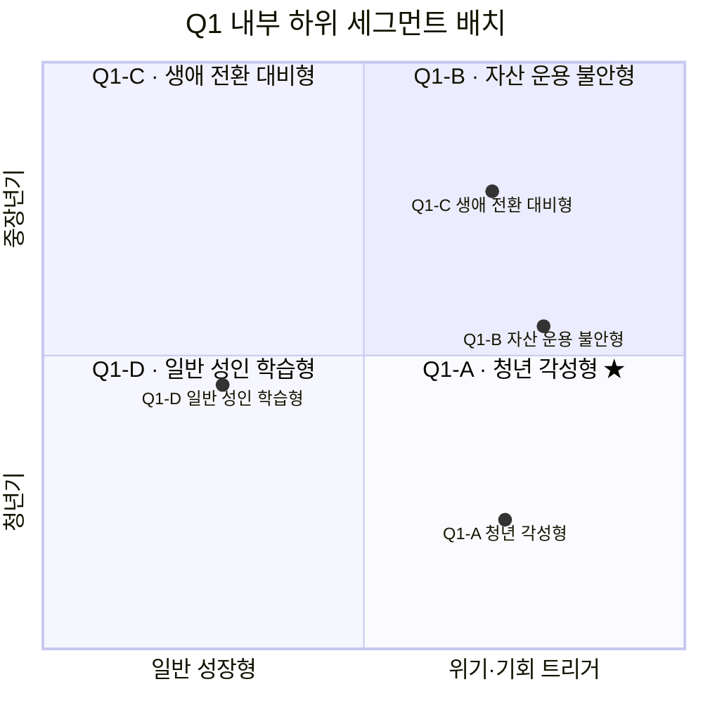

# 가장 시급한 타깃 식별과 심화 세분화 — Q1 각성 초심자

**대상 사업**: 경제 판단력 교과서 프로젝트
**분석일**: 2026. 04. 24.
**선행 문서**: 『Market Segment Map』, 『SAM 심화분석』, 『KSF Top 5』, 『5 Forces 분석』
**목적**: Market Segment Map에서 가장 시급한 타깃 사분면을 판정하고, 그 내부를 하위 세그먼트로 분해한다.

---

## 0. 왜 "가장 큰" 사분면이 아닌 "가장 시급한" 사분면인가

Q1 각성 초심자는 규모(120~200만 명)만으로도 Strict SAM 최대 사분면이지만, **규모와 시급성은 다릅니다.** 시급성은 아래 네 축으로 판단합니다.

| 축 | 의미 |
|---|---|
| 필요의 강도 | 현재 이 사분면이 겪는 불편의 심각도 |
| 대체재 침투 속도 | 이 사분면을 경쟁자·대체재가 얼마나 빠르게 점유 중인가 |
| 이탈 위험 | 지금 잡지 않으면 다른 사분면으로 이동하거나 학습을 포기하는 비율 |
| 본 프로젝트 적합도 | 우리가 가진 자원·원칙으로 이 사분면을 실제로 잡을 수 있는가 |

### 사분면별 시급성 스코어

| 사분면 | 필요 강도 | 대체재 침투 | 이탈 위험 | 적합도 | **시급성 종합** |
|---|---|---|---|---|---|
| **Q1 각성 초심자** | 매우 높음 | 매우 높음 (AI·유튜브 급속 점유 중) | 높음 (좌절 후 Q4 회귀) | 매우 높음 | **★ 1순위** |
| Q2 숙련 학습자 | 낮음 (이미 해결) | 낮음 | 낮음 | 낮음 | 3순위 |
| Q3 수동적 지식층 | 낮음 (자기인식 부재) | — | — | 낮음 | 4순위 |
| Q4 미접촉 잠재층 | 낮음 (자각 전) | 낮음 (아무도 공략 안 함) | 낮음 (이미 비활성) | 장기만 가능 | 2순위 (장기) |

**판정**: 가장 시급한 타깃은 **Q1 각성 초심자**입니다. 규모·필요·시간 압력·적합도 네 축 모두에서 최상위이며, 특히 **대체재(AI) 침투가 이미 진행 중**이라는 점에서 "지금 움직이지 않으면 놓치는" 유일한 사분면입니다.

### 시급성의 본질 — 시간 창의 문제

AI가 Q1의 개별 질문 입구를 빠르게 점유하고 있습니다. Q1 사용자가 "체계적 학습은 불가능하다"는 학습된 무기력에 도달하기 전에 본 프로젝트가 대안을 제시해야 합니다. 이 시간 창이 얼마나 남았는지는 정확히 알 수 없지만, 2~3년 단위로 빠르게 닫히는 창으로 보는 것이 합리적입니다. 원칙 3(속도보다 신뢰)을 지키되, **시간 창 자체의 존재는 직시해야 합니다.**

---

## 1. Q1 내부 재세분화 — 세 축의 직교 분해

Q1(약 120~200만 명)을 단일 집단으로 다루면 파일럿 대상자 선정과 사용자 리서치 설계가 불가능합니다. 세 축으로 분해합니다.

### 축 1 — 생애 재무 단계
학습 동기의 **내용**을 결정합니다.

- **청년 초기 (20대 초중반)**: 취업·첫 직장·기초 자산 관리
- **자산 형성 초입 (20대 후반~30대)**: 결혼·내집마련 준비·투자 시작
- **자산 운용기 (30대 후반~40대)**: 주택 구매·자녀 교육·본격 투자
- **은퇴 준비 (50~60대)**: 자산 관리·은퇴 설계

### 축 2 — 동기 트리거
학습을 **시작하게 만든 사건**의 성격을 결정합니다.

- **공포형 트리거**: 실제 손실·가족 위기·투자 실패 경험
- **기회형 트리거**: 새로운 기회 포착(창업·투자·이직)
- **일반 성장형 트리거**: 뉴스·주변 권유·자기계발 욕구

### 축 3 — 학습 태도
학습의 **진행 방식**을 결정합니다.

- **지도파**: 체계·순서를 따르고자 함
- **질문파**: 자신의 궁금증 중심으로 비선형 탐색 선호
- **혼합파**: 큰 틀은 지도, 세부는 질문 중심

세 축의 조합은 이론적으로 4×3×3=36개이지만, 현실에서는 특정 조합이 지배적입니다. 이를 **4개의 핵심 하위 세그먼트**로 묶습니다.

---

## 2. Q1의 4개 핵심 하위 세그먼트

---

### Q1-A · 청년 각성형 ★ 최우선 타깃

**정의**
20대 중반~30대 초반. 취업·첫 자산 형성·뉴스 해석 불능·코인/주식 첫 경험 등의 사건을 통해 "제대로 배우겠다"는 결심에 도달한 집단.

**규모 추정**
Q1 내부 **약 30~35%** → **약 40~70만 명**

**공식 지표와의 정합성**
- 2024 금융이해력 조사에서 20대 청년층 금융이해력 점수가 금융행위를 중심으로 상대적으로 낮게 나타남 — 취약층.
- 동시에 20대 청년층의 독서율이 모든 성인 연령층 중 최고 수준 — 텍스트 친화적이며 능동적.
- 장기 재무 목표가 있는 성인의 중요 재무 목표 순위에서 주택구입·결혼자금이 상위 — 20대의 주요 학습 트리거.

**페르소나**
- 27세 직장인 3년차. 월급을 받기 시작했지만 어떻게 관리해야 할지 모름.
- 코인·주식을 한 번 시도했다가 손실. "기초부터 다시"라고 결심.
- AI·유튜브·책을 뒤져봤지만 파편적. 6개월 후 돌아보면 뭘 배웠는지 모르겠음.
- 주된 학습 시간: 출퇴근 지하철, 평일 저녁 1시간.

**동기·진입 경로**
- 공포형 트리거 + 기회형 트리거가 섞인 복합 동기.
- 유튜브 알고리즘 노출 > 주변 권유 > 검색 순으로 진입.
- 진입 후 1~2주 내 체계성 판단 → 이탈 여부 결정.

**본 프로젝트와의 적합도**: **최고**
- 체계적 접근·스탬프 맵이 이 세그먼트의 정확한 불편을 해결.
- 원칙 1(이해가 먼저)과 원칙 5(1편=1교안=1장)가 이 세그먼트에서 가장 강력한 차별점으로 작동.
- 텍스트·영상·책 3매체 모두에 친화적이며, 매체 통합 구조의 가치를 가장 잘 이해할 집단.

**리스크**
- 학습 지속성 낮음. 초기 체감 변화가 없으면 이탈.
- AI 대체재 침투 가장 강한 집단. "AI에게 물어보면 즉답이 나오는데 왜 영상을 봐야 하는가"라는 판단에 가장 빠르게 도달.

---

### Q1-B · 자산 운용 불안형

**정의**
30대 후반~40대. 주택 구매·자녀 교육·퇴직연금·실거주용 부동산 등 구체적 재무 의사결정을 앞두거나 진행 중이며, 잘못된 판단의 비용을 체감하는 집단.

**규모 추정**
Q1 내부 **약 30~35%** → **약 40~70만 명**

**공식 지표와의 정합성**
- 장기 재무 목표가 있는 성인의 가장 중요한 재무 목표는 주택구입 25.8%, 자산 증식 19.9%, 결혼 자금 13.9% — 이 세그먼트의 주요 의사결정과 일치.
- 재무 상황 점검·장기 재무 목표 설정 점수가 낮게 나타나는 구간이며, 특히 40대의 금융행위 지표가 이상적 수준에 미달.

**페르소나**
- 41세. 자녀 1명. 실거주 아파트 구매를 3년 내 계획 중.
- 유튜브 부동산·금리 분석을 매일 30분씩 시청하나 정보가 충돌해 판단 불가.
- "이해해야 손해 보지 않는다"는 생존형 학습 동기.
- 학습 시간 확보 어려움. 평일 저녁은 가사·육아, 주말 1~2시간이 유일.

**동기·진입 경로**
- 공포형 트리거가 가장 강함. 특정 의사결정의 압박이 학습 트리거.
- 학습 기간이 정해진 목표 지향형. 의사결정 후 학습 동기가 급락하는 경향.

**본 프로젝트와의 적합도**: 중상
- 체계적 접근은 환영하지만, "지금 내 상황에 필요한 내용"을 빠르게 찾고자 하는 질문파 성향이 강함.
- 순서대로 소비하기보다, 특정 주제(부동산·금리·세금)로 건너뛰기 원함.
- 원칙 5(부분 공개 금지)와 이 세그먼트의 선호가 일부 충돌.

**리스크**
- 의사결정 후 학습 이탈. 주택 구매가 끝나면 관련 학습도 종료.
- 장기 여정에 대한 헌신도가 Q1-A보다 낮음.

---

### Q1-C · 생애 전환 대비형

**정의**
50대 후반~60대. 은퇴·재취업·상속·자산 재배치 등 생애 전환기의 판단을 앞두고 학습 동기가 늦게 발화된 집단.

**규모 추정**
Q1 내부 **약 15~20%** → **약 20~40만 명**

**공식 지표와의 정합성**
- 60세 이상 고령층 독서율이 낮지만 학습 의향 자체는 존재. 평생학습 참여율은 청년층보다 낮지만 학습 지속성은 높음.
- 디지털 접근성은 20~50대보다 낮으나 유튜브·간단한 SaaS 이용은 가능한 수준.

**페르소나**
- 58세. 대기업 퇴직 2년 후. 퇴직금 운용·연금 수령 방식·세금 처리가 모두 낯섦.
- 전에는 경제에 관심 없었으나 "이제 내가 직접 판단해야 한다"는 자각.
- 유튜브보다 책을 선호. 긴 영상보다 글로 된 자료를 신뢰.
- 학습 시간 풍부. 단 디지털 UI에 대한 학습 속도가 Q1-A보다 느림.

**동기·진입 경로**
- 공포형 트리거가 주. 퇴직·상속 등의 이벤트가 트리거.
- 주변 동년배 권유·책·공공기관 강좌에서 진입.

**본 프로젝트와의 적합도**: 중간
- 긴 호흡의 체계적 콘텐츠는 적합. 특히 종이책 형태의 가치가 가장 큰 집단.
- 단 UI·영상 소비 속도는 Q1-A 기준으로 설계된 경우 진입 장벽이 될 수 있음.

**리스크**
- SaaS UI가 이 세그먼트에 맞지 않을 수 있음.
- 종이책이 완결 이후 산출물이므로 초기 접근 경로 제약.

---

### Q1-D · 일반 성인 학습형

**정의**
특정 생애 이벤트나 위기 트리거 없이, 일반적 자기계발·교양·뉴스 해석 동기로 학습을 시작한 집단. 연령 분포는 Q1-A~C를 가로지르며 어느 특정 연령에 집중되지 않음.

**규모 추정**
Q1 내부 **약 15~20%** → **약 20~40만 명**

**페르소나**
- 34세 연구원. 경제에 특별한 이벤트는 없으나 "교양으로서 알고 싶음".
- 학습 동기는 강하나 긴급성은 낮음. 1~2년에 걸쳐 천천히 학습하려 함.
- 자신의 관심사 흐름에 따라 주제를 골라 학습하는 지도파+질문파 혼합형.

**동기·진입 경로**
- 일반 성장형 트리거. 특정 사건 없이 내재적 동기.
- 책·뉴스레터·장문 글 탐색에서 진입.

**본 프로젝트와의 적합도**: 상
- 105편 완결이라는 개념에 가장 공감하는 집단.
- 스탬프 맵을 수집 욕구가 아닌 지도 용도로 이해.
- 장기 사용자·재방문 비율이 가장 높을 잠재력.

**리스크**
- 긴급성 없음 → 이탈도 빠르지 않지만 진입도 느림.
- 파일럿 시점에서 유입 채널 확보가 어려울 수 있음.

---

## 3. 4개 하위 세그먼트 비교표

| 항목 | Q1-A 청년 각성형 | Q1-B 자산 운용 불안형 | Q1-C 생애 전환 대비형 | Q1-D 일반 성인 학습형 |
|---|---|---|---|---|
| **규모** | 40~70만 명 | 40~70만 명 | 20~40만 명 | 20~40만 명 |
| **주 연령** | 20대 중후반~30대 초 | 30대 후~40대 | 50대 후~60대 | 가로지름 |
| **주 트리거** | 공포+기회 복합 | 공포 지배 | 공포 지배 | 성장형 |
| **학습 태도** | 지도파 | 질문파 | 지도파 | 혼합파 |
| **학습 시간** | 짧고 분산 | 짧고 목적형 | 길고 여유 | 긴 흐름 |
| **매체 선호** | 영상 > 텍스트 > 책 | 영상·글 혼합 | 책 > 글 > 영상 | 글·책 > 영상 |
| **시간 창** | **매우 급박** | 중간 | 중간 | 완만 |
| **AI 대체 위협** | 매우 높음 | 높음 | 낮음 | 중간 |
| **적합도** | 최고 | 중상 | 중 | 상 |

---

## 4. 판단 — 지금 움직여야 하는 이유

### 시급성의 근거
1. **AI 침투는 Q1-A에서 가장 빠르게 진행**되고 있으며, "AI에게 묻는 것이 체계적 학습보다 낫다"는 학습된 패턴이 한 번 굳어지면 되돌리기 어려움.
2. **20대 금융이해력 취약 + 독서율 최고**라는 역설적 조합은 시간이 지나면 해소될 수 있는 일시적 조합이 아님. 다만 이 층이 첫 학습 경험으로 무엇을 만나는가가 향후 10년의 경제 이해 지형을 결정.
3. **경쟁자가 Q1-A를 제대로 점유하지 못하고 있음** — 후킹형 유튜버는 Q1-A를 지속 학습자로 전환시키지 못하고 있고, 유료 강의는 진입 장벽이 있음. 체계적·무료라는 포지션은 현재 비어 있음.

### Q1-B의 긴장 지점 — 정책 결정 필요

Q1-B의 『주제별 진입』 선호는 원칙 5(1편=1교안=1장 · 부분 공개 금지)와 일부 충돌합니다. Q1-B를 어느 정도로 수용할지는 기획서 수준의 정책 결정이며, 본 분석은 이 긴장을 식별하는 데서 멈춥니다.

---

## 부록. 이 분석의 한계

1. **하위 세그먼트 비율은 합리적 추정**이며, 실측 교정 필요.
2. **페르소나는 공식 지표 기반의 합성 프로필**이며, 실제 1:1 사용자 인터뷰로 대체되어야 함.
3. **Q1-A 우선 결정은 시급성 관점**입니다. 미션 정합성 관점에서는 Q4가 궁극 타깃이며, Q1-A 성공 후 Q4로 확장하는 순서를 전제로 합니다.
4. **시간 창에 대한 판단(2~3년)**은 구조적 직관이며, 정량적 근거는 약합니다.
