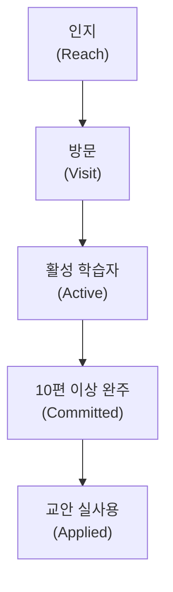

# SOM 1년차 분석 보고서 — 경제 판단력 교과서 프로젝트

**분석일**: 2026. 04. 24.
**대상 기간**: 프로젝트 본격 시작 시점부터 12개월 (Stage 0 + Stage 1 + Stage 2 초입)
**선행 문서**: 『SAM 심화분석』, 『Market Segment Map』, 『Q1 심화세분화』, 『페르소나 스펙트럼』
**핵심 세그먼트**: Q1 각성 초심자 전체 (Q1-A·B·C·D)

---

## 0. 핵심 요약

| 항목 | 수치 |
|---|---|
| Strict SAM (전체 기간 기준) | 약 300~450만 명 |
| Early SAM (MVP 대상) | 약 100~200만 명 |
| **1년차 현실적 SOM (방문자 기준)** | **약 3~7만 명** |
| **1년차 현실적 SOM (활성 학습자 기준)** | **약 3천~1만 명** |
| **1년차 현실적 SOM (완주 학습자 기준)** | **약 300~1천 명** |
| **1년차 교사 모드 SOM (교안 실사용 기준)** | **약 20~50명** |

> **주의**: 위 수치는 1년차 **점유 가능 범위의 현실적 추정**이며, 원칙 2(무료)에 따라 수익 개념이 아님. 이 보고서의 SOM은 『만나게 될 사람의 규모』와 『그중 실체로 작동하는 관계의 규모』를 구분해서 제시함.

---

## 1. 1년차 SOM을 산정할 때의 전제

### 1.1 무료 프로젝트의 SOM은 '수익'이 아니라 '접점'으로 측정

전통적 SOM은 시장 점유율 × 매출로 환산되지만, 본 프로젝트는 과금하지 않습니다. 따라서 SOM을 네 층의 깔때기로 재정의합니다.

각 층은 규모가 급격히 줄어들며, **의미 있는 SOM은 C층 이하**입니다. 인지·방문 숫자는 도달 지표일 뿐 관계의 증거가 되지 못합니다.

### 1.2 1년차의 물리적 제약

- **완결 시점 미정이므로 105편 전체 제작이 1년 내 이뤄지지 않음.** Stage 1 파일럿에서 10편, Stage 2 초입에 추가 30~50편 수준의 제작이 현실적 한계.
- **콘텐츠 공급량이 SOM의 상한을 결정.** 50편 내외의 콘텐츠로는 아무리 유입이 많아도 관계가 깊어질 여지가 제한적.
- **단일 제작자 의존 리스크(KSF 4).** 페이스 가드레일이 1년차 SOM의 하한을 결정.

### 1.3 1년차는 '규모 시즌'이 아닌 '검증 시즌'

본 프로젝트의 원칙 3(『속도보다 신뢰』)과 기획서 v0.2의 Stage Exit 기준 구조는 1년차를 **규모 확장 시즌이 아니라 실체 검증 시즌**으로 정의합니다. 따라서 SOM의 의미는 '많이 만난 사람의 수'가 아니라 '관계가 실제로 성립한 사람의 수'입니다.

---

## 2. 1년차 SOM 산정 — 깔때기 층위별

### 2.1 L1 · 인지 (Reach)

**정의**: 프로젝트의 존재를 한 번이라도 접한 사람.

**산정 방식**
- 유튜브: 50편 × 평균 노출수. 초기 채널의 알고리즘 노출은 편당 500~3,000 impression 수준이 일반적. 본 프로젝트는 후킹 콘텐츠가 아니므로 하한선에 가까움.
- SaaS 방문 유도: 영상 설명란·교사 커뮤니티·뉴스레터 · 지인 전파.
- 1년차 인지 도달 추정: **약 5~20만 명**.

**해석**: 이 층은 SOM의 의미가 약합니다. '한 번 지나간 사람'일 뿐 관계가 아닙니다.

### 2.2 L2 · 방문 (Visit)

**정의**: SaaS 페이지에 1회 이상 진입. 익명 방문 포함.

**산정 방식**
- 인지 → 방문 전환율은 무료 콘텐츠 서비스 일반적 기준 10~25%.
- 유튜브 → SaaS 이동은 End Card·설명란 링크를 통해서 발생. 전환율은 경험적으로 5~15%.
- **1년차 방문 추정: 약 3~7만 명.**

**해석**: 유의미하지만, 방문자 대다수는 10초 내 이탈할 가능성이 큽니다. 이 숫자로 성공을 선언하지 않습니다.

### 2.3 L3 · 활성 학습자 (Active)

**정의**: 영상 1편 이상 시청 완료 + OX 체크 1회 이상 수행. 익명에서 식별 가능한 사용자로 전환.

**산정 방식**
- 방문 → 활성 전환율은 무료 학습 SaaS의 경험상 **5~15%**. 본 프로젝트는 진입 장벽이 낮고(로그인 없이 영상 시청 가능), OX 체크가 가볍기 때문에 중간값 가정 가능.
- **1년차 활성 학습자 추정: 약 3천~1만 명.**

**해석**: SOM의 현실적 중심점. Stage 1 파일럿의 KPI(이해 전환율)가 실제로 측정되는 층입니다.

### 2.4 L4 · 완주 학습자 (Committed)

**정의**: 10편 이상 누적 시청 + OX 완료. 스탬프 맵 10자리 이상 채움.

**산정 방식**
- 활성 → 완주 전환율은 무료 온라인 학습의 구조적 한계로 **약 10%**. 유료 강의 플랫폼의 평균 완주율(약 3~7%)보다는 높되, 본 프로젝트의 "체감 변화가 10편 내에 와야 한다"는 설계 가정에 부합해야 함.
- **1년차 완주 학습자 추정: 약 300~1,000명.**

**해석**: **이 숫자가 1년차 SOM의 진짜 기준점**입니다. 관계가 실체로 성립한 사람의 규모이며, 기획서의 행동 KPI(스탬프 맵 진도율·체감 변화)가 의미 있게 측정됩니다.

### 2.5 L5 · 교안 실사용 (Applied)

**정의**: 교안 다운로드 + 실제 수업·스터디 사용 후기 회신.

**산정 방식**
- 1년차에 교사 모드에 진입하는 다운로드 규모는 현실적으로 **수백 명 수준**.
- 다운로드 → 실사용 후기 회신 전환율은 무료 B2B 자료 기준 **5~15%** 수준.
- **1년차 교안 실사용 교사 추정: 약 20~50명.**

**해석**: 숫자는 작지만 질적으로 매우 중요한 층. 기획서 v0.2의 Stage 1 Exit 기준(『교사 3명 이상 실사용』)을 충족하고도 남는 수준.

---

## 3. 1년차 SOM 종합표

| 층위 | 정의 | 추정 규모 | 전체 SAM 대비 |
|---|---|---|---|
| L1 · 인지 | 프로젝트 존재 접촉 | 약 5~20만 명 | Strict SAM의 1.5~5% |
| L2 · 방문 | SaaS 페이지 1회 진입 | 약 3~7만 명 | Strict SAM의 1~2% |
| **L3 · 활성 학습자** | **영상 1편+ OX 1회** | **약 3천~1만 명** | **Early SAM의 0.15~1%** |
| **L4 · 완주 학습자** | **10편+ 완료, 스탬프 10자리** | **약 300~1천 명** | **Early SAM의 0.015~0.1%** |
| L5 · 교안 실사용 | 교사 후기 회신 | 약 20~50명 | 교사 TAM(20만)의 0.01~0.025% |

---

## 4. 핵심 페르소나별 SOM 구성 추정

1년차 완주 학습자 약 300~1,000명 안에서 페르소나 5인의 분포를 추정합니다. 이는 확정이 아니라 **Stage 1 파일럿에서 모집·검증해야 할 타깃 분포**입니다.

| 페르소나 | Q1 내 비중 | 1년차 완주 학습자 내 목표 비중 | 조정 이유 |
|---|---|---|---|
| **Core 1·2 박지훈·이수민 (Q1-A)** | Q1의 30~35% | **50~60%** | 시간 창이 가장 급박. Stage 1 주 타깃. |
| **Core 3 정해민 (Q1-B)** | Q1의 30~35% | 15~20% | 주제별 진입 선호가 원칙 5와 긴장. 과대 유입 피함. |
| **Core 4 한정숙 (Q1-C)** | Q1의 15~20% | 5~10% | UI 접근성 검증 역할. 소수라도 질적 검증이 중요. |
| **Core 5 윤가을 (Q1-D)** | Q1의 15~20% | 15~20% | 장기 완주 잠재력. 1년 내 검증 가능. |
| 확장·극단 | — | 5% 내외 | 교사·스터디 리더 등 자연 유입분. |

**추정 절대 규모 (중간값 600명 기준)**
- Q1-A: 약 300~360명
- Q1-B: 약 90~120명
- Q1-C: 약 30~60명
- Q1-D: 약 90~120명
- 확장·극단: 약 30명

---

## 5. SOM 산정의 경쟁·시장 압력 요인

### 5.1 압력 요인이 하한을 끌어내리는 경우

- **유튜브 알고리즘 열위** (KSF 2): 후킹 콘텐츠를 쓰지 않으므로 노출이 제한적. 1년차 L1·L2 규모의 하한이 낮아질 수 있음.
- **AI 대체재 침투 가속** (5 Forces): Q1-A의 일부가 본 프로젝트를 발견하기 전에 AI 습관으로 굳어질 위험.
- **단일 제작자 페이스 리스크** (KSF 4): 2개월 연속 재작업 3건 초과 시 페이스 하향 → 콘텐츠 공급량 감소 → SOM 상한 하락.

### 5.2 요인이 상한을 끌어올릴 수 있는 경우

- **SaaS 직접 유입 경로 조기 확보** (KSF 2 달성 시): 교사 커뮤니티·뉴스레터·인디스쿨 등에서 자발 유입이 확보되면 유튜브 의존도 낮아지고 L3 상한이 상승.
- **초기 완주자의 유기적 전파** (기획서 행동 KPI): 한 명의 완주자가 친구·가족·스터디원에게 공유하는 배수 효과. 낮게 잡아도 1인당 2~3명 접촉.
- **Q1-D(장기 교양층)의 노트 공유 문화**: 옵시디언·Notion·블로그에서의 자발 언급이 SEO 효과를 만듦.

---

## 6. 1년차 SOM 목표선 — 두 가지 시나리오

### 6.1 보수 시나리오 (원칙 3 엄격 적용)

- 콘텐츠 제작 페이스: 주 1~1.5편. 1년차 누적 약 40~60편.
- L1 인지: 5만 명
- L2 방문: 3만 명
- **L3 활성 학습자: 3,000명**
- **L4 완주 학습자: 약 300명**
- L5 교안 실사용: 약 20명

**이 시나리오의 의미**: 원칙 3을 지키며 무리 없이 도달 가능한 수치. Stage 1 Exit 기준을 충족하고도 남음.

### 6.2 순조 시나리오 (KSF 1·2 모두 초기 작동)

- 콘텐츠 제작 페이스: 주 2편 내외. 1년차 누적 약 80~100편.
- L1 인지: 20만 명
- L2 방문: 7만 명
- **L3 활성 학습자: 1만 명**
- **L4 완주 학습자: 약 1,000명**
- L5 교안 실사용: 약 50명

**이 시나리오의 의미**: 본 프로젝트의 차별점이 의도대로 작동할 때의 상한. 여전히 유료 SaaS의 1년차 기준으로는 매우 작은 규모이지만, **무료 공공 인프라의 건강한 1년차 지표로는 충분히 의미 있음**.

### 6.3 시나리오 비교

| 지표 | 보수 | 순조 |
|---|---|---|
| 1년차 누적 콘텐츠 | 40~60편 | 80~100편 |
| 완주 학습자 | 약 300명 | 약 1,000명 |
| 교안 실사용 교사 | 약 20명 | 약 50명 |
| Stage 2 진입 가능성 | 조건부 충족 | 명확히 충족 |

---

## 7. 1년차 SOM 성공 판정 기준 (권고)

수치 KPI 단독이 아닌 **복합 판정**을 권고합니다.

1. **L4 완주 학습자 300명 이상** (보수 시나리오의 하한 도달).
2. **Q1-A 완주 학습자 150명 이상** (주 타깃에서의 실체 확인).
3. **교안 실사용 교사 20명 이상, 그중 재사용 의사 표명 10명 이상**.
4. **행동 KPI 세 축의 최소 한 축에서 긍정 신호**
   - 이해 전환율(OX 완료율) 60% 이상, 또는
   - 체감 변화 응답("경제가 덜 두려워졌다") 60% 이상, 또는
   - 유기적 전파("친구에게 공유했다") 30% 이상.

네 가지 중 **세 가지 이상 충족 시 1년차 성공**으로 판정하며, 이는 Stage 2 본제작 진입의 근거가 됩니다.

---

## 8. 1년차에 집중하지 말아야 할 것

SOM 산정에서 중요한 것은 `무엇을 잡을 것인가`만큼이나 `무엇을 놓아줄 것인가`입니다.

- **인지·방문 숫자로 성과 판단하지 않음**: 차근차근으로는 유튜브 상위 노출이 어렵고, 이를 강제로 올리려 하면 원칙 1·3·Non-Goals를 모두 침범.
- **Q1-B·C·D에 과도한 자원 배분하지 않음**: 1년차에는 Q1-A를 중심으로. 다른 세그먼트는 자연 유입분만 수용.
- **Q2 숙련 학습자·Q3 수동적 지식층 타깃팅하지 않음**: 1년차 SOM에서 제외. 장기 논의.
- **Non 3(유료 콘텐츠 신봉자) 대응하지 않음**: 원칙 2와 영구 충돌. 시간 누적으로만 돌파.
- **수익화 논의 배제**: 1년차는 수익 구조 논의가 있어서는 안 됨. 원칙 2 유지.

---

## 9. 1년차 SOM이 드러내는 구조적 진실

**이 프로젝트의 1년차 SOM은 유료 SaaS 기준으로는 매우 작습니다.** 완주 학습자 300~1,000명, 교사 20~50명은 민간 기업의 1년차 KPI로 보면 실패로 분류될 규모입니다. 그러나 이 프로젝트는 그 비교 기준이 잘못된 종목입니다.

- **EBS 수준의 공공 인프라 궤적**과 비교해야 합니다. EBS 대표 경제 콘텐츠도 1년차에 수천~수만 시청자 수준에서 시작해 10년 단위로 수백만 명 누적으로 확장되었습니다.
- **원칙 3(속도보다 신뢰)을 지킨 결과의 수치**입니다. 1년차에 수만 명을 만나려면 후킹·알고리즘 최적화·유료 광고 중 하나를 반드시 동원해야 하고, 이는 Non-Goals를 직접 위배합니다.
- **SOM 수치가 작다는 사실은 전략 실패가 아니라 포지션의 증거**입니다. 차근차근 체계적·무료로 완주 학습자 300명을 만드는 것은, 후킹으로 10만 명을 스쳐 보내는 것보다 어렵고 의미 있는 일입니다.

1년차 성공의 의미는 **"작은 규모의 실체 있는 관계"가 성립했는지**이며, 이것이 2년차 이후의 확장을 지지하는 기반이 됩니다.

---

## 부록 A. 산정 방식의 한계

1. **깔때기 전환율은 유사 무료 SaaS의 경험적 범위**를 사용. 본 프로젝트 고유 데이터가 없으므로 Stage 1 파일럿 실측으로 교정 필요.
2. **유튜브 알고리즘 노출 범위**는 채널 초기 성장 패턴의 평균적 가정이며, 실제는 큰 분산 존재.
3. **"1년차"의 기준점**을 프로젝트 본격 시작 시점으로 설정. Stage 0 설계 기간 3~4개월을 포함했으므로 실제 콘텐츠 공급 기간은 8~9개월로 해석.
4. **페르소나별 목표 비중은 Stage 1 모집 설계를 위한 가정**이며, 실제 유입 분포는 다를 수 있음.

## 부록 B. 이 SOM 수치의 활용

- **기획서 수정에 직접 반영 가능 수준은 §7의 성공 판정 기준**입니다. Stage 1 Exit 기준에 병합하는 방안을 검토해볼 가치가 있습니다.
- **보수·순조 시나리오 대비**를 6개월 시점에 중간 점검으로 활용 가능. 어느 시나리오에 수렴하는지 조기에 파악.
- **1년차 수치가 충족되지 못하는 경우의 대응**은 별도 문서(회고·재설계 프로토콜)에서 다룰 영역이며, 본 보고서 범위 밖입니다.
