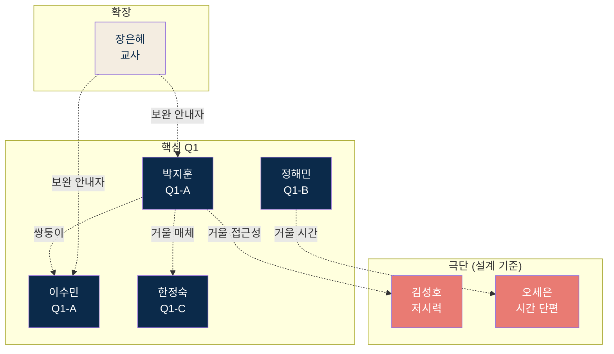

# 경제 판단력 교과서 · MVP PRD v0.5 (최종)

**대상 범위**: Stage 1 파일럿 (콘텐츠 10~25편 · 학습자 모드 + 교사 모드 동시)

- **Owner**: 창업가 본인 (단일 제작자 체제, 외주 편집·디자인 병행)
- **최종 업데이트**: 2026-04-24
- **기반 리서치**: `06_ValuePropositionSheet_v2` 외 선행 문서 15종
- **영구 배제**: 과금·구독·페이월·후킹·PPL·데이터 판매 (원칙 2·3·Non-Goals)

---

## 변경 이력

- **v0.4 → v0.5 (2026-04-24, 최종)**
  - 요건표 기준 최종 검토 반영. MSCW 완결성 보완.
  - §4 Must Have·Should Have에 **선행 의존 컬럼 추가** (기능 간 구현 선후 관계 명시).
  - §4 Could Have에 **예상 공수 컬럼 추가** (1스프린트 내 구현 가능성 검증).
  - §4 Could Have "옵시디언/Notion 연동" → **Won't Have 이관** (2~3 스프린트 추정, Could 기준 초과).
  - §4 Won't Have "교사용 추가 안내문·사용 가이드" 근거 보강 (JTBD M4·원칙 5 정합성으로 재기술).

- **v0.3 → v0.4 (2026-04-24)**
  - 문서 전략 변경 — **단일 지식창구**. ADR 5건 외부 참조 방식 폐기 → §7.4 본문 내 직접 포함.
  - ADR-001 법인 형태: 개인사업자 유지 확정 (법인 설립 없음).
  - ADR-002 저작권 라이선스: CC BY-NC-SA 4.0 확정 (등록 시점은 추후).
  - ADR-003 원칙 5 수용 범위: "부분 공개 금지" 폐기 · 순서 유지 + 사용자 자율 존중.
  - ADR-004 기술 스택: PRD 범위 밖. SRS 영역으로 이관 (개발 파트너 확보 후 별도 논의).
  - ADR-005 영상 호스팅: 유튜브 단독 · SaaS는 임베디드 제공. 이중화·백업 불필요 (유튜브 = 수익 자산).
  - §2.3 스탬프 맵 의미 재정의 반영 — "여정의 감각" → "본인 학습 궤적 기록".
  - §3 Story 3 AC2 삭제 (유튜브 외부 알고리즘 차단 요구 폐기). AC 번호 재매김.
  - §4 Should Have "관련 레슨 묶음 추천" 항목 제거 (ADR-003으로 불필요해짐).
  - §4 Won't Have에 "영상 호스팅 이중화·백업" 추가 (ADR-005 결정 반영).

- **v0.2 → v0.3 (2026-04-24)**: 10번 검토 반영. 미니 수정 3건.

- **v0.1 → v0.2 (2026-04-24)**: 08번 품질 리뷰 반영. 네거티브 AC 10건 신규, 에러 예산·Severity 체계 도입, 실험 통계 설계 명시.

---

## 1. 개요·목표

### 1.1 문제 정의 (Pain + 실패 KPI)

본 MVP가 공략하는 Pain은 AOS×DOS 매트릭스 Q1 혁신기회 7개 중 DOS 3.0 이상 3개가 1순위, 2.0~2.9 4개가 2순위입니다.

**1순위 Pain (MVP 핵심)**

| Pain ID | Pain | 페르소나 | DOS | 실패 KPI |
|---|---|---|---|---|
| **P1** | 체계감 부재 ("점은 찍혀도 선이 안 그어짐") | 박지훈 | 3.80 | 유튜브·AI 학습자의 10편 이상 누적 학습 도달 비율 < 5% (추정, Stage 1 4주 실측) |
| **P5** | 깊이·접근성 공백 ("무겁거나 얕거나") | 이수민 | 3.80 | 경제 입문서 독자 50페이지 이탈률 > 60% |
| **P14** | 학생 자기학습 경로 부재 | 장은혜 | 3.40 | 교사 1차시당 자료 수집·편집 시간 ≥ 120분 |

**2순위 Pain**

| Pain ID | Pain | DOS | 실패 KPI |
|---|---|---|---|
| P4 | 신뢰 기준 부재 | 2.70 | 후킹 톤 1회 감지 시 영구 이탈률 > 80% (이수민 유형) |
| P7 | 판단 기준 부재 | 2.40 | Q1-B 학습자 마감 후 유지율 < 10% |
| P13 | 수업 준비 부담 | 2.40 | 교사 주당 자료 제작 2~4시간 |
| P16 | 세션 단편화 | 2.10 | 5~10분 이상 연속 학습 불가 세그먼트 비율 > 40% |

### 1.2 목표 (Desired Outcome)

**북극성 Outcome**: Stage 1 파일럿 12개월 내 완주 학습자(L4) 300~1,000명 + 교사 재사용 의사 10명 이상.

| Outcome | 기준선 | 12개월 목표 |
|---|---|---|
| 완주 학습자 (10편+, 스탬프 10자리+) | 0명 | 보수 300 / 순조 1,000 |
| Q1-A 완주 학습자 | 0명 | ≥ 150 |
| 교안 실사용 교사 | 0명 | 20~50 |
| 교사 재사용 의사 표명 | 0명 | ≥ 10 |
| 체감 변화 응답률 (DOS 3.0+ Pain 2개 이상) | Stage 1 4주 확정 | ≥ 60% |

### 1.3 성공 지표 (북극성 + 보조 KPI)

**북극성 KPI**

| 항목 | 값 |
|---|---|
| 지표명 | L4 완주 학습자 수 (10편+ 누적 시청 + OX 완료 + 스탬프 10자리+) |
| 기준선 | 0명 (신규 런칭) |
| 12개월 목표 | 보수 300 / 순조 1,000 |
| 측정 이벤트 | `lesson.completed` + `ox.passed` + `stamp.earned` 3종 동시 충족 |
| 데이터 소스 | `lesson_progress` + `stamp` 테이블 조인 |
| 계산식 | `COUNT(DISTINCT user_id) WHERE stamp_count >= 10` |
| 측정 주기 | 일간 집계 · 주간 리뷰 · 분기 공개 |
| 판정 기준 | 12개월 시점 ≥ 300명 = Stage 1 통과. 미달 시 Stage 2 진입 보류. |

**보조 KPI (7개)**

| KPI | 기준선 | 목표 | 측정 이벤트 | 데이터 소스 | 계산식 | 주기 |
|---|---|---|---|---|---|---|
| 이해 전환율 (OX 완료율) | Stage 1 4주 후 확정 | ≥ 60% | `video.watched_full` → `ox.submitted` | `lesson_progress` | `COUNT(ox_completed=true) / COUNT(video_completed=true)` | 주간 |
| 스탬프 맵 진도율 (10편+ 활성 대비) | Stage 1 4주 후 확정 | ≥ 10% | `stamp.earned` 10회+ | `stamp` | `COUNT(DISTINCT user_id WHERE stamps>=10) / COUNT(DISTINCT active_user)` | 월간 |
| 체감 변화 응답률 | N/A | ≥ 60% | `survey.submitted` + `answer.positive` | `survey_response` | 『덜 두렵다』 응답 / 전체 응답 | 분기 |
| 유기적 전파율 | N/A | ≥ 30% | `share.clicked` OR 설문 추천 경험 | `share_event` + `survey_response` | (공유 or 추천) 사용자 수 / 완주자 수 | 월간 |
| 교안 실사용률 | N/A | ≥ 5% | `teacher_feedback.used_in_class=true` | `teacher_feedback` | 실사용 후기 / 다운로드 수 | 월간 |
| 교사 재사용 의사 수 | 0 | ≥ 10 | `teacher_feedback.will_reuse=true` 누적 | `teacher_feedback` | COUNT | 분기 |
| 접근성 체크리스트 충족률 | 0% | 100% | Stage 0 종료 시 자동화 테스트 | axe-core CI 리포트 | 통과 항목 / 전체 항목 | 빌드별 |

**측정 규정**
- 모든 KPI는 `event_log` 테이블에 `timestamp, user_id, event_name, payload_json` 구조로 기록.
- Stage 1 첫 4주는 **기준선 확정 기간**으로 목표 달성 여부 판정하지 않음.
- 주간 대시보드에 **목표 대비 달성률(%) + 주차별 추세선** 병기.

---

## 2. 사용자와 페르소나

### 2.1 핵심 4인 (Stage 1 직접 타깃)

| 페르소나 | 프로필 | 핵심 Pain 실제 언어 | CJM 이탈 지점 |
|---|---|---|---|
| **박지훈** | 27세 개발자 · Q1-A | "점은 찍히는데 선이 안 그어져요" | S2 🔴 / S3 🟡 |
| **이수민** | 29세 마케터 · Q1-A | "빠른 수익 약속이 방아쇠예요" | S2·S3 🔴🔴 / S4·S5 🟢 |
| **정해민** | 41세 과장 · Q1-B | "열 명이 열 명 다 다른 말 해요" | S3 🔴 / S5 🔴 |
| **한정숙** | 58세 퇴직 · Q1-C | "유튜브 빠르고 책 어렵고 중간이 없다" | S3 UI 🟠 / S4·S5 🟢 |

### 2.2 확장 페르소나

| 페르소나 | 역할 | MVP 기여 |
|---|---|---|
| **장은혜** (36세 교사) | 교사 모드 1차 타깃 | P14·P13 (DOS 3.40) |
| **김성호** (52세 저시력) | 접근성 설계 기준 | Stage 0 체크리스트 |
| **오세은** (33세 육아휴직) | 세션 단편화 설계 | NP3 재개 위치 저장 |

**제외 페르소나**: 서하윤(Non-user, DOS 2.00) · Q2 숙련 학습자 · Q3 수동적 지식층.

### 2.3 페르소나 관계 구조 + 스탬프 맵 의미 재정의

**페르소나 관계**



**설계 휴리스틱**: 박지훈·이수민·김성호·오세은 4명을 만족시키면 나머지 페르소나 Pain 80% 자동 해결 (Persona Spectrum Map 결론).

**스탬프 맵 의미 재정의 (v0.4)**

ADR-003에서 "부분 공개 금지"를 폐기함에 따라, 스탬프 맵의 의미가 다음과 같이 재정의됩니다.

| 구분 | 기존 (v0.3까지) | 현재 (v0.4) |
|---|---|---|
| 역할 | 105편 순서대로 채워지는 여정의 감각 | 본인이 학습한 레슨의 궤적 기록 |
| 순서 강제 | 있음 ("부분 공개 금지") | 없음 (자율 선택 허용) |
| 인지 장치 기능 | 유지 | 유지 |
| 수집 욕구로의 전용 | Non-Goal | Non-Goal (유지) |

박지훈 페르소나의 "선이 그어지는 감각" Pain은 여전히 해결되나, 이제 그 선은 **본인이 선택한 경로**로 그어집니다.

---

## 3. 사용자 스토리와 수용 기준 (AC)

### Story 1 · 박지훈 (P1 체계감)

**Story**: As a 27세 직장인 박지훈, I want 학습한 레슨이 한눈에 보이기, so that "내가 뭘 배웠는지" 감각을 얻는다.

**G-W-T**
- **Given** 학습자가 SaaS에 로그인된 상태
- **When** 임의 레슨을 시청 완료하고 OX 체크를 통과
- **Then** 진주 스탬프 맵에 해당 레슨 위치가 즉시 채워지고, 누적 학습 수가 표시된다

**AC (Positive 4 + Negative 2 = 총 6개)**

| # | 분류 | AC | 측정 임계치 · 검증 방법 |
|---|---|---|---|
| AC1 | ✅ Positive | 스탬프 렌더링 응답 | 시청 완료 이벤트 발행 → 클라이언트 시각 반영까지 **p95 ≤ 500ms**. 부하 테스트 도구 k6로 동시 사용자 100명 기준 측정. |
| AC2 | ✅ Positive | OX 완료 → 진도 반영 실패율 | **< 0.5%**. 프로덕션 로그에서 `ox.submitted` 대비 `progress.updated` 미반영 비율, 일간 집계. |
| AC3 | ✅ Positive | 10편 완주 시점 체감 변화 응답률 | **≥ 60%**. 스탬프 10자리 달성 시 자동 발송 설문, 응답 중 『덜 두렵다』 비율. |
| AC4 | ✅ Positive | 스탬프 맵 진입 체류 시간 | **15초 ~ 60초**. 60초 초과 = 수집 욕구 전용 의심 → 설계 재검토 트리거. |
| AC5 | ❌ Negative | **네트워크 단절 복원** | 시청 중 오프라인 전환 시 **로컬 10초 간격 큐잉 → 재연결 시 30초 내 서버 동기화 완료**. 손실 이벤트 < 0.1%. |
| AC6 | ❌ Negative | **중복 OX 제출 방지** | 동일 사용자·동일 레슨의 OX 제출이 **5초 내 재전송 시 서버가 멱등 처리 (중복 스탬프 발급 0건)**. |

---

### Story 2 · 이수민 (P5 깊이 공백 + P4 신뢰)

**Story**: As a 29세 투자 실패 회복 중인 마케터 이수민, I want 첫 30초에 후킹 없는 진중한 톤과 깊이 있는 접근이 증명되기를, so that 또 이탈하지 않고 여정에 몸을 맡길 수 있다.

**G-W-T**
- **Given** 이수민이 채널·SaaS 랜딩·영상 도입부 어느 접점에 도달한 상태
- **When** 첫 30초 내 도입부·채널 소개문·설명란 중 어느 하나라도 읽거나 들음
- **Then** "후킹 없음" 신호(숫자 약속 0회·자극어 0회·수익 언급 0회)와 "깊이 있음" 신호(개념 정의 1회 이상·한국 맥락 예시 1개)가 동시에 전달된다

**AC (Positive 4 + Negative 2 = 총 6개)**

| # | 분류 | AC | 측정 임계치 · 검증 방법 |
|---|---|---|---|
| AC1 | ✅ Positive | 썸네일·제목 자극어 출현 | **0회**. 배포 파이프라인 내 금지어 린터(정규식 + LLM 2차 검증) 통과율 **100%**. |
| AC2 | ✅ Positive | 영상 도입부 30초 개념 정의 포함 | **100%**. 편집 QA 체크리스트 항목. 실패 시 배포 차단. |
| AC3 | ✅ Positive | 이수민 유형 첫 영상 완시청률 | **≥ 60%**. 온보딩 설문 "최근 투자 손실 경험 있음" 응답자 세그먼트 기준. |
| AC4 | ✅ Positive | S2→S3 전환율 (랜딩→첫 영상 완시청) | **≥ 20%**. GA4 또는 오픈소스 분석기의 퍼널 리포트. |
| AC5 | ❌ Negative | **A/B 실험 트래픽 누수 방지** | 후킹 도입부 테스트 변형 트래픽은 **이수민 유형 세그먼트 유입 차단** (유입 시도 로그 + 자동 필터링). |
| AC6 | ❌ Negative | **린터 우회 시도 감지** | 금지어 린터 통과했으나 사용자 리포트 "과장됨" 비율 **> 5%** 시 해당 편 게시 중단 + 린터 규칙 업데이트 트리거. |

---

### Story 3 · 장은혜 (P14 학생 경로 + P13 수업 준비)

**Story**: As a 중학교 사회 교사 장은혜, I want 영상+교안+OX가 단일 패키지로 정렬된 무료 자료와 QR 코드를, so that 수업 준비 시간을 주당 2~4시간에서 30분 이하로 줄인다.

**G-W-T**
- **Given** 장은혜가 교사 모드 페이지에서 특정 레슨 ID를 조회
- **When** 교안 PDF 다운로드 버튼을 클릭
- **Then** 영상 링크·QR 코드·OX 문항·개정 이력이 포함된 **단일 PDF** 1개가 제공된다

**AC (Positive 4 + Negative 2 = 총 6개)**

v0.4 변경: 구 AC2(유튜브 외부 알고리즘 차단 요구)는 **삭제**되었습니다. ADR-005에 따라 유튜브는 수익 창출 자산이며, 외부 알고리즘 차단은 PRD 범위 밖입니다. AC 번호는 재매김되었습니다.

| # | 분류 | AC | 측정 임계치 · 검증 방법 |
|---|---|---|---|
| AC1 | ✅ Positive | 교안 PDF 생성·다운로드 응답 | 클릭 → 파일 수신 **p95 ≤ 2초** (k6 부하 테스트, 동시 50명). |
| AC2 | ✅ Positive | 교사 수업 준비 시간 절감 | 파일럿 교사 자기 보고 기준 **평균 ≥ 60분 절감** (사전-사후 설문, n≥10). |
| AC3 | ✅ Positive | 개정 이력 명기 | PDF 1페이지에 **출처·갱신일 100% 포함**. CI 단계 PDF 자동 검증. |
| AC4 | ✅ Positive | 교사 재사용 의사 | Stage 1 종료 시 **≥ 10명**. `teacher_feedback.will_reuse=true` 누적. |
| AC5 | ❌ Negative | **구버전 PDF 접근 차단** | 개정된 레슨의 구버전 PDF URL 접근 시 **301 리디렉트 → 최신 버전**. 구버전 직접 노출 0건. |
| AC6 | ❌ Negative | **PDF 생성 실패 대응** | PDF 생성 서버 오류 시 **최신 캐시 버전 제공 + 에러 로그**. 완전 실패율 **< 1%**. |

---

### Story 4 · 오세은 (P16 세션 단편화 + NP3 재개 위치)

**Story**: As a 33세 육아휴직 오세은, I want 5~10분 단위로 끊어서 보고 다시 돌아와도 자동 재개되는 학습 경험을, so that 수유 중·통근 중 단편 시간이 누적 학습으로 이어진다.

**G-W-T**
- **Given** 오세은이 임의 레슨을 시청 중 이탈 (앱 닫기·네트워크 단절·브라우저 종료)
- **When** 동일 계정·기기 조합으로 재진입
- **Then** 직전 시청 위치(초 단위)와 OX 진행 상태가 자동 복원된다

**AC (Positive 4 + Negative 2 = 총 6개)**

| # | 분류 | AC | 측정 임계치 · 검증 방법 |
|---|---|---|---|
| AC1 | ✅ Positive | 재생 위치 저장 주기 | **≤ 10초 간격** 백엔드 저장. 로그 샘플링으로 주기 검증. |
| AC2 | ✅ Positive | 재개 시 복원 정확도 | 마지막 저장 대비 **오차 ≤ 5초**. QA 자동화 시나리오 100회 실행 시 실패 < 2건. |
| AC3 | ✅ Positive | 소리 없는 환경 이해 가능성 | 자막 기본 ON + 차트·수치 자막 완결 **100%**. 편집 QA 체크리스트. |
| AC4 | ✅ Positive | 단편 세션 학습자 완주율 | 세션당 평균 < 8분 학습자 10편 완주율 **≥ 8%**. |
| AC5 | ❌ Negative | **다기기 동시 진입 충돌** | 동일 계정 2기기 동시 재생 시 **최종 저장 기준 Last-Write-Wins + 사용자 알림 배너** 노출. |
| AC6 | ❌ Negative | **저장 실패 복구** | 서버 500 오류 시 **로컬 IndexedDB 큐잉 → 재연결 시 1분 내 동기화**. 데이터 유실 < 0.1%. |

---

### Story 5 · 한정숙 (매체 선택권 + 접근성)

**Story**: As a 58세 퇴직 한정숙, I want 영상 외에 글과 큰 글씨 버전을 함께 이용, so that 디지털 UI 속도에 치이지 않고 내 페이스로 학습한다.

**G-W-T**
- **Given** 한정숙이 임의 레슨 페이지에 진입
- **When** "글로 읽기" 또는 "큰 글씨" 토글을 선택
- **Then** 동일 레슨 ID의 스크립트 전문이 표시되고, 글자 크기·색 대비가 WCAG AA를 충족한다

**AC (Positive 4 + Negative 2 = 총 6개)**

| # | 분류 | AC | 측정 임계치 · 검증 방법 |
|---|---|---|---|
| AC1 | ✅ Positive | 매체 전환 응답 시간 | **p95 ≤ 300ms**. Lighthouse + Real User Monitoring 측정. |
| AC2 | ✅ Positive | 색 대비비 | **≥ 4.5:1** (WCAG AA). axe-core CI 통과율 100%. |
| AC3 | ✅ Positive | 자막 일시정지 유지 | **100%**. 자동화 E2E 테스트 (Playwright). |
| AC4 | ✅ Positive | 글자 크기 조절 | **14px ~ 28px 단계 조절**. UI 회귀 테스트. |
| AC5 | ❌ Negative | **확대 상태에서 레이아웃 깨짐 방지** | 글자 28px + 브라우저 확대 200% 조합에서 **가로 스크롤 발생 = 0**. |
| AC6 | ❌ Negative | **스크린 리더 순서 오류 감지** | 스크린 리더 읽기 순서 자동 검증 (NVDA + axe) 실패 시 **배포 차단**. |

---

## 4. 기능 요구사항 (MoSCoW)

우선순위 근거: **AOS×DOS 매트릭스 Q1 혁신기회 7개 Pain 대응 + JTBD 7명제 검증 결과 + 대체재 Firing 이유 직접 차단**.

### Must Have (Stage 1 런칭 필수)

| 기능 | 근거 Pain·DOS | 대체재 대비 가치 | 선행 의존 |
|---|---|---|---|
| **105편 커리큘럼 체계 + 고유 레슨 ID** | P1 (3.80) · 원칙 5 | ChatGPT·유튜브 대비 **완결 구조** | LESSON 스키마, 콘텐츠 제작 파이프라인 |
| **진주 스탬프 맵 (학습 궤적 기록)** | P1 · 여정 층위 | 유튜브 시청 기록 대비 **구조적 진도 가시화** | 레슨 ID 체계, LESSON_PROGRESS·STAMP 스키마, 인증, OX 체크(스탬프 트리거) |
| **OX 체크 + 오답 스크립트 자동 스크롤** | 인지·판단 층위 | AI 즉답 대비 **자기 학습 확인 루프** | OX_QUESTION 스키마, 스크립트 앵커 ID, LESSON.script |
| **영상·글(스크립트)·교안 PDF 3매체 단일 원전** | P5 · P11 · 원칙 4 | 경제학원론(책만) · 유튜브(영상만) 대비 **매체 선택권** | LESSON 필드 3종(youtube_video_id·script·pdf_kit_url), PDF 생성 서버 |
| **교사 모드 · 교안 PDF 단일 버전 + QR + 개정 이력** | P14 (3.40) · P13 · M4 검증 | 인디스쿨 자작 자료 대비 **검증된 단일 원전** | 레슨 ID, 3매체, TEACHER_KIT 스키마, QR 생성, 개정 이력 자동 삽입 |
| **재개 위치 저장 (NP3)** | P16 · 오세은 | 숏폼 대비 **누적형 설계** | LESSON_PROGRESS.last_position_sec, 인증, /api/progress/save |
| **접근성 기본** (WCAG AA 색 대비 · 자막 · 글자 크기 조절) | P15 · 김성호 · 한정숙 | 경제 콘텐츠 시장 최초의 **포함 신호** | 독립 (Stage 0 Exit 100% 요건) |
| **후킹 금지 린팅** | P4 · P6 · 이수민 | 경쟁사 대비 **톤 일관성 보증** | CI 파이프라인, 금지어 사전(정규식 + LLM 2차 검증) |

### Should Have (Stage 1 후반 ~ Stage 2 초입)

| 기능 | 근거 | 선행 의존 |
|---|---|---|
| **SaaS 직접 유입 뉴스레터** | KSF 2 (유튜브 외 유입 경로) | 외부 이메일 SaaS, USER.email, 사용자 등록 |
| **교사 실사용 사례 공개 페이지** | KSF 3 (교사 신뢰 자본) | 교사 모드, TEACHER_FEEDBACK 3개월 이상 누적 |

v0.4 변경: 구 Should Have "관련 레슨 묶음 추천"은 **제거**되었습니다. ADR-003에서 "부분 공개 금지"를 폐기하면서 학습자가 직접 자유롭게 레슨을 선택할 수 있게 되었으므로, 추천 시스템이 불필요해졌습니다.

### Could Have (Stage 2~3 검토)

| 기능 | 근거 | 선행 의존 | 예상 공수 |
|---|---|---|---|
| **오프라인 교안 묶음 발송** (한정숙·장한석) | 접근성 확장 | 교안 PDF, 발송 운영 프로세스 | 0.5~1 스프린트 |
| **스탬프 맵 URL 공유** | 유기적 전파 KPI | 스탬프 맵, 공유 토큰 시스템 | 1 스프린트 |

v0.5 변경: 구 Could Have "옵시디언/Notion 연동"은 예상 공수 2~3 스프린트로 추정되어 Could 기준(1스프린트 내 구현 가능)을 초과합니다. **Won't Have로 이관**되었습니다.

### Won't Have (영구 배제)

| 배제 항목 | 이유 |
|---|---|
| 구독형 페이월·유료 프리미엄 | 원칙 2 직접 위반 |
| 댓글·커뮤니티·포럼 | Non-Goals 명시 |
| 자극적 썸네일·후킹 제목 | 원칙 3 · 이수민 Firing 재현 위험 |
| AI 자유 생성 답변 | 원칙 1 위반 (이해 대신 즉답) |
| 게임화 (배지·랭킹·레벨업) | 스탬프 맵이 보상이 아닌 인지 장치임을 희석 |
| 금융 상품 광고 · PPL | 원칙 3 · P4 재현 |
| 학습자 데이터 판매 | 윤리 · 프라이버시 |
| **영상 호스팅 이중화·자체 CDN·백업 요건** | ADR-005 결정 — 유튜브 = 수익 자산 |
| **교사용 추가 안내문·사용 가이드** | 교사 모드 Scope는 단일 PDF 교안 제공으로 종료. 추가 안내문·사용 가이드는 JTBD M4(교사 관점 강점 = 검증된 단일 원전)와 원칙 5("1편=1교안=1장")를 희석할 위험. 교사의 수업 재구성 자율성이 인디스쿨 대비 차별 가치. |
| **옵시디언/Notion 연동** (Q1-D 장기 교양층) | 예상 공수 2~3 스프린트로 Could 기준(1스프린트 내 구현) 초과. Stage 3 이후 재검토 가능하나 Stage 1~2 범위에서는 배제. 읽기 전용 export 분할안도 Q1-D 수요 실측 이전 단계에서는 비용 대비 효용 불명확. |

---

## 5. 비기능 요구사항 (NFR)

### 5.1 성능

| 지표 | 목표 |
|---|---|
| 영상 재생 시작 p95 | **≤ 2초** (유튜브 임베디드 기준) |
| SaaS 페이지 초기 렌더 p95 | **≤ 1.5초** (LCP 기준) |
| 스탬프 렌더링 p95 | **≤ 500ms** (Story 1 AC1) |
| 교안 PDF 생성·다운로드 p95 | **≤ 2초** (Story 3 AC1) |
| 매체 전환 (영상 ↔ 글) p95 | **≤ 300ms** (Story 5 AC1) |
| 재생 위치 저장 주기 | **≤ 10초 간격** (Story 4 AC1) |

### 5.2 신뢰성 + 에러 예산

| 지표 | 목표 | 에러 예산 (월간) |
|---|---|---|
| 월 가용성 | ≥ 99.5% | 월 **최대 216분** 다운타임 허용 |
| 핵심 플로 오류율 (로그인·시청·OX·스탬프·교안 다운로드) | ≤ 0.5% | 월 **최대 5,000건** 오류 허용 (MAU 100만 기준) |
| OX → 진도 반영 실패 | ≤ 0.5% | 동일 |
| 재개 위치 복원 실패 | ≤ 1% | 동일 |
| RPO | ≤ 24시간 | (학습 진도 데이터 복구 시점 목표) |
| RTO | ≤ 4시간 | (SaaS 복구 시간 목표) |

**에러 예산 소진 정책**
- 월간 예산 **80% 소진** 시: 신규 기능 출시 검토 단계로 전환.
- **100% 소진** 시: 신규 기능 출시 동결 + 안정성 스프린트 전환.
- 다음 달 1일 예산 리셋.

**v0.4 주의**: 본 NFR은 **SaaS 인프라** 대상입니다. 영상 호스팅(유튜브) 가용성은 유튜브 플랫폼 책임이며 본 프로젝트 SLO 대상 아닙니다.

### 5.3 보안·개인정보

- 학습자 PII 최소 수집 원칙: 이메일 + 닉네임만 필수. 성명·연락처·소득 등 수집 금지.
- 결제 정보 수집 없음 (원칙 2).
- 모든 학습 로그 개인 식별 해제(pseudonymization) 상태로 분석.
- CC BY-NC-SA 4.0 기본 적용 (ADR-002, 등록 시점 추후).
- 비밀번호 저장: bcrypt 이상 단방향 해시.
- 외부 폰트·스크립트 CDN 최소화 (개인정보 보호 관점).

### 5.4 비용

| 항목 | 연간 상한 |
|---|---|
| 서버·CDN·DB | **연 300~1,000만원** (월 25~80만원) |
| 외부 도구 구독 | **월 ≤ 30만원** (편집·디자인·모니터링 합산) |
| 신규 기능 추가 시 | 월 운영비 증가 **≤ 10%** 내에서 승인 |

영상 호스팅 비용: 유튜브 단독 사용으로 **0원** (ADR-005).

### 5.5 모니터링 — Severity 체계 + SLA

| Severity | 조건 | 알림 채널 | 대응 SLA |
|---|---|---|---|
| **Sev1 (Critical)** | 가용성 < 99.0% 또는 핵심 플로 오류율 > 2% 또는 데이터 손실 발생 | 즉시 푸시 + SMS + 이메일 | **15분 내 응답, 1시간 내 완화 시작** |
| **Sev2 (High)** | p95 임계치 20% 초과 또는 오류율 > 1% | 푸시 + 이메일 | **1시간 내 응답, 4시간 내 조치** |
| **Sev3 (Medium)** | KPI 주간 목표 20% 이상 미달 또는 에러 예산 80% 소진 | 대시보드 + 주간 리뷰 | **24시간 내 리뷰 회의** |

**알림 대상**
- Sev1: 창업자 본인 + 백업 연락처
- Sev2~3: 창업자 본인

**대시보드 구성**
1. 북극성 KPI 추세선 (일간·주간·월간)
2. 보조 KPI 7개 목표 대비 달성률
3. 에러 예산 소진도
4. Severity 이벤트 타임라인 (최근 30일)
5. 접근성 체크리스트 CI 상태

**로그 보관**: 서버 로그 중앙 집계 · 14일 이상. 이벤트 로그(`event_log` 테이블) 90일 이상.

### 5.6 접근성 체크리스트 (Stage 0 Exit 100% 필수)

- [ ] 색 대비비 ≥ 4.5:1 (WCAG AA)
- [ ] 모든 영상 자막 기본 ON
- [ ] 자막 일시정지 시 유지
- [ ] 글자 크기 14~28px 조절
- [ ] 키보드 탐색 100% 가능
- [ ] 스크린 리더 레이블 완성
- [ ] 영상 내 차트·수치는 음성 내레이션 + 자막 동시 포함
- [ ] "글로 읽기" 대체 경로 100% 제공

---

## 6. 데이터·인터페이스 개요

### 6.1 핵심 엔터티

```mermaid
erDiagram
    USER ||--o{ LESSON_PROGRESS : tracks
    USER ||--o{ STAMP : earns
    USER ||--o{ SURVEY_RESPONSE : submits
    LESSON ||--o{ LESSON_PROGRESS : referenced_by
    LESSON ||--o{ STAMP : produces
    LESSON ||--o{ TEACHER_KIT : linked_to
    LESSON ||--o{ OX_QUESTION : contains
    MODULE ||--o{ LESSON : groups
    TEACHER ||--o{ TEACHER_KIT_DOWNLOAD : downloads
    TEACHER ||--o{ TEACHER_FEEDBACK : submits

    USER {
        uuid id PK
        string email UNIQUE
        string nickname
        enum role "learner or teacher"
        bool accessibility_mode
        string media_preference "video or text or mixed"
        timestamp created_at
    }

    LESSON {
        string lesson_id PK "ex L001"
        string module_id FK
        int order_in_module
        string title
        string youtube_video_id
        text script
        string pdf_kit_url
        date revision_last_updated
        string revision_notes
    }

    LESSON_PROGRESS {
        uuid id PK
        uuid user_id FK
        string lesson_id FK
        int last_position_sec
        bool ox_completed
        bool stamp_earned
        timestamp updated_at
    }

    STAMP {
        uuid id PK
        uuid user_id FK
        string lesson_id FK
        timestamp earned_at
    }

    TEACHER_KIT {
        string lesson_id PK FK
        int pages
        string revision_log_page_url
    }

    TEACHER_FEEDBACK {
        uuid id PK
        uuid teacher_id FK
        string lesson_id FK
        bool used_in_class
        bool will_reuse
        text comment
        date reported_at
    }

    SURVEY_RESPONSE {
        uuid id PK
        uuid user_id FK
        string survey_id
        json answers
        timestamp submitted_at
    }
```

### 6.2 주요 필드 및 제약

**LESSON**
- `lesson_id`: 문자열 포맷 `L001` ~ `L105`. 원칙 5 준수 — 고유·불변.
- `youtube_video_id`: 유튜브 영상 ID. SaaS에서 임베디드로 재생 (ADR-005).
- `pdf_kit_url`: 원칙 5 준수 — 레슨 1개당 **단일 PDF**만 존재.
- `revision_last_updated`: 날짜 필수. PDF 1페이지에 반드시 명기 (Story 3 AC3).

**LESSON_PROGRESS**
- `last_position_sec`: 재생 위치. 10초 간격 저장 (Story 4 AC1).
- `ox_completed`: OX 전체 문항 통과 여부. 부분 통과는 저장하되 stamp_earned는 false 유지.

**TEACHER_FEEDBACK**
- `will_reuse`: 교사 재사용 의사 지표 (북극성 KPI 연결).

### 6.3 API 개요 (내부)

| 엔드포인트 | 메서드 | 입력 | 출력 | 제약 |
|---|---|---|---|---|
| `/api/lesson/{id}` | GET | `lesson_id` | 유튜브 영상 ID·스크립트·PDF URL·개정이력 | 인증 선택 (미로그인 시 스탬프 기록 안됨) |
| `/api/progress/save` | POST | `lesson_id`, `position_sec` | `{ok: bool}` | 10초 간격 내 요청은 병합 |
| `/api/ox/submit` | POST | `lesson_id`, `answers[]` | `{passed, stamp_earned, scroll_to_section}` | 오답 시 스크립트 문단 앵커 반환, 5초 내 재전송 멱등 처리 (Story 1 AC6) |
| `/api/stamp/map` | GET | `user_id` | 학습한 레슨 배열 | 캐시 1분 |
| `/api/teacher/kit/{id}` | GET | `lesson_id` | PDF 파일 (인라인) | 구버전 URL은 301 리디렉트 (Story 3 AC5) |
| `/api/teacher/feedback` | POST | `lesson_id`, `will_reuse`, `comment` | `{ok}` | 인증 필수 |
| `/api/survey/submit` | POST | `survey_id`, `answers{}` | `{ok}` | 분기 1회 제한 |

### 6.4 외부 의존

- **영상 호스팅**: 유튜브 단독 (ADR-005). SaaS에서는 유튜브 임베디드 플레이어로 재생.
- **이메일 발송**: 뉴스레터·설문 (외부 SaaS 1개)
- **분석**: 오픈소스 분석 도구 (프라이버시 우선, 추적기 최소화)
- **PDF 생성**: 서버 사이드 생성 (템플릿 기반, 개정 이력 자동 삽입)

---

## 7. 범위 (In/Out), 리스크·가정·의존성

### 7.1 In Scope (Stage 1 범위)

- 콘텐츠 10~25편 (M1·M2 초입)
- 학습자 모드 + 교사 모드 동시 런칭
- 영상·글(스크립트)·교안 PDF 3매체
- 진주 스탬프 맵 (학습 궤적 기록 용도) · OX 체크 · 재개 위치 저장
- 접근성 기본 세트 (WCAG AA)
- 후킹 금지 린팅
- 북극성·보조 KPI 대시보드

### 7.2 Out of Scope (Stage 1 배제)

- 105편 전편 제작 (Stage 2~3 이후)
- 종이책 출간 (완결 후)
- 댓글·커뮤니티·포럼
- 모바일 앱 (웹 반응형으로 대체)
- 다국어 (한국어 전용)
- 게임화 요소
- Q2·Q3·Q4 세그먼트 타겟팅
- 수익 모델·과금 (원칙 2 유지)
- **영상 호스팅 이중화·백업 시스템** (ADR-005)
- **SaaS 기술 스택 결정** (SRS 영역, ADR-004)

### 7.3 리스크

| # | 리스크 | 영향 | 완화책 |
|---|---|---|---|
| R1 | **유튜브 알고리즘 열위** (후킹 없어 노출 부족) | 인지·방문 단계 SOM 하한 이탈 | 뉴스레터·교사 커뮤니티 등 비알고리즘 유입 경로 조기 확보 (KSF 2) |
| R2 | **생성형 AI 침투 가속** (개별 질문 시장 완전 잠식) | P1·P5 Pain의 Satisfaction 상승 → DOS 하락 | 『체계적 여정』 포지션의 외부 언어화 강화 (KSF 5) |
| R3 | **단일 제작자 페이스 붕괴** (번아웃·품질 저하) | 공급량 부족 → 완주 학습자 경로 단절 | 레슨 템플릿 문서화·외주 편집 시스템화 (KSF 4), 2개월 연속 재작업 3건 초과 시 페이스 하향 |
| R4 | ~~Q1-B 학습자 원칙 5 충돌로 이탈~~ | **ADR-003으로 구조적 해소** | "부분 공개 금지" 폐기로 자율 선택 허용. 리스크 대폭 완화. |
| R5 | 교사 모드 실사용 전환율 < 5% | KSF 3 미달 → 교사 모드 동시 런칭 정당성 흔들림 | 인디스쿨·교사 커뮤니티에 교안 샘플 배포, 초기 5명 파일럿 그룹 확보 |
| R6 | 접근성 체크리스트 미충족 | 김성호 유형 이탈 + 브랜드 『포함 신호』 훼손 | Stage 0 Exit 기준에 100% 필수 |
| R7 | 재정 지속가능성 확보 실패 | Stage 2 진입 전 프로젝트 중단 | 자체 자본 2~3년치 확보 + 개인 후원 채널 Stage 1 내 런칭 |

### 7.4 가정·의존성

**가정**
- G1. 창업자가 Stage 1 기간(12개월) 동안 전담 가능한 시간·자원 확보.
- G2. 스크리닝 통과 파일럿 교사 5명 이상 자발 참여 가능.
- G3. 학습자 SOM 깔때기 전환율이 유사 무료 SaaS 경험 범위와 크게 괴리되지 않음.
- G4. 유튜브·SaaS 복수 채널 병행 운영의 외주 편집 파트너 확보 가능.

**의존성 · 구조 결정 기록**

본 프로젝트는 **단일 지식창구 전략**에 따라 구조 결정을 별도 ADR 파일로 관리하지 않고 본 PRD §7.4 내에 직접 기록합니다. 모든 결정은 본 섹션이 단일 출처(single source of truth)입니다.

---

#### ADR-001 법인 형태 (확정)

**배경**: 무료 공공 인프라 성격의 프로젝트. 법인 설립 시 사업 리스크·운영 부담·회계 복잡도 증가. 단일 제작자 체제에서 법인 관리 공수가 콘텐츠 제작 페이스(KSF 4)를 저해할 가능성.

**결정**: 법인 설립 없음. **개인사업자 체제로 Stage 1 운영**.

**결과**:
- 기부금 영수증 발급 불가 · 세제 혜택 없음 수용.
- 재정 지속가능성은 개인 후원·라이선스·종이책 등 개인사업자 레벨에서 가능한 수익 통로 중심으로 설계 (VPS v2 §10 참조).
- Stage 2 이후 프로젝트 규모 확대 시 재검토 가능하나, Stage 1 범위에서는 논외.

---

#### ADR-002 저작권 라이선스 (확정)

**배경**: 무료 공공 인프라 성격 + 장기 라이선스 수익 가능성. 공교육·비영리 자유 이용을 허용하되 영리 이용은 통제 필요.

**결정**: **CC BY-NC-SA 4.0** (Creative Commons 저작자표시-비영리-동일조건변경허락 4.0 국제). 저작권 공식 등록 시점은 추후 결정.

**결과**:
- 공교육·개인·비영리 자유 이용 가능.
- 영리 이용은 별도 라이선스 계약 필요 (라이선스 수익 가능성 유지).
- 파생 저작물은 동일 라이선스 조건으로 재공개 (SA 조건).
- 등록 시점 미확정 상태에서도 라이선스 명시로 권리 보호 가능.

---

#### ADR-003 원칙 5 수용 범위 (확정)

**배경**: Q1-B(정해민·박건우) 페르소나가 "부분 공개 금지" 원칙과 구조적으로 충돌. "지금 필요한 주제(부동산·금리·세금)만 먼저 보고 싶다"는 요구가 JTBD 인터뷰 M7 검증에서 **학습자 관점의 장벽**으로 확인됨. 동시에 교사(장은혜) 관점에서는 "부분 공개 금지"가 오히려 강점으로 작동.

**결정**:
- **"부분 공개 금지" 조항 폐기**.
- "1편 = 1교안 = 1장" 구조는 유지 (원칙 5의 본질).
- 순서 강제 제거. **사용자 자율 선택 허용**.
- 권장 경로는 순서대로이지만, 건너뛰기·역순·부분 소비 모두 허용.

**결과**:
- 스탬프 맵 의미 재정의: "순서대로 채워지는 여정의 감각" → "본인이 학습한 레슨의 궤적 기록" (§2.3 참조).
- Q1-B 세그먼트 20% 이탈 리스크 완화 → R4 하향 조정.
- KSF 1(체계적 완결성) 일부 약화 수용. "체계는 제공하되 소비는 자율"이라는 성숙한 포지션으로 재정의.
- Should Have "관련 레슨 묶음 추천" 기능 불필요해짐 (§4에서 제거).

---

#### ADR-004 SaaS 기술 스택 (PRD 범위 밖)

**배경**: 기술 스택(웹 프레임워크·DB·CDN) 선정은 구현 상세 영역이며, §5 NFR 임계치를 만족하는 선에서 개발 파트너와의 공동 결정이 자연스러움.

**결정**: **PRD 범위에서 제외. SRS(Software Requirements Specification) 영역으로 이관**.

**결과**:
- 본 PRD는 기술 스택에 대한 결정을 포함하지 않음.
- 개발 파트너 확보 시점에 별도 논의.
- PRD §5 NFR의 성능·신뢰성·비용 임계치가 기술 스택 선택의 제약 조건으로 작동.
- 단일 지식창구 원칙과 배치되지 않음 — 기술 스택은 원래 PRD 책임 영역이 아니므로 단일 문서의 완결성을 해치지 않음.

---

#### ADR-005 영상 호스팅 (확정)

**배경**: 영상 발견성·수익성과 플랫폼 의존성의 균형. 5 Forces 분석에서 유튜브 의존을 공급자 교섭력 리스크로 식별한 바 있으나, 프로젝트 수익 모델 관점에서 유튜브는 **발견 경로이자 수익 창출 통로**로 재분류.

**결정**:
- **유튜브 단독 업로드**. 자체 CDN 이중화 없음.
- SaaS에서는 **유튜브 임베디드 플레이어**로 영상 재생.
- 백업·이중화·복구 계획 **PRD 범위에서 배제**.

**결과**:
- 유튜브는 본 프로젝트의 수익 창출 자산으로 유지.
- 영상 호스팅 비용 0원.
- 유튜브 외부 알고리즘 노출(연관 영상 추천 등)은 통제하지 않음 — 이는 Stage 1 본질이 아님.
- Story 3 AC2(외부 알고리즘 차단 요구) 삭제됨.
- Should Have에 "영상 이중화" 관련 항목 없음. Won't Have에 명시적 배제 추가.
- Stage 2 이후 트래픽·비용·플랫폼 정책 변화가 발생할 경우 재검토 가능하나, Stage 1 범위에서는 논외.

---

## 8. 실험·롤아웃·측정

### 8.1 베타 채널

| 단계 | 기간 | 대상 | 목표 |
|---|---|---|---|
| **Alpha · 비공개 테스트** | Stage 0 마지막 2주 | 창업자 지인 5명 + 교사 3명 | 핵심 플로 오류·접근성 체크리스트 검증 |
| **Closed Beta** | Stage 1 초기 1~2개월 | 스크리닝 통과 학습자 50명 + 교사 10명 | AC 충족 여부·재개 위치 저장 안정성 실측 |
| **Public Pilot** | Stage 1 잔여 기간 | 자발 유입 전체 (유튜브·뉴스레터) | 북극성 KPI 도달 검증 |

### 8.2 실험 가설 · 측정 · 성공 기준 (통계 설계 포함)

| 실험 ID | 가설 | 설계 | 통계 파라미터 | 성공 기준 |
|---|---|---|---|---|
| **EXP-1** | 스탬프 맵 노출이 10편 완주율 ≥ 2배 | A/B (스탬프 노출 vs 숨김) | α=0.05 · Power 0.8 · 최소 탐지 효과 2배 · 필요 표본 그룹당 n=250, 총 n≥500 · 카이제곱 검정 | A군 완주율이 B군 대비 **2배 이상 + p-value < 0.05** |
| **EXP-2** | 후킹 없는 도입부가 이수민 유형 완시청률 ≥ 60% | 페르소나 매칭 설문 후 유형별 전수 관찰 | 단일 그룹 비율 검정 · α=0.05 · n≥200 · 95% CI 하한 ≥ 55% | 완시청률 **≥ 60%** |
| **EXP-3** | 재개 위치 저장이 단편 세션 완주율 유지 | 단편 그룹(세션<8분) vs 전체 비교 | 비율 비교 검정 · α=0.05 · Power 0.8 · 허용 격차 2pp | 단편 그룹 완주율 **≥ 8%** |
| **EXP-4** | "글로 읽기" 전환이 한정숙 유형 완주율 향상 | 매체 선호 설문 매칭 후 코호트 관찰 | 단일 비율 검정 · α=0.05 · n≥100 | 전환 사용자 완주율 **≥ 15%** |

v0.4 변경: 구 EXP-4(교안 QR이 학생 알고리즘 이탈 방지)는 **삭제**되었습니다. ADR-005에 따라 유튜브 외부 알고리즘 노출은 통제 대상이 아닙니다. EXP 번호 재매김되었습니다.

**추가 규정**
- 모든 실험은 사전에 **사전등록(pre-registration)** 문서 작성 — 가설·통계 설계·분석 기법·중단 기준 고정.
- 실험 데이터는 **통계 분석 자동화 스크립트**로 산출 (재현 가능성 확보).
- 효과 크기 확인 전 조기 중단 금지 (peeking 방지).

### 8.3 경쟁 대안 벤치마크 (기준선 확정 정책)

| 비교 대상 | 비교 지표 | 본 프로젝트 목표 | 기준선 확정 방법 |
|---|---|---|---|
| ChatGPT 경제 학습 세션 | 10편 상당 누적 학습률 | ≥ 10% | Stage 1 첫 4주 데이터로 기준선 확정 |
| 경제학원론 (맨큐) | 50페이지 이탈률 환산 | ≤ 50% | 파일럿 참가자 사전 설문 + 본 프로젝트 실측 |
| 경제 유튜브 | 10편 이상 누적 시청자 비율 | ≥ 10% | 파일럿 참가자 이용 이력 설문 |
| 유료 강의 완강률 | 완강률 | ≥ 10% | 공개 통계 (업계 평균 3~7%) + Stage 1 실측 |
| EBS 교사 실사용 후기 | 후기 회신율 | ≥ 5% | Stage 1 첫 4주 실측값을 기준선 |

**핵심 정책**
- "추정" 값은 **성공 기준의 근거로 사용하지 않는다**.
- 모든 비교 수치는 Stage 1 첫 4주 실측 또는 공식 통계 인용 중 하나로만 제시.
- 추정값을 불가피하게 사용할 때는 **(추정, 검증 예정)** 태그 명시.

**차별 가치 수치 요약**

| 차원 | 기존 대안 평균 | 본 프로젝트 목표 | 개선폭 | 출처·검증 시점 |
|---|---|---|---|---|
| 완강률 | 3~7% (유료 강의) | ≥ 10% | 약 1.5~3배 ↑ | Coursera 공개 리포트 + 내부 실측 |
| 교사 수업 준비 시간 | 120~240분/차시 | ≤ 60분/차시 절감 | 50~75% ↓ | 파일럿 교사 사전 설문 (n≥10) |
| 월 비용 | 유료 강의 2~10만원 | 0원 | 100% ↓ | 클래스101·패스트캠퍼스 공시 가격 |
| 10편 누적 학습자 비율 | (추정, 검증 예정) | ≥ 10% | 파일럿 실측 확정 | Stage 1 첫 4주 실측 후 확정 |

---

## 9. 근거 (Proof)

### 9.1 인터뷰 (JTBD 시뮬레이션 보고서)

- 21건 합성 인터뷰 중 유효 20건
- 핵심 언어 맵 8종 (P1·P4·P5·P7·P13·P14·P15·P16)
- 7명제 검증: M1·M2·M3·M4·M6 ✅ / M5 부분 검증 / M7 분기 검증 (학습자에겐 장벽, 교사에겐 강점 → **ADR-003으로 구조적 해소**)
- 신규 Pain 후보 3종: NP1 사회적 부끄러움 / NP2 AI 번역기 격하 / NP3 재개 위치 저장
- **한계**: 합성 시뮬레이션. 실제 1:1 인터뷰 시 가설 수정 필요.

### 9.2 로그·메트릭 (Stage 1 파일럿에서 수집 예정)

| 데이터 원천 | 수집 지표 |
|---|---|
| SaaS 이벤트 로그 | 시청 시작·완료·OX 응답·스탬프 생성·재개 이벤트 |
| 뉴스레터 플랫폼 | 구독자 수·오픈율·클릭률 |
| 교안 다운로드 로그 | 레슨별 다운로드 수·교사 식별 여부 |
| 분기 설문 | 체감 변화 응답률·유기적 전파 응답 |

### 9.3 벤치마크

- **Khan Academy**: 글로벌 1억 8천만+ 등록 사용자, 2023년 약 1.07억 달러 기부 수익 — 무료 교육 인프라가 기부 모델로 지속가능함을 입증
- **EBS**: 연 매출 2,500억원 규모 — 공공성 기반 다각화 수익 구조
- **경제배움e+ (KDI/기재부)**: 정부 예산 운영 무료 경제교육 플랫폼

### 9.4 리서치 (통합 분석 문서)

| 문서 | 핵심 수치 |
|---|---|
| 5 Forces 분석 | 대체재 위협 매우 강함 (5중 유일 최고 등급) |
| KSF Top 5 | 체계·SaaS 유입·교사 증거·제작 시스템화·포지션 언어화 |
| TAM 분석 | 상단 TAM 4,100만 / 중단 2,000만 / Strict SAM 300~450만 / Early SAM 100~200만 |
| SOM 1년차 분석 | L4 완주 보수 300명 / 순조 1,000명 |
| AOS 분석 | AOS 4.00 Pain 4개 (P1·P5·P14·P18) |
| DOS 분석 | DOS 3.80 Pain 2개 (P1·P5) / DOS 3.40 Pain 1개 (P14) |
| AOS×DOS 매트릭스 | Q1 혁신기회 7개 = MVP 집중 영역 |

### 9.5 공식 통계 (KPI 근거 매핑)

| 통계 | 수치 | 근거가 되는 KPI·임계치 |
|---|---|---|
| 2024 전국민 금융이해력 조사 (한은·금감원) | 성인 65.7점, 20대·저소득 취약 | Q1-A 타깃 규모 (북극성 KPI 300~1,000명의 분모) |
| 2023 전 국민 경제이해력 조사 (기재부) | 평균 60점 미달, 교육수준 간 19.8점 격차 | 미션 정합성 보조 지표 |
| 2024 교육기본통계 (교육부) | 20,480개교·학생 568만명 | 교사 실사용 KPI (≥20명) 분모 |
| 2023 이러닝 산업 실태조사 (소프트웨어정책연구소) | 5조 5,946억원 | 대체 지출 시장 규모 (경쟁 벤치마크 근거) |
| 2023 문체부 독서율 | 성인 43%, 20대 78.1% | 박지훈 페르소나 텍스트 친화성 근거 |

### 9.6 원칙-DOS 1:1 대응 수치 증명

| 원칙 | 대응 Q1 Pain | DOS 합계 |
|---|---|---|
| 원칙 1 (이해가 먼저) | P5, P7 | 6.20 |
| 원칙 3 (속도보다 신뢰) | P4 | 2.70 |
| 원칙 4 (3매체 유기체) | P1, P16 | 5.90 |
| **원칙 5 (1편=1교안=1장)** | **P1, P14** | **7.20 (최상위)** |

**원칙 5가 DOS 합계 최상위(7.20)** · 교사 모드 동시 런칭 결정의 정량 근거.

v0.4 주석: ADR-003에서 원칙 5의 "부분 공개 금지" 조항을 폐기했으나, "1편=1교안=1장" 구조는 유지되므로 본 표의 근거 관계는 변함없음.

---

## 부록 · 변경 관리

- 본 PRD는 **v0.4 (최종)**이며, Stage 1 파일럿 데이터로 분기 단위 개정.
- 개정 시점: Stage 1 파일럿 첫 3개월 후·6개월 후·12개월 완료 시점.
- 변경 이력은 본 문서 상단 『변경 이력』 섹션에 작성일·변경 항목 요약으로 기록.
- 원칙 1·2·3·4·5 중 본 PRD는 **원칙 5의 "부분 공개 금지" 조항 폐기**를 포함합니다 (ADR-003). 원칙 5의 본질("1편=1교안=1장")은 유지됩니다.
- 원칙 1·2·3·4 및 Non-Goals는 **변경 불가 항목**이며, 수정 시 별도 기획서 v0.3 승격 필요.
