# Software Requirements Specification (SRS)
Document ID: SRS-001
Revision: 0.9 (MVP Implementation Edition)
Origin: Based on `SRS_경제판단력교과서_v1.4.md` + `MVP-개발목표-적절성-종합-검토(난이도_가능성_효율성)-보고서.md` Part VI 수정 지시 전수 반영
Date: 2026-04-25
Standard: ISO/IEC/IEEE 29148:2018

**Project**: 경제 판단력 교과서 · MVP (Stage 1 파일럿)
**Source of Truth**: `PRD_경제판단력교과서_Final.md` (v0.5, 2026-04-24)
**Prepared by**: Senior Requirements Engineer

---

## 1. Introduction

### 1.1 Purpose

본 SRS는 PRD v0.5에 정의된 『경제 판단력 교과서 MVP』의 Stage 1 파일럿(콘텐츠 10~25편 · 학습자 모드 + 교사 모드 동시 런칭) 범위에 대해, 기능·비기능·인터페이스·데이터 요구사항을 완전하고 테스트 가능하며 추적 가능한 형태로 정의한다.

본 문서가 해결하는 Pain은 PRD §1.1의 1순위 3건(P1 체계감 부재 / P5 깊이·접근성 공백 / P14 학생 자기학습 경로 부재)과 2순위 4건(P4·P7·P13·P16)이다. 본 SRS는 해당 Pain의 해소를 위한 시스템 요구사항의 구현·검증 기준을 명시한다.

**본 Revision 0.9 (MVP Implementation Edition)의 성격**: v1.4의 "완성형 목표 사양" 을 유지하되, 각 요구사항에 **MVP 라벨** (✅ MVP-IN / 🟡 MVP-SOFT / ⏸️ MVP-DEFER) 을 병기하고 **파일럿을 4구간으로 세분화**하여 3개월 개발 경험 + 바이브코딩 기반 단일 제작자가 Alpha 4주 내에 실제 구현 가능한 범위를 명확히 한다. 라벨 분류 근거는 `MVP-개발목표-적절성-종합-검토(난이도_가능성_효율성)-보고서.md` Appendix A·B에 수록.

### 1.2 Scope

#### 1.2.1 In-Scope (Stage 1)

| 항목 | 설명 |
|---|---|
| 콘텐츠 범위 | 105편 커리큘럼 중 M1·M2 초입 **10~25편** |
| 사용자 모드 | 학습자 모드 + 교사 모드 **동시 런칭** |
| 매체 구성 | 영상(유튜브 임베디드) · 글(스크립트) · 교안 PDF **3매체 단일 원전** |
| 핵심 기능 | 진주 스탬프 맵, OX 체크, 재개 위치 저장, 접근성 기본 세트(WCAG AA), 후킹 금지 린팅 |
| 운영 | 북극성·보조 KPI 대시보드, Severity 체계, 에러 예산 관리 |
| 플랫폼 | 웹 반응형 (한국어 단일) |
| 라이선스 | CC BY-NC-SA 4.0 (ADR-002) |

#### 1.2.2 Out-of-Scope (Stage 1 배제)

| 항목 | 배제 사유 |
|---|---|
| 105편 전편 제작 | Stage 2~3 이후 범위 |
| 종이책 출간 | 완결 후 진행 |
| 댓글·커뮤니티·포럼 | PRD Non-Goals |
| 네이티브 모바일 앱 | 웹 반응형으로 대체 |
| 다국어 | 한국어 전용 |
| 게임화 요소 (배지·랭킹·레벨) | 스탬프 맵이 보상이 아닌 인지 장치임을 희석 |
| Q2·Q3·Q4 세그먼트 타겟팅 | Q1 혁신기회 7개 집중 |
| 수익 모델·과금·구독·페이월 | 원칙 2 영구 배제 |
| PPL·데이터 판매 | 원칙 3 · 윤리 영구 배제 |
| 영상 호스팅 이중화·자체 CDN·백업 | ADR-005 (유튜브 단독) |
| 교사용 추가 안내문·사용 가이드 | JTBD M4 · 원칙 5 희석 위험 |
| 옵시디언/Notion 연동 | 공수 2~3 스프린트로 Could 기준 초과 |
| 관련 레슨 묶음 추천 | ADR-003으로 불필요 |
| SaaS 기술 스택 결정 | ADR-004 (개발 파트너 확보 후 별도) |

#### 1.2.3 Stage 1 파일럿 단계 정의 (4구간)

PRD v0.5 §8.1의 Alpha 2주·Closed Beta 1~2개월·Public Pilot 잔여 3단계를 4구간으로 재정의한다. 본 재정의는 PRD v0.6 승격 시 원천 문서 정합화 대상이다.

| 단계 | 기간 | 대상 | 구현 Story 범위 | Exit 게이트 |
|---|---|---|---|---|
| **Alpha** | 4주 | 창업자 + 지인 2~3명 | Story 1 (박지훈) + Story 4 축소 (오세은) | MVP-IN 38건 완료 · Story 1·4 E2E 1회 통과 · axe CI 통과 |
| **Private Beta** (신설) | 6주 | 지인 학습자 10~15 + 지인 교사 2~3 | + Story 3 (장은혜 교안 PDF) | Story 3 교안 PDF 단일 원전 제공 · 교사 재사용 의사 1건 이상 |
| **Closed Beta** | 8주 | 학습자 50 + 교사 10 | + Story 5 (한정숙) + Story 2 정규식 1차 | AC 수치 실측 완료 · 기준선 4주 확정 · Sentry Sev2 이상 0건 |
| **Public Pilot** | 잔여 ~34주 | 자발 유입 | + Story 2 Gemini 2차 + EXP-1~4 실험 + KPI 판정 + Sev SLA 엄격 | 북극성 KPI 300명 경로 확인 |

각 REQ는 §4.1/§4.2의 **MVP 라벨 컬럼** (✅ MVP-IN / 🟡 MVP-SOFT / ⏸️ MVP-DEFER) 에 따라 단계별 구현 시점이 결정된다. Alpha Exit 체크리스트는 §6.7 Appendix E 참조.

### 1.3 Definitions, Acronyms, Abbreviations

| 용어 | 정의 |
|---|---|
| **Stage 1 파일럿** | Stage 0 종료 후 12개월 운영 기간. 북극성 KPI 검증 구간. |
| **L4 완주 학습자** | 10편 이상 누적 시청 완료 + OX 통과 + 스탬프 10자리 이상 동시 충족 사용자. |
| **JTBD** (Jobs To Be Done) | 사용자가 완수하고자 하는 과업. PRD 9.1 참조. |
| **AOS** (Adjusted Opportunity Score) | 중요도 조정 후 기회 점수. |
| **DOS** (Discovered Opportunity Score) | 실제 인터뷰 발견 기반 기회 점수. |
| **Q1-A/B/C** | Q1 혁신기회 세그먼트. A=체계 갈구, B=특정 주제 선호, C=매체 선택권 요구. |
| **Validator** | 파일럿 교사 및 학습자 피드백 제공자. |
| **Pain** | 사용자가 겪는 구조적 문제. PRD §1.1의 P1~P18. |
| **북극성 KPI** | L4 완주 학습자 수. Stage 1 통과 판정의 단일 지표. |
| **보조 KPI** | 북극성 보완 7종(OX 완료율·스탬프 진도율·체감 변화·유기적 전파·교안 실사용률·교사 재사용·접근성). |
| **OX 체크** | 이해 확인 문항. 오답 시 스크립트 해당 문단으로 자동 스크롤. |
| **진주 스탬프 맵** | 학습자 궤적 시각화 UI. ADR-003 이후 순서 강제 없음. |
| **교안 PDF** | 레슨 1개당 단일 PDF. 영상 링크·QR·OX·개정 이력 포함. |
| **3매체 단일 원전** | 영상·글·PDF가 동일 lesson_id에 1:1:1로 대응(원칙 4·5). |
| **에러 예산** (Error Budget) | 월간 가용성·오류율 초과분의 허용 한도. |
| **Severity (Sev1~3)** | 장애 심각도 등급. 대응 SLA 연결. |
| **WCAG AA** | Web Content Accessibility Guidelines 2.x AA 준수 기준. |
| **RPO** (Recovery Point Objective) | 데이터 복구 시점 목표. |
| **RTO** (Recovery Time Objective) | 서비스 복구 시간 목표. |
| **p95** | 관측 분포 95번째 백분위수 지연. |
| **LCP** | Largest Contentful Paint. 웹 성능 지표. |
| **Last-Write-Wins (LWW)** | 다기기 충돌 시 최종 저장 우선 정책. |
| **ADR** (Architectural Decision Record) | 구조 결정 기록. PRD §7.4 본문 통합. |
| **CC BY-NC-SA 4.0** | Creative Commons 저작자표시-비영리-동일조건변경허락 4.0 국제. |
| **MVP-IN / MVP-SOFT / MVP-DEFER** | 본 Revision 0.9에서 신규 도입한 구현 범위 라벨 체계 (§1.2.3, §4.1, §4.2). |

### 1.4 References (REF-XX)

| ID | 문서 | 위치 · 비고 |
|---|---|---|
| REF-01 | PRD v0.5 (2026-04-24) | 본 SRS의 Source of Truth |
| REF-02 | 06_ValuePropositionSheet_v2 (VPS v2) | PRD §1.2 인용 |
| REF-03 | JTBD 시뮬레이션 보고서 (21건 합성 인터뷰) | PRD §9.1 |
| REF-04 | AOS×DOS 매트릭스 분석 | PRD §9.4 |
| REF-05 | 5 Forces · KSF · TAM · SOM 통합 분석 | PRD §9.4 |
| REF-06 | Persona Spectrum Map 결론 | PRD §2.3 |
| REF-07 | ADR-001 법인 형태 | PRD §7.4 |
| REF-08 | ADR-002 저작권 라이선스 (CC BY-NC-SA 4.0) | PRD §7.4 |
| REF-09 | ADR-003 원칙 5 수용 범위 | PRD §7.4 |
| REF-10 | ADR-004 SaaS 기술 스택 (범위 밖) | PRD §7.4 |
| REF-11 | ADR-005 영상 호스팅 (유튜브 단독) | PRD §7.4 |
| REF-12 | 2024 전국민 금융이해력 조사 (한은·금감원) | PRD §9.5 |
| REF-13 | 2023 전 국민 경제이해력 조사 (기재부) | PRD §9.5 |
| REF-14 | 2024 교육기본통계 (교육부) | PRD §9.5 |
| REF-15 | ISO/IEC/IEEE 29148:2018 | 본 SRS 준수 표준 |
| REF-16 | WCAG 2.x AA | 접근성 요구사항 근거 |
| REF-17 | axe-core / Lighthouse / Playwright / k6 | 검증 도구 체계 |
| REF-18 | MVP-개발목표-적절성-종합-검토(난이도_가능성_효율성)-보고서 | 본 Revision 0.9 라벨 병기·4구간 재정의 근거 |

### 1.5 Constraints

#### 1.5.1 Architectural Decision Records (ADR — PRD §7.4 통합)

| ADR | 결정 | SRS 영향 |
|---|---|---|
| ADR-001 | 개인사업자 체제 유지. 법인 설립 없음. | 결제·기부금 기능 구현 금지. PII 최소 수집 근거 강화. |
| ADR-002 | CC BY-NC-SA 4.0 라이선스. 등록 시점 추후. | 모든 배포물 라이선스 메타데이터 필수 포함 (REQ-FUNC-033 참조). |
| ADR-003 | 원칙 5 "부분 공개 금지" 폐기. 순서 강제 제거. | 스탬프 맵 자율 선택. 레슨 묶음 추천 기능 미구현. |
| ADR-004 | SaaS 기술 스택을 **Next.js App Router + Supabase + Vercel + Vercel AI SDK/Gemini** 단일 풀스택으로 확정 (§1.5.1.2). 멱등성은 §1.5.1.1 Option B(DB UNIQUE + 자연 멱등 키)로 확정. | §5 NFR 임계치가 스택 선정의 제약으로 작동하며, 본 스택이 해당 제약을 충족함을 §3.6, §4.2, §6.2에서 검증. |
| ADR-005 | 유튜브 단독 업로드. 자체 CDN·백업 없음. | SaaS SLO에 영상 가용성 제외. 외부 알고리즘 차단 요구 폐기. |

#### 1.5.1.1 ADR-004 Pending Decisions — 멱등성 보장 메커니즘 (결정: Option B)

**결정일**: 2026-04-25
**선택**: **Option B — DB UNIQUE 제약 + 자연 멱등 키**
**대체 고려 후 기각**: A(Idempotency-Key + 분산 캐시), C(행 잠금), D(이벤트 소싱), E(분산 락)

**결정 배경**: REQ-FUNC-006 · INV-05는 "동일 사용자·레슨에 대한 OX 제출이 5초 내 재수신되더라도 중복 스탬프 발급 0건"을 요구한다. §6.2.3 Class Diagram은 `OxSubmission` 도메인 서비스에 이 책임을 귀속시켰으나, 실제 구현에서 서비스 경계가 달라질 수 있으므로 **데이터 레이어에서 구조적으로 보장**하는 방식을 채택한다.

**결정 내용 (구현 규약)**:

1. §6.2.2 `Stamp` 테이블의 기존 제약 **`UNIQUE(user_id, lesson_id)`** 이 자연 멱등 키 역할을 한다 (INV-03 재사용).
2. `POST /api/ox/submit` 처리 시 `Stamp` INSERT가 UNIQUE 충돌을 일으키면, 애플리케이션은 이를 **정상 응답(200)으로 변환** 하고 동일한 `{passed, stamp_earned, scroll_to_section}` 페이로드를 반환한다.
3. `LessonProgress.stamp_earned = true` 상태에서 재수신된 동일 요청은 **DB 재쓰기 없이 즉시 동일 응답**을 반환한다 (read-only short-circuit).
4. 멱등 윈도우는 엄밀한 "5초"가 아닌 **영구(permanent) 멱등**으로 구현된다. INV-05의 본질(중복 발급 방지) 대비 더 강한 보장.

**수용한 리스크 및 트레이드오프**:

| 항목 | 영향 | 수용 근거 |
|---|---|---|
| 영구 멱등 | 동일 레슨 두 번째 정답 재제출은 항상 단일 스탬프 | INV-03의 본래 의도와 일치 |
| OX 문항 개정 시 과거 제출 재처리 불가 | 자동 재처리 경로 없음 | `revision_last_updated` 변경 시 **수동 감사 절차**를 운영 플레이북에 명시 |
| 5초 "윈도우" 시간성 포기 | 시간 기반 제어 부재 | 버튼 연타 방지 본질은 영구 멱등으로 동등 이상 충족 |
| 답안 일부 변경 재제출 | 첫 정답의 스탬프 유지 | 정책적 의도 동작 (재채점은 운영 절차로 처리) |

**비용·성능 영향**:
- 추가 인프라: **0개**
- 월 비용 증분: **0원** (CON-07 · REQ-NF-023 불변)
- p95 영향: 무시 가능 (DB 단일 INSERT 경로 · UNIQUE 인덱스 조회)
- 기술 스택 독립성: RDBMS 전제만 유지 (ADR-004 취지 부합)
- 단일 제작자 운영 부담: 최소 (CON-08 부합)

**Option A 이전 트리거 (모니터링 규칙)**:

다음 중 **어느 하나라도 2개월 연속 관측 시** Option A(Idempotency-Key + 분산 캐시)로 이전을 재검토한다.

- 월간 `Stamp` INSERT UNIQUE 충돌율 **> 0.5%** (비정상 재시도·봇 시그널)
- `/api/ox/submit` p95 **> 400ms** (REQ-NF-003의 80% 도달, DB 경합 신호)
- 분기당 중복 제출 사용자 리포트 **> 10건**
- OX 문항 개정 후 수동 감사 필요 이벤트가 월 3건 이상 발생

**영향 받는 요구사항·구현 포인트**:
- REQ-FUNC-002, REQ-FUNC-006 (OX 제출·멱등)
- INV-03, INV-05 (§6.2.3 업데이트)
- REQ-NF-023 (비용 증분 0원 확정)
- §3.6.2 Component 책임 매트릭스 Progress Service 문구 보강
- §6.1 `/api/ox/submit` 응답 스펙에 "이미 처리됨" 케이스 명시(동일 페이로드 재반환)

#### 1.5.1.2 ADR-004 Technology Stack — 확정

**결정일**: 2026-04-25
**결정 주체**: Ella (창업자)
**선택 스택**: **Next.js App Router (단일 풀스택) + Supabase + Vercel + Vercel AI SDK/Gemini**

##### 1.5.1.2.1 기술 제약 (C-TEC-001 ~ C-TEC-007)

| ID | 제약 |
|---|---|
| **C-TEC-001** | 모든 서비스는 **Next.js (App Router)** 기반의 단일 풀스택 프레임워크로 구현한다. 프론트엔드와 백엔드를 별도 분리하지 않는다. |
| **C-TEC-002** | 서버 측 로직(DB 접근·API 호출·메일 발송·LLM 호출)은 Next.js의 **Server Actions** 또는 **Route Handlers** 로 구현한다. 별도의 백엔드 서버 없음. |
| **C-TEC-003** | 데이터베이스는 **Prisma + 로컬 SQLite** 로 개발환경을 구성하고, 배포 시 **Supabase(PostgreSQL)** 를 사용한다. 인프라 설정 복잡도 최소화. |
| **C-TEC-004** | UI·스타일링은 **Tailwind CSS + shadcn/ui** 로 통일한다. 일관된 디자인 생성 강제. |
| **C-TEC-005** | LLM 오케스트레이션은 별도 Python 서버 없이 **Vercel AI SDK** 로 Next.js 내부에서 구현한다. |
| **C-TEC-006** | LLM 호출은 **Google Gemini API** 를 기본으로 하며, 환경 변수 설정만으로 모델 교체가 가능하도록 SDK 표준 인터페이스를 준수한다. |
| **C-TEC-007** | 배포·인프라 관리는 **Vercel 플랫폼** 으로 단일화하며, **Git Push = 배포** 자동화를 유지한다. |

##### 1.5.1.2.2 파생 결정 (D-CI / D-AUTH / D-TIER)

| ID | 결정 | 근거 |
|---|---|---|
| **D-CI** | 품질 게이트는 **GitHub Actions** `.github/workflows/quality.yml` 단일 파일로 운영한다. Vercel Preview Deploy와 병렬 작동. | REQ-NF-050 필수 게이트(axe-core·Lighthouse·후킹 린터·Playwright·k6) 를 유지하면서도 C-TEC-007의 "배포 자동화" 본질 보존. 1회 설정 후 유지보수 0. |
| **D-AUTH** | 인증은 **Supabase Auth** 를 사용한다. 자체 bcrypt 관리 없음. | Edge Runtime 호환성 확보 + 단일 제작자 운영 부담 최소화. REQ-NF-017 은 "Supabase Auth 가 bcrypt 이상 수준 단방향 해시를 내부적으로 보장" 으로 재서술(§4.2.3). |
| **D-TIER** | Stage 1 파일럿은 **Vercel Hobby + Supabase Free + Gemini Free + Resend Free** 조합으로 시작. 유료 전환 트리거 도달 시 재검토. | CON-07 월 0원 출발 가능. |

**유료 전환 트리거 (D-TIER — 어느 하나라도 도달 시 Vercel Pro + Supabase Pro 전환 검토)**

1. MAU 1,000 명 도달 (Supabase Free 프로젝트 한도 접근)
2. 월 외부 메일 발송 2,500건 초과 (Resend Free 3,000건의 83%)
3. 라이선스 수익 실현 (Vercel Hobby "non-commercial" 정책 저촉)
4. 백업·복구 RPO/RTO 실제 위반 1회 발생
5. Vercel Functions 월 실행 100K 회 초과 (Hobby 한도 접근)

##### 1.5.1.2.3 기각 대안

| 기각 대안 | 기각 이유 |
|---|---|
| Next.js + 별도 Express/FastAPI BE | C-TEC-001 정면 위배. 단일 제작자 운영 부담 증가. |
| Django/Rails 풀스택 | Vercel AI SDK 통합 장점 포기. Vercel 배포 최적화 상실. |
| Cloudflare Workers + D1 | Prisma 지원 부분적. 생태계 성숙도 낮음. |
| Firebase + Next.js | 복잡한 KPI 쿼리(REQ-NF-040~047) 에 NoSQL 부적합. |

##### 1.5.1.2.4 핵심 사용자 경험 훼손 검토 결과 (요약)

본 스택 선택은 5개 사용자 스토리 · 5대 원칙 · 8개 KPI 어느 축에서도 사용자 가치 전달을 훼손하지 않는다. 상세 검토는 `Plan_SRS_v1.4_NextJS_Stack_Transition.md` §3 참조. 3건의 운영 주의 지점(Cold start · Supabase pause · PDF 한글 폰트)은 §3.6·§6.4·§6.6에서 구체 완화책으로 반영되었다.

##### 1.5.1.2.5 영향 받는 요구사항·섹션

REQ-NF-017, REQ-NF-023, REQ-NF-050, §3.1, §3.2, §3.3, §3.6, §4.2.5, §6.1, §6.2, §6.4, §6.6.

#### 1.5.2 Regulatory & Policy Constraints

- **CON-01 · 개인정보**: 학습자 PII는 이메일 + 닉네임만 필수. 성명·연락처·소득·주민번호 수집 금지.
- **CON-02 · 결제**: 결제 정보(카드·계좌) 수집 절대 금지. 페이월·구독·유료 프리미엄 영구 배제.
- **CON-03 · 광고**: PPL·금융 상품 광고 영구 배제.
- **CON-04 · 데이터 판매**: 학습자 데이터 판매·제3자 제공 금지.
- **CON-05 · 톤**: 후킹·자극어·숫자 약속 금지 (P4 대응, 영구 배제).
- **CON-06 · 접근성**: Stage 0 Exit 조건 = 접근성 체크리스트 100% 충족.
- **CON-07 · 비용 상한 (MVP)**: SaaS 인프라(서버·CDN·DB) **월 0~10만원 이내** (연 최대 120만원). 영상 호스팅은 유튜브 단독으로 0원(ADR-005). 신규 기능은 월 운영비 증가 **≤ 10%** 범위 내 승인. 본 상한은 Stage 1 MVP 기준이며, Stage 2 이후 트래픽·사용자 규모 변동에 따라 PRD 개정 시 재산정한다. **주의**: 본 상한은 PRD v0.5 §5.4(연 300~1,000만원)와 수치적으로 불일치하므로, PRD v0.6 승격 시 원천 문서도 동일 수치로 정합화해야 한다.

  **실제 비용 구성 예시 (§1.5.1.2 D-TIER 기준)**

  | 등급 | 구성 | 월 비용 | 전환 조건 |
  |---|---|---|---|
  | **Free 조합 (출발)** | Vercel Hobby + Supabase Free + Gemini Free + Resend Free + Vercel Analytics Free | **0원** | MAU < 1,000 · 메일 < 2,500/월 · 비영리 |
  | **Pro 조합 (전환 후)** | Vercel Pro ($20) + Supabase Pro ($25) + Gemini 유료 + Resend Pro ($20) | **≈ 월 8~9만원** (CON-07 내) | D-TIER 트리거 5건 중 하나 도달 시 |
- **CON-08 · 단일 제작자 제약**: 콘텐츠 제작 페이스 유지를 위해, 운영 자동화(CI·린터·자동 QA) 필수.

### 1.6 Assumptions

| ID | 가정 | 근거 |
|---|---|---|
| ASM-01 | 창업자가 Stage 1 12개월간 전담 가능 | PRD G1 |
| ASM-02 | 파일럿 교사 5명 이상 자발 참여 | PRD G2 |
| ASM-03 | SOM 깔때기 전환율이 유사 무료 SaaS 경험 범위와 크게 괴리되지 않음 | PRD G3 |
| ASM-04 | 유튜브·SaaS 병행 운영을 위한 외주 편집 파트너 확보 가능 | PRD G4 |
| ASM-05 | 유튜브 플랫폼 가용성은 본 SRS SLO 대상 아님 | ADR-005 |
| ASM-06 | Stage 1 첫 4주는 기준선 확정 구간. 본 구간의 KPI 미달은 판정 불가 처리 | PRD §1.3 측정 규정 |

---

## 2. Stakeholders

PRD §2의 페르소나를 이해관계자 모델로 변환한다. 핵심·확장·극단·외부의 4계층으로 구조화한다.

| ID | 역할 (Role) | 책임 (Responsibility) | 관심사 (Interest) | PRD 출처 |
|---|---|---|---|---|
| **SH-01** | 학습자 — 박지훈 (Q1-A, 개발자 27세) | 10편 이상 완주 · OX 통과 · 스탬프 누적 | "뭘 배웠는지" 가시화 · 체계감 · 텍스트 친화 경로 | §2.1 (P1) |
| **SH-02** | 학습자 — 이수민 (Q1-A, 마케터 29세) | 첫 영상 완시청 · 신뢰 기준 검증 · 재이탈 방지 | 후킹 없는 진중한 톤 · 깊이 증명 · 투자 실패 회복 | §2.1 (P5·P4) |
| **SH-03** | 학습자 — 정해민 (Q1-B, 과장 41세) | 필요 주제(부동산·금리·세금) 선택 학습 | 자율 선택권 · 실용적 판단 기준 | §2.1 (P7) · ADR-003 |
| **SH-04** | 학습자 — 한정숙 (Q1-C, 퇴직 58세) | "글로 읽기" · "큰 글씨"로 본인 페이스 학습 | 매체 선택권 · 접근성 · UI 속도 부담 경감 | §2.1 (P15·P5) |
| **SH-05** | 교사 — 장은혜 (중학 사회, 36세) | 교안 PDF 다운로드 · 수업 활용 · 재사용 피드백 | 수업 준비 시간 절감 (120~240분 → 60분 이하) · 단일 원전 | §2.2 (P14·P13) |
| **SH-06** | 학습자 — 김성호 (저시력, 52세) | 접근성 경로로 전 기능 이용 | WCAG AA · 스크린 리더 순서 · 색 대비 | §2.2 (P15) |
| **SH-07** | 학습자 — 오세은 (육아휴직, 33세) | 5~10분 단편 세션 학습 · 자동 재개 | 재개 위치 저장 · 다기기 · 네트워크 단절 복원 | §2.2 (P16 · NP3) |
| **SH-08** | 창업자 (Owner · 단일 제작자) | 콘텐츠 제작·운영·파일럿 관리·KPI 모니터링 | 제작 페이스 유지 · 번아웃 방지 · 재정 지속성 | §Owner · R3 |
| **SH-09** | 외주 편집·디자인 파트너 | 영상 편집 · 교안 디자인 · 접근성 QA | 템플릿 표준화 · CI 자동 검증 · 정량 피드백 | KSF 4 |
| **SH-10** | 베타 참여 학습자 (50명) / 교사 (10명) | AC 충족 여부 · 재개 안정성 실측 · 체감 변화 응답 | 파일럿 품질 · 피드백 반영 속도 | §8.1 Closed Beta |
| **SH-11** | 뉴스레터 구독자 | 비알고리즘 유입 · 재방문 | 뉴스레터 가독성 · 광고·후킹 없음 | KSF 2 |
| **SH-12** | 공공·비영리 재사용자 (교육청·커뮤니티) | CC BY-NC-SA 4.0 하 자유 이용 | 라이선스 명시성 · 개정 이력 추적성 | ADR-002 |

**설계 휴리스틱 (REF-06)**: SH-01·SH-02·SH-06·SH-07 (박지훈·이수민·김성호·오세은) 4명을 만족시키면 나머지 페르소나 Pain 80% 자동 해결. 본 SRS의 기능 요구사항은 이 4명의 제약을 우선 충족하도록 배열된다.

**제외 이해관계자**: 서하윤(Non-user, DOS 2.00), Q2 숙련 학습자, Q3 수동적 지식층. (PRD §2.2)

---

## 3. System Context and Interfaces

### 3.1 External Systems

ADR-004 확정(§1.5.1.2)에 따라 외부 의존을 구체화한다. **투입 시점** 컬럼은 Revision 0.9에서 신규 추가된 것으로, §1.2.3 파일럿 4구간 정의와 연결되어 외부 의존 단계적 증설 원칙을 명시한다.

| 외부 시스템 | 역할 | 의존 방식 | SLO 포함 여부 | 투입 시점 | 근거 |
|---|---|---|---|---|---|
| **YouTube** | 영상 호스팅·재생 | 임베디드 플레이어 (iframe API) | ❌ (유튜브 플랫폼 책임) | **Alpha** | ADR-005 |
| **Vercel Platform** | 호스팅·CDN·Serverless Functions·Cron·Analytics | Next.js 네이티브 배포 | ✅ (자체 SLO 대상) | **Alpha** | C-TEC-007 |
| **Supabase** | PostgreSQL DB · Auth · Storage(PDF 캐시·pg_dump 백업) | Prisma Client + `@supabase/supabase-js` | ✅ | **Alpha** | C-TEC-003, D-AUTH |
| **Google Gemini API** | 후킹 린터 2차 검증 (LLM) | Vercel AI SDK 경유 | ⚠️ 외부 SLA 의존 (CI 게이트 한정) | **Closed Beta** | C-TEC-005, C-TEC-006 |
| **Resend** | 뉴스레터·설문·스탬프 10자리 트리거 메일 발송 | Server Action → REST | ⚠️ 외부 SLA 의존 | **Private Beta** | §6.4 · D-TIER |
| **Plausible** (선택) 또는 Vercel Analytics | 프라이버시 우선 웹 분석 | 클라이언트 SDK / Vercel 네이티브 | ✅ 자체 운영 | **Public Pilot** (선택) | CON-01 · §6.4 |
| **Google Fonts CDN** | 교안 PDF·웹 폰트 제공 (나눔바른고딕·나눔명조, SIL OFL 1.1) | `next/font/google` 네이티브 | ❌ (Google 플랫폼 책임) | **Alpha** | §6.2.4 PDF 양식 |
| **GitHub Actions** | CI 품질 게이트 (axe-core·Lighthouse·후킹 린터·Playwright·k6) | `.github/workflows/quality.yml` | ✅ (빌드 단계) | **Alpha** (axe + Lighthouse 2종만. 나머지는 Closed Beta) | REQ-NF-050 · D-CI |
| **Sentry** (Free tier) | 에러 모니터링·Severity 연동 | Next.js SDK | ✅ (자체 SLO) | **Public Pilot** | REQ-NF-027~029 |

**단계별 투입 원칙**: 외부 의존은 10개 → Alpha 5개 → Private Beta 6개 → Closed Beta 7개 → Public Pilot 9~10개로 단계적 증설한다. 초기 vendor lock-in 노출 최소화 + 단일 제작자 운영 부담 경감 (CON-08).

### 3.2 Client Applications

| 클라이언트 | 구현 | 대상 사용자 | 핵심 요건 |
|---|---|---|---|
| **Web (Responsive)** | **Next.js App Router** (RSC 중심) + Tailwind CSS + **shadcn/ui** (Radix UI 기반) | 학습자·교사 모든 유형 | WCAG AA · LCP p95 ≤ 1.5s · 키보드 완전 탐색. shadcn/ui 선택으로 스크린 리더 접근성 기본 충족 (REQ-FUNC-031 개선) |
| **교사 모드 뷰** | 같은 Next.js 앱의 `/teacher/*` 라우트 | SH-05 (교사) | 레슨 ID 기반 교안 PDF 조회·다운로드. Route Handler로 PDF 스트리밍 |
| **뉴스레터 링크 도달 지점** | Next.js SSG 랜딩 + Vercel Edge 캐시 | SH-11 | Cold start 영향 밖. 1-click 재개 경로 지원 |

**배제**: 네이티브 모바일 앱 (§1.2.2). 전용 교사용 앱도 배제.

### 3.3 API Overview

모든 서버 로직은 **Next.js Server Actions** 또는 **Route Handlers** 로 구현한다 (C-TEC-002). 인증은 **Supabase Auth 세션** 기반 (D-AUTH). 상세 스펙은 Appendix 6.1 참조.

**Server Action vs Route Handler 선택 기준**

| 구분 | 사용 경우 | 이점 |
|---|---|---|
| **Server Action** | 클라이언트 컴포넌트에서 타입 안전하게 호출되는 내부 변경 연산 (POST성) | Form·RSC 통합, 타입 추론, CSRF 토큰 자동 |
| **Route Handler** | 외부 URL 노출이 필요한 GET·공개 자원·파일 스트리밍·Webhook | REST URL 보장, 캐싱 헤더 제어, 파일 응답 |

| 분류 | 경로 | 구현 방식 | 메서드 | 요약 |
|---|---|---|---|---|
| 레슨 조회 | `/api/lesson/{id}` | Route Handler | GET | 레슨 메타·유튜브 ID·스크립트·PDF URL·개정이력 반환 |
| 진도 저장 | `saveProgress()` | **Server Action** | POST | 재생 위치 저장 (10s 간격 병합) |
| OX 제출 | `submitOx()` | **Server Action** | POST | 정답 판정·스크롤 앵커·스탬프 발급. Prisma `@@unique` 기반 멱등 (§1.5.1.1 Option B) |
| 스탬프 맵 | `/api/stamp/map` | Route Handler | GET | 사용자별 학습 궤적 반환 (1분 캐시 · `revalidate`) |
| 교안 PDF | `/api/teacher/kit/{id}` | Route Handler | GET | `@react-pdf/renderer` 로 스트리밍. 구버전 301 리디렉트 |
| 교사 피드백 | `submitTeacherFeedback()` | **Server Action** | POST | `will_reuse`·`comment` 수집 (Supabase Auth 세션 필수) |
| 설문 | `submitSurvey()` | **Server Action** | POST | 분기 1회 제한 |
| 뉴스레터 구독 | `/api/newsletter/subscribe` | Route Handler | POST | Resend API 프록시, 더블 옵트인 |
| 스탬프 맵 공유 | `shareStampMap()` (Could) | **Server Action** | POST | 토큰 발급 |
| Cron warm-up | `/api/cron/warmup` | Route Handler | GET | Vercel Cron 5분 간격 호출. Function warm 상태 유지 (R9 완화) |
| Cron DB ping | `/api/cron/supabase-ping` | Route Handler | GET | 주 1회 `SELECT 1` (R10 완화) |
| Cron 백업 | `/api/cron/pg-dump` | Route Handler | GET | 일 1회 `pg_dump` → Supabase Storage (RPO 24h) |

### 3.4 Interaction Sequences (핵심 시퀀스)

#### 3.4.1 OX 제출 → 스탬프 발급 (핵심 학습 루프)

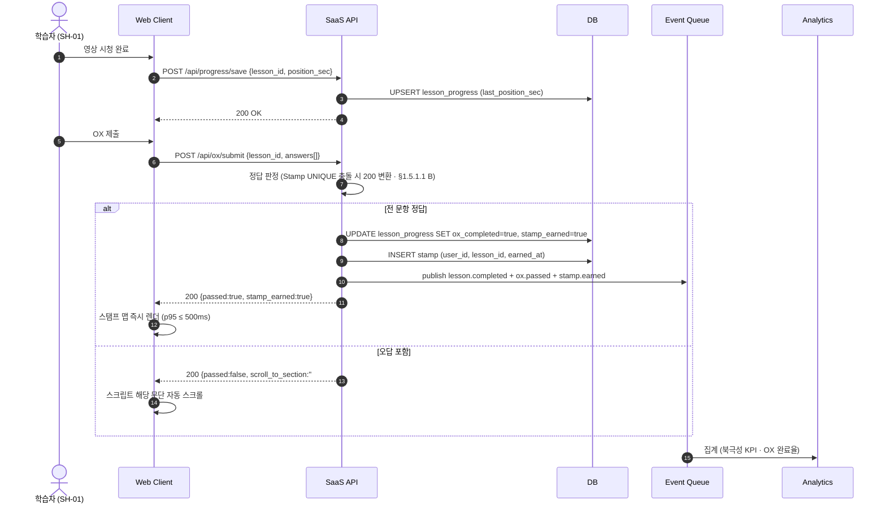

#### 3.4.2 교사 모드 교안 PDF 다운로드

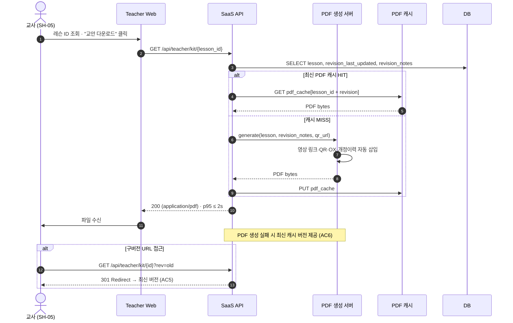

#### 3.4.3 재개 위치 저장 · 복원 (단편 세션)

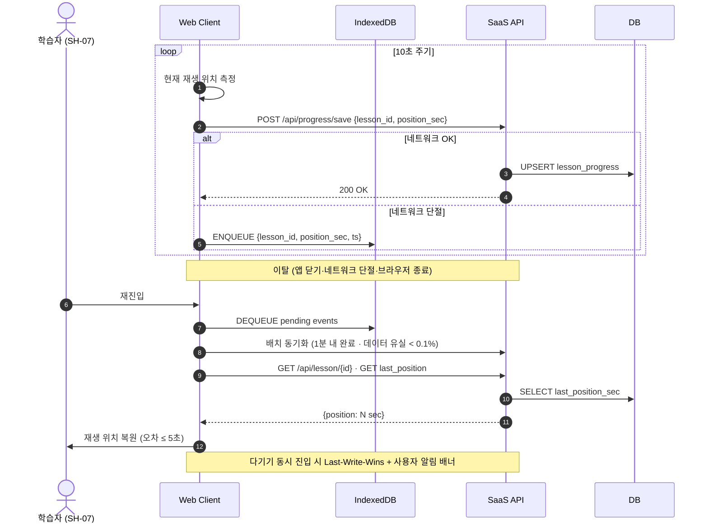

### 3.5 Use Case View

Mermaid는 UML Use Case Diagram을 직접 지원하지 않으므로, `graph` 표기로 **액터 – 시스템 경계 – 유스케이스** 구조를 재현했다. 각 Use Case는 Traceability가 가능하도록 `UC-xx` ID를 갖고, §4.1의 REQ-FUNC에 연결된다.

#### 3.5.1 Use Case Diagram

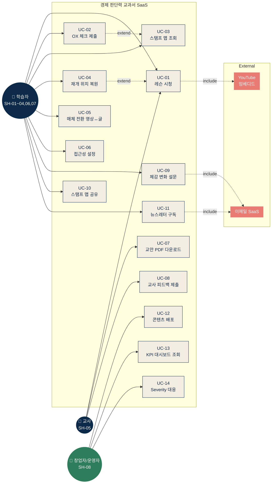

#### 3.5.2 Use Case Catalog

| UC ID | 유스케이스 | Primary Actor | 주요 흐름 요약 | 연결 Requirement |
|---|---|---|---|---|
| **UC-01** | 레슨 시청 | 학습자 · 교사 | 레슨 선택 → 유튜브 임베디드 재생 → 10초 간격 위치 저장 | REQ-FUNC-020, REQ-FUNC-035, REQ-NF-001 |
| **UC-02** | OX 체크 제출 | 학습자 | 시청 완료 후 OX 문항 제출 → 정답 판정 → (오답 시) 스크립트 앵커 스크롤 | REQ-FUNC-002, 006, 036 |
| **UC-03** | 스탬프 맵 조회 | 학습자 | 학습 궤적을 시각적으로 확인 | REQ-FUNC-001, 038, REQ-NF-003 |
| **UC-04** | 재개 위치 복원 | 학습자 | 재진입 시 직전 위치·OX 진행 상태 자동 복원 | REQ-FUNC-021, 025 |
| **UC-05** | 매체 전환 | 학습자 | "글로 읽기" · 영상 토글 | REQ-FUNC-026, REQ-NF-005 |
| **UC-06** | 접근성 설정 | 학습자 | 글자 크기(14~28px) · 고대비 · 자막 설정 | REQ-FUNC-029, 032, REQ-NF-033~039 |
| **UC-07** | 교안 PDF 다운로드 | 교사 | 레슨 ID 조회 → 단일 PDF(영상링크·QR·OX·개정이력) 다운로드 | REQ-FUNC-013, 015, 017, 018, 019 |
| **UC-08** | 교사 피드백 제출 | 교사 | `will_reuse`·`used_in_class`·코멘트 제출 | REQ-FUNC-016, REQ-NF-045, 046 |
| **UC-09** | 체감 변화 설문 응답 | 학습자 | 스탬프 10자리 달성 시 자동 발송 설문 응답 | REQ-FUNC-003, REQ-NF-043 |
| **UC-10** | 스탬프 맵 공유 | 학습자 | 공유 토큰 URL 생성 (Could Have) | REQ-FUNC-041, REQ-NF-044 |
| **UC-11** | 뉴스레터 구독 | 학습자·방문자 | 이메일 입력 → 더블 옵트인 | REQ-FUNC-039 |
| **UC-12** | 콘텐츠 배포 | 운영자 | 신규 레슨 커밋 → 후킹 린터·접근성 CI 통과 → 배포 | REQ-FUNC-007, 008, 037, REQ-NF-050 |
| **UC-13** | KPI 대시보드 조회 | 운영자 | 북극성·보조 KPI·에러 예산·접근성 CI 상태 확인 | REQ-NF-032, 040~047 |
| **UC-14** | Severity 대응 | 운영자 | Sev1~3 알림 수신 · SLA 내 조치 | REQ-NF-027~029 |

### 3.6 Component View

ADR-004 확정(§1.5.1.2)에 따라 구체 기술로 매핑된 컴포넌트 구조를 제시한다. 기존 "역할 단위 컴포넌트" 추상화 대신, **Next.js App Router 단일 풀스택 레이어** 를 중심으로 외부 의존을 분리한 구성이다. NFR 임계치(§4.2)가 각 컴포넌트 선택의 제약 조건으로 작동하며, 본 구성이 모든 임계치를 충족함은 Plan §3 검토에서 확인되었다.

#### 3.6.1 Component Diagram

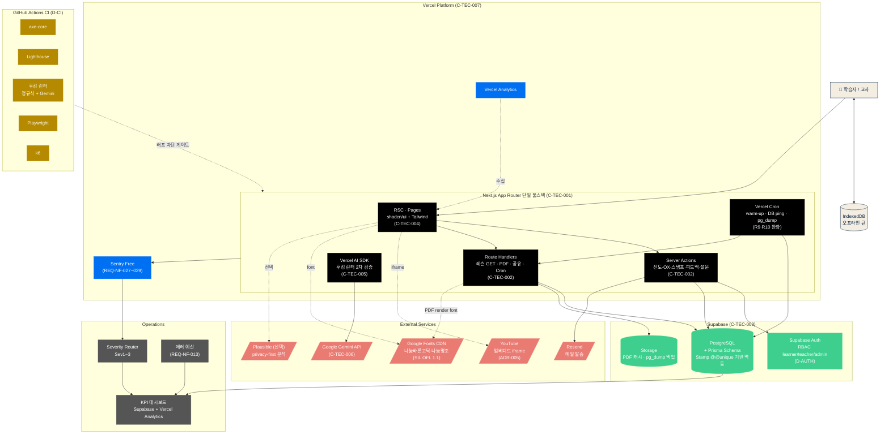

#### 3.6.2 컴포넌트 책임 매트릭스

| 컴포넌트 | 구현 기술 | 책임 | 의존 | 관련 Requirement |
|---|---|---|---|---|
| Web Client (RSC + Client Components) | **Next.js App Router · Tailwind · shadcn/ui** | UI 렌더·매체 전환·오프라인 큐·접근성. shadcn/ui(Radix UI 기반)로 스크린 리더 호환 기본 충족 | Server Actions, IndexedDB, YouTube iframe, Google Fonts | REQ-FUNC-001, 026~032, REQ-NF-002, 033~039 |
| IndexedDB (Client) | 브라우저 네이티브 | 오프라인 이벤트 큐잉·재연결 시 flush | Web Client | REQ-FUNC-005, 025 |
| Edge / Routing | **Vercel Edge Network** | TLS 1.2+·정적 자산 CDN·Rate Limit·Region 최적화 | Next.js App | REQ-NF-018, 019 |
| Auth | **Supabase Auth** | 가입·로그인·세션·RBAC(learner/teacher/admin)·bcrypt 이상 해시 내부 보장 | Supabase PostgreSQL | REQ-NF-017, 021 · D-AUTH |
| Lesson Service | **Next.js Route Handler + Prisma** | 레슨 메타·스크립트·youtube_id·pdf_url 제공 | Supabase PostgreSQL | REQ-FUNC-033, 034, 035 |
| Progress Service (OX·Stamp) | **Next.js Server Action + Prisma** | 위치 저장·OX 판정·스탬프 발급. Prisma `@@unique([userId, lessonId])` 기반 멱등. `P2002` 에러 catch → 200 응답 변환 (§1.5.1.1 Option B) | Supabase PostgreSQL | REQ-FUNC-001, 002, 006, 020, 024, 036 · INV-05 |
| Teacher Kit Service | **Next.js Route Handler + Prisma** | 교안 메타·구버전 301 리디렉트 | Supabase, PDF Renderer | REQ-FUNC-013, 017 |
| PDF Generation | **`@react-pdf/renderer` (Route Handler 내)** | 템플릿 기반 PDF · QR(`qrcode`) · 개정이력 자동 삽입 · 나눔바른고딕·나눔명조 embedding (SIL OFL 1.1) | Google Fonts CDN, Supabase Storage (캐시) | REQ-FUNC-015, 018, 019, REQ-NF-049 · §6.2.4 |
| Notification | **Server Action + Resend API** | 설문 트리거·뉴스레터 발송 | Resend | REQ-FUNC-003, 039 |
| Analytics | **Vercel Analytics + Prisma 집계 쿼리 + (선택) Plausible** | 이벤트 수집·KPI 집계·대시보드 피드 | Supabase, Vercel | REQ-FUNC-009, 010, 023, REQ-NF-040~047 |
| 후킹 린터 | **Vercel AI SDK + Google Gemini API** (Python 서버 없음) | 정규식 1차 + Gemini 2차 톤 검증. GitHub Actions 내 실행 | Gemini API | REQ-FUNC-007, 012 · C-TEC-005, 006 |
| Event Log Store | **Supabase PostgreSQL `event_log` 테이블** | event_log 90일 이상 보관 (append-only) | Supabase | REQ-NF-031 · INV-08 |
| PDF Cache | **Vercel Edge Cache + Supabase Storage** (2단) | `lesson_id + revision_last_updated` 키 캐시 | — | REQ-NF-049 |
| Vercel Cron | **Vercel Cron Jobs** | (1) Function warm-up 5분 (R9) / (2) Supabase `SELECT 1` 주 1회 (R10) / (3) `pg_dump` 일 1회 (RPO 24h) | Next.js Route Handler, Supabase Storage | REQ-NF-011, R9, R10 |
| CI Gate | **GitHub Actions `.github/workflows/quality.yml`** | axe-core · Lighthouse · 후킹 린터 · Playwright · k6. 배포 차단형 필수 게이트 | Vercel Preview | REQ-NF-050 · D-CI |
| 모니터링·Severity Router·에러 예산 | **Sentry Free + Vercel Logs + Supabase Dashboard** | Sev1~3 라우팅 · SLA 집계 · 예산 소진 관리 | 전 컴포넌트 | REQ-NF-013, 027~029, 032 |

#### 3.6.3 외부 시스템 경계와 SLO

| 외부 시스템 | 통합 방식 | SLO 편입 여부 | 비고 |
|---|---|---|---|
| YouTube | iframe 임베디드 | ❌ (ASM-05) | ADR-005. 외부 알고리즘 차단 요구 없음 |
| Vercel Platform | Next.js 네이티브 호스팅 + Cron + Analytics | ✅ (자체 SLO) | C-TEC-007. Hobby 시작 → D-TIER 전환 |
| Supabase | Prisma Client + `@supabase/supabase-js` | ✅ (자체 SLO. Free 시작) | 7일 비활성 pause 리스크(R10) → Cron ping 완화 |
| Google Gemini API | Vercel AI SDK | ⚠️ 외부 SLA 의존 (CI 한정) | 학습자 대면 경로 없음. 장애 시 배포만 영향 |
| Resend | Server Action → REST | ⚠️ 외부 SLA 의존 | 메일 실패 시 큐잉·재시도·Severity Sev2 연동 |
| Plausible / Vercel Analytics | 클라이언트 SDK · Vercel 네이티브 | ✅ (자체 SLO) | CON-01 준수. 프라이버시 우선 |
| Google Fonts CDN | `next/font/google` subset 포함 | ❌ (Google 책임) | SIL OFL 1.1. 폰트 로드 실패 시 시스템 폰트 폴백 |
| GitHub Actions | `.github/workflows/quality.yml` | ✅ (빌드 단계 자체 SLO) | 실패 = 배포 차단 |
| Sentry (Free) | Next.js SDK | ✅ (자체 SLO) | 에러 샘플링·Severity 연동 |

---

## 4. Specific Requirements

### 4.1 Functional Requirements

표기 규칙
- **ID 형식**: `REQ-FUNC-xxx` (3자리 순번, atomic requirement 단위)
- **Source**: PRD의 Story ID 또는 F-기능(Must/Should)
- **Priority**: MoSCoW 기반 (M = Must / S = Should / C = Could)
- **MVP 라벨 (Revision 0.9 신규 도입 · §1.2.3 파일럿 4구간 정의 참조)**
  - ✅ **MVP-IN**: Alpha 단계 내 구현 필수. 누락 시 핵심 학습 루프 작동 안 함
  - 🟡 **MVP-SOFT**: Alpha best-effort, Private Beta/Closed Beta 정식 검증. 수치 임계치 달성은 Public Pilot 유보
  - ⏸️ **MVP-DEFER**: Public Pilot 이후로 이관. 구현 연기 또는 실측/통계 설계 필요
- **Acceptance Criteria**: Given/When/Then 또는 측정 임계치 형식으로 테스트 가능화
- **Traceability**: 하나의 Story/F-기능은 복수 REQ-FUNC로 분해 (SRS 생성 규칙 2)

#### 4.1.1 학습자 모드 — Story 1 (박지훈 · 스탬프 맵)

| ID | 요구사항 | Source | Priority | MVP 라벨 | Acceptance Criteria |
|---|---|---|---|---|---|
| **REQ-FUNC-001** | OX 통과 시 진주 스탬프 맵에 해당 레슨 위치를 시각적으로 반영한다. | Story 1 · F2 | M | ✅ MVP-IN | **Given** 인증 학습자가 레슨 시청 완료 상태에서 **When** OX 문항을 전부 통과 **Then** 스탬프 맵에 해당 `lesson_id` 위치가 채워지고, 누적 스탬프 수가 갱신된다. 이벤트 발행 후 클라이언트 반영까지 **p95 ≤ 500ms** (k6 동시 100명, Story 1 AC1). |
| **REQ-FUNC-002** | OX 제출 이벤트가 누락 없이 `lesson_progress`에 반영되어야 한다. | Story 1 · F3 | M | ✅ MVP-IN (실패율 수치 판정은 🟡) | `ox.submitted` 대비 `progress.updated` 미반영 비율 **< 0.5%** (일간 집계, Story 1 AC2). |
| **REQ-FUNC-003** | 스탬프 10자리 달성 시 체감 변화 설문이 자동 발송된다. | Story 1 · KPI | M | 🟡 MVP-SOFT (Resend 투입 Private Beta 이후) | **Given** `stamp_count = 10` 도달 **When** 이벤트 `stamp.earned` 발행 **Then** 이메일 SaaS로 설문 링크 발송, 응답 중 『덜 두렵다』 비율 **≥ 60%** 목표 (Story 1 AC3). |
| **REQ-FUNC-004** | 스탬프 맵 진입 체류 시간을 측정·경보한다. | Story 1 · Non-Goal 검증 | M | ⏸️ MVP-DEFER (체류 시간 분포 측정은 Public Pilot) | 진입 후 체류 시간 중앙값 **15~60초** 범위. 60초 초과 사용자 비율 > 5% 시 설계 재검토 트리거 (Story 1 AC4 · 게임화 Non-Goal 방지). |
| **REQ-FUNC-005** | 시청 중 네트워크 단절 시 이벤트 손실을 방지한다. | Story 1 AC5 | M | 🟡 MVP-SOFT (MVP는 IndexedDB 단순 큐, 손실 <0.1%는 Closed Beta) | 오프라인 진입 시 로컬 큐(IndexedDB) **10초 간격 적재** → 재연결 시 **30초 내 서버 동기화 완료**. 이벤트 손실 **< 0.1%**. |
| **REQ-FUNC-006** | 동일 OX 제출의 중복 채점·중복 스탬프 발급을 방지한다. | Story 1 AC6 | M | ✅ MVP-IN | 동일 `(user_id, lesson_id)` 의 OX 재제출은 **`Stamp` 테이블 `UNIQUE(user_id, lesson_id)` 제약을 통한 영구 멱등** 으로 처리한다 (§1.5.1.1 Option B). UNIQUE 충돌은 200 응답으로 변환되어 동일 페이로드(`{passed, stamp_earned, scroll_to_section}`)가 재반환되며, 중복 스탬프 발급은 **0건**이다. |

#### 4.1.2 톤·편집 품질 — Story 2 (이수민 · 후킹 금지)

| ID | 요구사항 | Source | Priority | MVP 라벨 | Acceptance Criteria |
|---|---|---|---|---|---|
| **REQ-FUNC-007** | 배포 파이프라인에 후킹 금지어 린터를 두어 썸네일·제목·도입부의 자극어 출현을 0으로 유지한다. | Story 2 AC1 · F8 | M | ✅ MVP-IN (정규식 1차) / 🟡 MVP-SOFT (Gemini 2차는 Closed Beta) | 정규식 1차 + LLM 2차 검증 통과율 **100%**. 숫자 약속·수익 언급·자극어 0회. 실패 시 배포 **자동 차단**. |
| **REQ-FUNC-008** | 영상 도입부 30초 내 개념 정의 1회 이상 · 한국 맥락 예시 1개 포함을 강제한다. | Story 2 AC2 | M | 🟡 MVP-SOFT (자막 키워드 매칭·편집 QA는 Closed Beta) | 편집 QA 체크리스트 항목. 미충족 시 배포 차단. 자동 검증(자막 텍스트 기반 키워드 매칭) + 수동 QA 병행. |
| **REQ-FUNC-009** | 이수민 유형 세그먼트의 첫 영상 완시청률을 측정한다. | Story 2 AC3 | M | 🟡 MVP-SOFT (세그먼트 완시청률 측정은 Closed Beta) | 온보딩 설문 "최근 투자 손실 경험" 응답자 세그먼트 완시청률 **≥ 60%**. n≥200, 95% CI 하한 ≥ 55% (EXP-2). |
| **REQ-FUNC-010** | S2(랜딩) → S3(첫 영상 완시청) 퍼널 전환율을 측정한다. | Story 2 AC4 | M | 🟡 MVP-SOFT (퍼널 리포트 도구 Closed Beta) | GA4 또는 오픈소스 분석기 퍼널 리포트 기준 **≥ 20%**. |
| **REQ-FUNC-011** | A/B 실험 시 이수민 유형 세그먼트는 후킹 변형 트래픽에서 배제된다. | Story 2 AC5 | M | ⏸️ MVP-DEFER (EXP 인프라 필요) | 페르소나 매칭 태그 기반 자동 필터링. 유입 시도 시 차단 로그 발생. 유입 실측 0건. |
| **REQ-FUNC-012** | 린터 통과 후에도 사용자 리포트 기반의 톤 피드백을 수집·반영한다. | Story 2 AC6 | M | ⏸️ MVP-DEFER (자동 감지 + 알림 체계 필요) | "과장됨" 리포트 비율 **> 5%** 해당 편 → 게시 중단 + 린터 규칙 업데이트 트리거. |

#### 4.1.3 교사 모드 — Story 3 (장은혜 · 교안 PDF)

| ID | 요구사항 | Source | Priority | MVP 라벨 | Acceptance Criteria |
|---|---|---|---|---|---|
| **REQ-FUNC-013** | 레슨 ID 기반 교안 PDF를 단일 파일로 생성·다운로드한다. | Story 3 · F5 | M | ✅ MVP-IN (Private Beta 진입) | **Given** 교사가 레슨 ID 조회 **When** 다운로드 버튼 클릭 **Then** 영상 링크·QR·OX·개정 이력 포함 **단일 PDF 1개** 응답. 클릭→수신 **p95 ≤ 2초** (k6 동시 50명). |
| **REQ-FUNC-014** | 교사 수업 준비 시간 절감 효과를 측정한다. | Story 3 AC2 | M | ⏸️ MVP-DEFER (교사 사전-사후 설문 n≥10. 모집 공수) | 파일럿 교사 사전-사후 설문(n≥10) 기준 평균 **≥ 60분 절감**. |
| **REQ-FUNC-015** | PDF 1페이지에 출처·갱신일(`revision_last_updated`)·개정 이력(`revision_notes`) 100% 자동 삽입한다. | Story 3 AC3 · F5 | M | ✅ MVP-IN | CI 단계 PDF 자동 검증. 필드 1개라도 누락 시 배포 차단. |
| **REQ-FUNC-016** | 교사 재사용 의사를 누적 집계한다. | Story 3 AC4 · KPI | M | ⏸️ MVP-DEFER (10명 판정은 Public Pilot) | `teacher_feedback.will_reuse=true` 누적 **≥ 10명** (Stage 1 종료 시). |
| **REQ-FUNC-017** | 개정된 레슨의 구버전 PDF URL 접근 시 최신 버전으로 301 리디렉트한다. | Story 3 AC5 | M | 🟡 MVP-SOFT (MVP는 최신만 제공으로 축소) | 구버전 직접 노출 **0건**. URL 체계는 `?rev=` 또는 불변 경로 + 최신 alias 분리. |
| **REQ-FUNC-018** | PDF 생성 실패 시 최신 캐시 버전을 제공한다. | Story 3 AC6 | M | ⏸️ MVP-DEFER (2단 캐시 상태 관리 복잡) | PDF 서버 5xx 오류 시 **최신 캐시 PDF 응답 + 에러 로그**. 완전 실패율 **< 1%**. |
| **REQ-FUNC-019** | 교안 PDF에 영상 링크용 QR 코드를 자동 생성한다. | F5 | M | ✅ MVP-IN | PDF 템플릿에 QR(유튜브 영상 URL) 삽입. 인쇄 시 스캔 가능 해상도 유지. |

#### 4.1.4 재개 위치 저장 — Story 4 (오세은 · NP3)

| ID | 요구사항 | Source | Priority | MVP 라벨 | Acceptance Criteria |
|---|---|---|---|---|---|
| **REQ-FUNC-020** | 영상 재생 위치를 10초 이내 간격으로 백엔드에 저장한다. | Story 4 AC1 · F6 | M | ✅ MVP-IN | 로그 샘플링 기준 저장 주기 **≤ 10초**. 10초 간격 내 요청은 `/api/progress/save`에서 병합. |
| **REQ-FUNC-021** | 재진입 시 마지막 저장 위치 기준 오차 ≤ 5초로 복원한다. | Story 4 AC2 | M | ✅ MVP-IN (기본 복원) / 🟡 (100회 QA 시나리오는 Closed Beta) | QA 자동화 시나리오 100회 실행 시 복원 실패 **< 2건**. |
| **REQ-FUNC-022** | 자막 기본 ON + 차트·수치 자막 완결 100%. | Story 4 AC3 · §5.6 | M | ✅ MVP-IN (자막 기본 ON 편집 체크리스트) | 편집 QA 체크리스트 항목. 영상 내 수치·차트 음성 내레이션 + 자막 동시 포함. |
| **REQ-FUNC-023** | 세션 평균 < 8분 학습자의 10편 완주율을 측정한다. | Story 4 AC4 | M | 🟡 MVP-SOFT (완주율 측정은 Closed Beta) | 단편 그룹 완주율 **≥ 8%** (EXP-3). |
| **REQ-FUNC-024** | 다기기 동시 재생 시 Last-Write-Wins + 사용자 알림 배너를 노출한다. | Story 4 AC5 | M | 🟡 MVP-SOFT (Realtime/SSE 학습 Closed Beta) | 동일 `user_id`의 2기기 동시 세션 감지 시 최종 `updated_at` 기준 저장. 타 기기에 배너 노출. |
| **REQ-FUNC-025** | 서버 5xx 오류 시 IndexedDB로 큐잉하고 재연결 후 1분 내 동기화한다. | Story 4 AC6 | M | 🟡 MVP-SOFT (엣지 케이스 QA Closed Beta) | 데이터 유실 **< 0.1%**. 큐 크기 상한·TTL 정책 정의 필수. |

#### 4.1.5 매체 선택권·접근성 — Story 5 (한정숙 · 김성호)

| ID | 요구사항 | Source | Priority | MVP 라벨 | Acceptance Criteria |
|---|---|---|---|---|---|
| **REQ-FUNC-026** | "글로 읽기" 토글로 영상↔스크립트 전문을 전환한다. | Story 5 · F4 | M | ✅ MVP-IN | 동일 `lesson_id`의 `script` 필드 표시. 전환 **p95 ≤ 300ms** (Lighthouse + RUM). |
| **REQ-FUNC-027** | 모든 UI 색 대비비 ≥ 4.5:1 (WCAG AA). | Story 5 AC2 · §5.6 | M | 🟡 MVP-SOFT (shadcn/ui 기본 OK, 배포 확인 Closed Beta) | axe-core CI 통과율 **100%**. 실패 시 배포 차단. |
| **REQ-FUNC-028** | 자막 일시정지 상태에서도 자막이 유지된다. | Story 5 AC3 · §5.6 | M | 🟡 MVP-SOFT (Playwright 커버 Closed Beta) | Playwright E2E 테스트로 자동 검증. |
| **REQ-FUNC-029** | 글자 크기 14~28px 단계 조절 토글을 제공한다. | Story 5 AC4 · §5.6 | M | ✅ MVP-IN | UI 회귀 테스트. 사용자 설정 영속 저장(`USER.accessibility_mode`). |
| **REQ-FUNC-030** | 글자 28px + 브라우저 확대 200% 조합에서 가로 스크롤이 발생하지 않는다. | Story 5 AC5 | M | ⏸️ MVP-DEFER (수동 QA 공수) | 반응형 레이아웃 회귀 테스트. 주요 브레이크포인트 전부 검증. |
| **REQ-FUNC-031** | 스크린 리더 읽기 순서 오류 시 배포를 차단한다. | Story 5 AC6 · §5.6 | M | 🟡 MVP-SOFT (axe 부분 커버, NVDA 수동은 Public Pilot) | NVDA + axe 자동 검증. 실패 시 CI Fail. |
| **REQ-FUNC-032** | 키보드만으로 전 화면 탐색·조작이 가능하다. | §5.6 | M | 🟡 MVP-SOFT (E2E 키보드 Closed Beta) | 접근성 체크리스트 항목. E2E 키보드 네비게이션 테스트 통과. |

#### 4.1.6 콘텐츠 구조 · 라이선스 · 3매체

| ID | 요구사항 | Source | Priority | MVP 라벨 | Acceptance Criteria |
|---|---|---|---|---|---|
| **REQ-FUNC-033** | 레슨 ID는 `L001 ~ L105` 포맷의 고유·불변 식별자로 관리된다. | F1 · §6.2 · 원칙 5 | M | ✅ MVP-IN | DB UNIQUE 제약. 생성 후 변경 불가. 누락·중복 허용 0건. |
| **REQ-FUNC-034** | 1 레슨 = 1 영상(유튜브 임베디드) = 1 스크립트 = 1 교안 PDF의 3매체 단일 원전을 유지한다. | F4 · 원칙 4·5 | M | ✅ MVP-IN | `LESSON` 레코드는 `youtube_video_id`·`script`·`pdf_kit_url` 3필드 모두 NOT NULL 강제. |
| **REQ-FUNC-035** | 영상은 유튜브 임베디드 플레이어로만 재생한다. | ADR-005 · §6.4 | M | ✅ MVP-IN | 자체 영상 CDN·백업 구현 금지. iframe 재생 외 경로 차단. |
| **REQ-FUNC-036** | OX 오답 시 스크립트의 해당 문단 앵커로 자동 스크롤한다. | F3 · Story 1 | M | ✅ MVP-IN | `/api/ox/submit` 응답의 `scroll_to_section` 앵커 기반 클라이언트 스크롤. 앵커는 `script` 편집 시점에 자동 생성. |
| **REQ-FUNC-037** | 모든 공개 자산(영상 설명란·PDF·웹 페이지)에 CC BY-NC-SA 4.0 라이선스를 명시한다. | ADR-002 · REF-08 | M | ✅ MVP-IN | PDF 푸터·영상 설명·웹 푸터 3곳 모두. CI 단계 자동 검증. |
| **REQ-FUNC-038** | 스탬프 맵은 사용자 자율 선택을 허용하며 순서를 강제하지 않는다. | ADR-003 | M | ✅ MVP-IN | 임의 `lesson_id` 시청 가능. "부분 공개 금지" 관련 차단 로직 0건. |

#### 4.1.7 뉴스레터 · 교사 사례 (Should Have)

| ID | 요구사항 | Source | Priority | MVP 라벨 | Acceptance Criteria |
|---|---|---|---|---|---|
| **REQ-FUNC-039** | SaaS 직접 유입용 뉴스레터 구독 폼을 제공한다. | Should · KSF 2 | S | 🟡 MVP-SOFT (Resend 투입 Private Beta 이후) | 이메일 입력 → 더블 옵트인. 외부 이메일 SaaS API 연동. `USER.email` 선택 저장. |
| **REQ-FUNC-040** | 교사 실사용 사례 공개 페이지를 운영한다. | Should · KSF 3 | S | 🟡 MVP-SOFT (TEACHER_FEEDBACK 3개월 누적 이후) | `TEACHER_FEEDBACK` 3개월 이상 누적 후 공개. 본인 동의 여부 필드 기반 노출 제어. |

#### 4.1.8 Could Have

| ID | 요구사항 | Source | Priority | MVP 라벨 | Acceptance Criteria |
|---|---|---|---|---|---|
| **REQ-FUNC-041** | 스탬프 맵 URL 공유 기능을 제공한다. | Could · 유기적 전파 KPI | C | ⏸️ MVP-DEFER (Public Pilot) | 공유 토큰 생성 · 뷰어 전용 URL. 개인정보 노출 방지(user_id 토큰화 필수). |
| **REQ-FUNC-042** | 오프라인 교안 묶음 발송 운영 프로세스를 제공한다. | Could · 접근성 확장 | C | ⏸️ MVP-DEFER (Public Pilot) | 교안 PDF 기반 우편 발송 프로세스 문서화. 최소 신청 수량·비용 정책 정의. |

**이행 금지 사항 (Won't Have, 구현 금지 — CON-02~04 연계)**
- 구독형 페이월·유료 프리미엄, 댓글·커뮤니티·포럼, 자극적 썸네일, AI 자유 생성 답변, 게임화(배지·랭킹·레벨업), 금융 상품 광고·PPL, 학습자 데이터 판매, 영상 호스팅 이중화·자체 CDN, 교사용 추가 안내문, 옵시디언/Notion 연동, 관련 레슨 묶음 추천.

**REQ-FUNC 라벨 소계**: ✅ MVP-IN 18 · 🟡 MVP-SOFT 15 · ⏸️ MVP-DEFER 9 = **42**

---

### 4.2 Non-Functional Requirements

표기 규칙: `REQ-NF-xxx` (atomic · 측정 가능). 모든 임계치는 프로덕션 모니터링 대상. MVP 라벨 의미는 §4.1 서두 참조.

#### 4.2.1 성능 (Performance)

| ID | 요구사항 | 임계치 | 측정 방법 | MVP 라벨 | 출처 |
|---|---|---|---|---|---|
| **REQ-NF-001** | 영상 재생 시작 시간 | **p95 ≤ 2초** (유튜브 임베디드 기준) | RUM + 합성 모니터링 | 🟡 MVP-SOFT (유튜브 책임, 측정만) | §5.1 |
| **REQ-NF-002** | SaaS 페이지 초기 렌더 (LCP) | **p95 ≤ 1.5초** | Lighthouse + RUM | ✅ MVP-IN (SSG 기본 충족) | §5.1 |
| **REQ-NF-003** | 스탬프 렌더링 (이벤트→시각 반영) | **p95 ≤ 500ms** | k6 동시 100명, 이벤트-UI 델타 측정 | 🟡 MVP-SOFT (측정 모니터링. k6는 Closed Beta) | §5.1 · Story 1 AC1 |
| **REQ-NF-004** | 교안 PDF 생성·다운로드 | **p95 ≤ 2초** | k6 동시 50명 | 🟡 MVP-SOFT (캐시 포함 측정) | §5.1 · Story 3 AC1 |
| **REQ-NF-005** | 매체 전환 (영상 ↔ 글) | **p95 ≤ 300ms** | Lighthouse + RUM | 🟡 MVP-SOFT (사실상 즉시) | §5.1 · Story 5 AC1 |
| **REQ-NF-006** | 재생 위치 저장 주기 | **≤ 10초 간격** | 서버 로그 샘플링 | ✅ MVP-IN | §5.1 · Story 4 AC1 |

#### 4.2.2 신뢰성 · 에러 예산 (Reliability)

| ID | 요구사항 | 임계치 / 예산 | 측정 방법 | MVP 라벨 | 출처 |
|---|---|---|---|---|---|
| **REQ-NF-007** | 월 가용성 | **≥ 99.5%** · 월 최대 216분 다운타임 | 외부 업타임 모니터 | 🟡 MVP-SOFT (Vercel·Supabase 기본 SLA 모니터링만) | §5.2 |
| **REQ-NF-008** | 핵심 플로 오류율 (로그인·시청·OX·스탬프·교안 다운로드) | **≤ 0.5%** · 월 최대 5,000건 (MAU 100만 기준) | APM 오류 집계 | 🟡 MVP-SOFT (Sentry 집계, 판정은 Public Pilot) | §5.2 |
| **REQ-NF-009** | OX → 진도 반영 실패율 | **≤ 0.5%** | 이벤트 대조 집계 | ⏸️ MVP-DEFER (임계 판정) | §5.2 · Story 1 AC2 |
| **REQ-NF-010** | 재개 위치 복원 실패율 | **≤ 1%** | QA 시나리오 + 프로덕션 집계 | ⏸️ MVP-DEFER (임계 판정) | §5.2 · Story 4 AC2 |
| **REQ-NF-011** | RPO (학습 진도 데이터) | **≤ 24시간** | 백업 정책 감사 | ⏸️ MVP-DEFER (pg_dump Cron은 Closed Beta 후반) | §5.2 |
| **REQ-NF-012** | RTO (SaaS 복구 시간) | **≤ 4시간** | 재해 복구 훈련 | ⏸️ MVP-DEFER (복구 훈련 Public Pilot) | §5.2 |
| **REQ-NF-013** | 에러 예산 소진 정책 | 80% 소진 → 신규 기능 검토 단계 전환 / 100% 소진 → 출시 동결 + 안정성 스프린트 | 에러 예산 대시보드 | ⏸️ MVP-DEFER (대시보드 자동화) | §5.2 |

**주의**: 영상 호스팅(YouTube) 가용성은 본 SLO 대상 아님 (ADR-005 · ASM-05).

#### 4.2.3 보안 · 개인정보 (Security & Privacy)

| ID | 요구사항 | 임계치 | MVP 라벨 | 출처 |
|---|---|---|---|---|
| **REQ-NF-014** | 학습자 PII 수집 범위 | 이메일 + 닉네임만 필수. 성명·연락처·소득·주민번호 등 수집 금지 | ✅ MVP-IN (스키마 강제) | §5.3 · CON-01 |
| **REQ-NF-015** | 결제 정보 수집 | **수집 금지** (원칙 2 · CON-02) | ✅ MVP-IN (영구 배제) | §5.3 |
| **REQ-NF-016** | 학습 로그 가명처리(pseudonymization) | 분석 데이터는 user_id를 pseudo ID로 변환 후 사용 | 🟡 MVP-SOFT (분석 시 적용. MVP는 user_id 사용) | §5.3 |
| **REQ-NF-017** | 비밀번호 저장 | **Supabase Auth** 를 사용하여 bcrypt 이상 수준의 단방향 해시를 구조적으로 보장. 자체 해시 로직 구현 금지 (§1.5.1.2 D-AUTH). | ✅ MVP-IN (Supabase Auth 기본) | §5.3 · §1.5.1.2 D-AUTH |
| **REQ-NF-018** | 전송 구간 암호화 | **TLS 1.2 이상**, HSTS 활성화 | ✅ MVP-IN (Vercel 자동) | §5.3 (확장 정의) |
| **REQ-NF-019** | 세션 관리 | HttpOnly + Secure + SameSite=Lax 쿠키. 세션 만료·리프레시 정책 명시. | ✅ MVP-IN (Supabase Auth 기본) | §5.3 (확장 정의) |
| **REQ-NF-020** | 외부 폰트·스크립트 CDN | **최소화** (프라이버시 우선) | ✅ MVP-IN (Google Fonts만) | §5.3 |
| **REQ-NF-021** | RBAC | learner / teacher / admin 3역할. teacher 전용 엔드포인트 분리 | ✅ MVP-IN (Supabase Auth 3역할) | §6.1 · 3.3 |
| **REQ-NF-022** | 감사 로그 | 관리자 행위·콘텐츠 개정·라이선스 메타 변경 이벤트 **90일 이상 보관** | 🟡 MVP-SOFT (Supabase 기본. 90일은 Pro 전환 시) | §5.5 |

#### 4.2.4 비용 (Cost)

| ID | 요구사항 | 임계치 | MVP 라벨 | 출처 |
|---|---|---|---|---|
| **REQ-NF-023** | SaaS 인프라 비용 (서버·CDN·DB, MVP 기준) | **월 0~10만원** (연 최대 120만원). Free 조합 출발 0원 → D-TIER 트리거 시 Pro 조합 ≈8~9만원 (§1.5.2 CON-07 표). | ✅ MVP-IN (Free 출발) | §5.4 · CON-07 · §1.5.1.2 D-TIER · PRD v0.6 정합화 대상 |
| **REQ-NF-024** | 외부 도구 구독 | **월 ≤ 30만원** | ✅ MVP-IN (MVP는 거의 0원) | §5.4 |
| **REQ-NF-025** | 신규 기능 추가 시 운영비 증가 | **≤ 10%/월** 범위 내 승인 | 🟡 MVP-SOFT (Alpha는 N/A) | §5.4 · CON-07 |
| **REQ-NF-026** | 영상 호스팅 비용 | **0원** (유튜브 단독 · ADR-005) | ✅ MVP-IN | §5.4 |

#### 4.2.5 운영·모니터링 (Observability)

| ID | 요구사항 | 임계치 | MVP 라벨 | 출처 |
|---|---|---|---|---|
| **REQ-NF-027** | Severity 체계 Sev1 대응 | 가용성 < 99.0% 또는 핵심 오류율 > 2% 또는 데이터 손실 → **15분 내 응답, 1시간 내 완화 시작** | ⏸️ MVP-DEFER (24/7 실전 불가) | §5.5 |
| **REQ-NF-028** | Severity 체계 Sev2 대응 | p95 임계치 20% 초과 또는 오류율 > 1% → **1시간 내 응답, 4시간 내 조치** | ⏸️ MVP-DEFER (동일) | §5.5 |
| **REQ-NF-029** | Severity 체계 Sev3 대응 | KPI 주간 20% 이상 미달 또는 에러 예산 80% 소진 → **24시간 내 리뷰 회의** | ⏸️ MVP-DEFER (동일) | §5.5 |
| **REQ-NF-030** | 서버 로그 보관 | **14일 이상** 중앙 집계 | ✅ MVP-IN (Vercel Logs 기본) | §5.5 |
| **REQ-NF-031** | `event_log` 보관 | **90일 이상** | 🟡 MVP-SOFT (MVP 30일로 완화. Supabase Free 용량 고려) | §5.5 |
| **REQ-NF-032** | 대시보드 구성 | 북극성 KPI 추세선 / 보조 KPI 7개 달성률 / 에러 예산 소진도 / Severity 타임라인 30일 / 접근성 CI 상태. 구현: **Supabase Dashboard (SQL 편집기) + Vercel Analytics + Sentry Free + GitHub Actions 리포트** 조합. 별도 BI 도구 불요. | 🟡 MVP-SOFT (Supabase + Vercel Logs 조합 축소) | §5.5 · §1.5.1.2 |

#### 4.2.6 접근성 (Accessibility)

| ID | 요구사항 | 임계치 | MVP 라벨 | 출처 |
|---|---|---|---|---|
| **REQ-NF-033** | 접근성 체크리스트 (Stage 0 Exit) | **100% 충족** | 🟡 MVP-SOFT (axe 자동 부분 커버) | §5.6 · CON-06 |
| **REQ-NF-034** | 색 대비비 | **≥ 4.5:1** (WCAG AA) | ✅ MVP-IN (shadcn/ui 기본) | §5.6 |
| **REQ-NF-035** | 자막 기본 ON / 일시정지 유지 / 차트·수치 자막 완결 | **100%** | 🟡 MVP-SOFT (편집 QA) | §5.6 |
| **REQ-NF-036** | 글자 크기 조절 범위 | **14px ~ 28px** 단계 | 🟡 MVP-SOFT (Tailwind 구현·UI 회귀 테스트 Closed Beta) | §5.6 |
| **REQ-NF-037** | 키보드 탐색 | **100% 가능** | ✅ MVP-IN (shadcn/ui Radix 기본) | §5.6 |
| **REQ-NF-038** | 스크린 리더 레이블 | **완성** (실패 시 배포 차단) | ⏸️ MVP-DEFER (NVDA 수동 QA) | §5.6 |
| **REQ-NF-039** | "글로 읽기" 대체 경로 | **100% 레슨 제공** | ✅ MVP-IN (매체 전환 구현 포함) | §5.6 |

#### 4.2.7 비즈니스 KPI (정량 목표 — §1.3)

| ID | KPI | 기준 | 측정 방식 | MVP 라벨 | 출처 |
|---|---|---|---|---|---|
| **REQ-NF-040** | 북극성 KPI — L4 완주 학습자 수 | 12개월 **≥ 300명(보수) / 1,000명(순조)** | `COUNT(DISTINCT user_id) WHERE stamp_count >= 10` | ⏸️ MVP-DEFER (**측정 쿼리는 Closed Beta, 300명 판정은 Public Pilot**) | §1.3 |
| **REQ-NF-041** | 이해 전환율 (OX 완료율) | **≥ 60%** | `COUNT(ox_completed) / COUNT(video_completed)` 주간 | ⏸️ MVP-DEFER (측정은 Closed Beta, 판정 Public Pilot) | §1.3 |
| **REQ-NF-042** | 스탬프 맵 진도율 (10편+) | **≥ 10%** | 월간 | ⏸️ MVP-DEFER (동일) | §1.3 |
| **REQ-NF-043** | 체감 변화 응답률 | **≥ 60%** | 분기 설문 | ⏸️ MVP-DEFER (동일) | §1.3 |
| **REQ-NF-044** | 유기적 전파율 | **≥ 30%** | 공유 이벤트 + 설문 | ⏸️ MVP-DEFER (동일) | §1.3 |
| **REQ-NF-045** | 교안 실사용률 | **≥ 5%** | `teacher_feedback.used_in_class / download_count` | ⏸️ MVP-DEFER (동일) | §1.3 |
| **REQ-NF-046** | 교사 재사용 의사 수 | **≥ 10명** | `will_reuse=true` 누적 | ⏸️ MVP-DEFER (동일) | §1.3 |
| **REQ-NF-047** | 접근성 체크리스트 충족률 | **100%** | axe-core CI 빌드별 | ⏸️ MVP-DEFER (100% 판정은 NVDA QA 이후) | §1.3 |

#### 4.2.8 확장성·유지보수성 (Scalability & Maintainability)

| ID | 요구사항 | 임계치 | MVP 라벨 | 출처 |
|---|---|---|---|---|
| **REQ-NF-048** | 콘텐츠 확장 | 레슨 1~105편 확장 시 데이터 모델·API 변경 없이 수용 (`lesson_id` 체계 기반) | ✅ MVP-IN (스키마 기본) | F1 · ADR-004 |
| **REQ-NF-049** | PDF 생성 캐시 | 동일 `lesson_id + revision` 조합 재생성 요청 시 캐시 HIT ≥ 95% | ⏸️ MVP-DEFER (실측 판정은 Public Pilot) | 3.4.2 · AC6 |
| **REQ-NF-050** | CI 자동화 | **`.github/workflows/quality.yml` 단일 파일**로 접근성(axe-core)·성능(Lighthouse)·후킹 린터(정규식 + Gemini via Vercel AI SDK)·E2E(Playwright)·부하(k6) 전부 배포 차단형 필수 게이트. Vercel Preview Deploy와 병렬 작동. (§1.5.1.2 D-CI) | ✅ MVP-IN (axe + Lighthouse 2종만 Alpha) / 🟡 MVP-SOFT (Playwright/k6/Gemini Closed Beta) | CON-08 · §1.5.1.2 D-CI |
| **REQ-NF-051** | 단일 제작자 운영 적합성 | 신규 레슨 1편 추가 시 제작자 수작업 **≤ 30분** (템플릿·자동 삽입 기반) | ⏸️ MVP-DEFER (실측은 Closed Beta 후반) | CON-08 · KSF 4 |
| **REQ-NF-052** | `lesson_id` 불변성 | 생성 이후 변경 불가. 개정은 `revision_last_updated` + `revision_notes`로 관리 | ✅ MVP-IN (스키마 제약) | 원칙 5 · §6.2 |

**REQ-NF 라벨 소계**: ✅ MVP-IN 20 · 🟡 MVP-SOFT 17 · ⏸️ MVP-DEFER 15 = **52**

---

## 5. Traceability Matrix

PRD Story ↔ SRS Requirement ID ↔ Test Case ID. 테스트 케이스 ID는 `TC-xxx` 포맷. 모든 테스트는 자동화(k6·Playwright·axe-core·CI 린터) 또는 문서화된 수동 QA로 검증.

### 5.1 Story ↔ Functional Requirement ↔ Test Case

| Story (PRD) | 페르소나 | REQ-FUNC | 검증 Test Case | 검증 수단 |
|---|---|---|---|---|
| **Story 1** (P1 체계감) | 박지훈 (SH-01) | REQ-FUNC-001 ~ 006 | TC-001 ~ TC-006 | k6 부하, APM 집계, 설문 자동 발송, E2E |
| TC-001 | — | REQ-FUNC-001 | 스탬프 렌더 p95 측정 | k6 동시 100명 |
| TC-002 | — | REQ-FUNC-002 | `ox.submitted` vs `progress.updated` 대조 | 프로덕션 로그 일간 집계 |
| TC-003 | — | REQ-FUNC-003 | 10자리 도달 시 설문 자동 발송 검증 | E2E + 메일 SaaS 로그 |
| TC-004 | — | REQ-FUNC-004 | 스탬프 맵 체류 시간 분포 검증 | 분석 도구 이벤트 집계 |
| TC-005 | — | REQ-FUNC-005 | 오프라인→온라인 복원 시나리오 | Playwright + Chrome DevTools throttling |
| TC-006 | — | REQ-FUNC-006 | Stamp UNIQUE 충돌 → 200 변환 검증 (§1.5.1.1 Option B) | 단위 테스트 + 통합 테스트 |
| **Story 2** (P5·P4 톤) | 이수민 (SH-02) | REQ-FUNC-007 ~ 012 | TC-007 ~ TC-012 | 린터 CI, 편집 QA, 퍼널 분석 |
| TC-007 | — | REQ-FUNC-007 | 후킹 금지어 린터 통과율 | CI 게이트 |
| TC-008 | — | REQ-FUNC-008 | 30초 개념 정의 + 한국 예시 검증 | 편집 QA 체크리스트 + 자막 기반 자동 |
| TC-009 | — | REQ-FUNC-009 | 이수민 세그먼트 완시청률 (n≥200) | EXP-2 |
| TC-010 | — | REQ-FUNC-010 | S2→S3 퍼널 전환율 | GA4/오픈소스 분석기 |
| TC-011 | — | REQ-FUNC-011 | 페르소나 태그 A/B 격리 | 유입 로그 감사 |
| TC-012 | — | REQ-FUNC-012 | 과장 리포트 5% 초과 시 게시 중단 자동 알림 | Severity 연동 |
| **Story 3** (P14·P13 교사) | 장은혜 (SH-05) | REQ-FUNC-013 ~ 019 | TC-013 ~ TC-019 | k6, CI, 설문 |
| TC-013 | — | REQ-FUNC-013 | 교안 PDF 생성·다운로드 p95 | k6 동시 50명 |
| TC-014 | — | REQ-FUNC-014 | 교사 수업 준비 시간 사전-사후 설문 | 파일럿 n≥10 |
| TC-015 | — | REQ-FUNC-015 | PDF 개정 이력·출처·갱신일 필드 검증 | CI PDF 파서 |
| TC-016 | — | REQ-FUNC-016 | `will_reuse=true` 누적 카운트 | 분기 집계 |
| TC-017 | — | REQ-FUNC-017 | 구버전 URL 301 리디렉트 | HTTP 레벨 테스트 |
| TC-018 | — | REQ-FUNC-018 | PDF 서버 장애 시 캐시 폴백 | 카오스 테스트 |
| TC-019 | — | REQ-FUNC-019 | PDF 내 QR 스캔 가능성 검증 | 수동 QA + 해상도 체크 |
| **Story 4** (P16·NP3 재개) | 오세은 (SH-07) | REQ-FUNC-020 ~ 025 | TC-020 ~ TC-025 | QA 자동화 |
| TC-020 | — | REQ-FUNC-020 | 저장 주기 샘플링 | 서버 로그 |
| TC-021 | — | REQ-FUNC-021 | 100회 복원 시나리오 실패 < 2건 | Playwright |
| TC-022 | — | REQ-FUNC-022 | 자막 · 차트 자막 완결 QA | 편집 체크리스트 |
| TC-023 | — | REQ-FUNC-023 | 단편 그룹 완주율 ≥ 8% | EXP-3 |
| TC-024 | — | REQ-FUNC-024 | 2기기 동시 재생 충돌 시나리오 | 통합 테스트 |
| TC-025 | — | REQ-FUNC-025 | IndexedDB 큐잉·동기화 | Playwright + 서버 mock |
| **Story 5** (매체·접근성) | 한정숙·김성호 (SH-04·06) | REQ-FUNC-026 ~ 032 | TC-026 ~ TC-032 | Lighthouse, axe-core, NVDA |
| TC-026 | — | REQ-FUNC-026 | 매체 전환 p95 | Lighthouse + RUM |
| TC-027 | — | REQ-FUNC-027 | 색 대비비 axe 통과 | CI |
| TC-028 | — | REQ-FUNC-028 | 자막 일시정지 유지 | Playwright |
| TC-029 | — | REQ-FUNC-029 | 14~28px 조절 회귀 | UI 회귀 |
| TC-030 | — | REQ-FUNC-030 | 28px + 200% 확대 레이아웃 | 수동 + 자동 |
| TC-031 | — | REQ-FUNC-031 | NVDA + axe 읽기 순서 | CI |
| TC-032 | — | REQ-FUNC-032 | 키보드 네비게이션 100% | E2E |
| **공통 콘텐츠** | 전 페르소나 | REQ-FUNC-033 ~ 038 | TC-033 ~ TC-038 | 스키마·CI |
| TC-033 | — | REQ-FUNC-033 | lesson_id 포맷·유일성 | DB 제약 검증 |
| TC-034 | — | REQ-FUNC-034 | 3매체 필드 NOT NULL | 스키마 제약 |
| TC-035 | — | REQ-FUNC-035 | 자체 영상 CDN 경로 존재 0건 | 코드 정적 분석 |
| TC-036 | — | REQ-FUNC-036 | OX 오답 스크립트 앵커 스크롤 | Playwright |
| TC-037 | — | REQ-FUNC-037 | CC 라이선스 3곳 명시 | CI 문서 린터 |
| TC-038 | — | REQ-FUNC-038 | 임의 lesson_id 접근 허용 | E2E |
| **Should** | — | REQ-FUNC-039 ~ 040 | TC-039 ~ TC-040 | 통합 |
| TC-039 | — | REQ-FUNC-039 | 뉴스레터 더블 옵트인 플로 | E2E |
| TC-040 | — | REQ-FUNC-040 | 교사 사례 공개 권한 제어 | 권한 테스트 |
| **Could** | — | REQ-FUNC-041 ~ 042 | TC-041 ~ TC-042 | 이관 검토 |

### 5.2 KPI/NFR ↔ 측정 Test Case

| 출처 | REQ-NF | Test Case | 검증 수단 |
|---|---|---|---|
| §5.1 성능 | REQ-NF-001 ~ 006 | TC-NF-001 ~ 006 | k6 + Lighthouse + RUM |
| §5.2 신뢰성 | REQ-NF-007 ~ 013 | TC-NF-007 ~ 013 | 업타임 모니터 + APM + 예산 대시보드 |
| §5.3 보안 | REQ-NF-014 ~ 022 | TC-NF-014 ~ 022 | 보안 점검 체크리스트 + 감사 로그 검증 |
| §5.4 비용 | REQ-NF-023 ~ 026 | TC-NF-023 ~ 026 | 월간 청구서·회계 리뷰 |
| §5.5 운영 | REQ-NF-027 ~ 032 | TC-NF-027 ~ 032 | Severity 드릴 + 대시보드 감사 |
| §5.6 접근성 | REQ-NF-033 ~ 039 | TC-NF-033 ~ 039 | axe-core CI + NVDA 수동 |
| §1.3 KPI | REQ-NF-040 ~ 047 | TC-NF-040 ~ 047 | 분기·월간 집계 |
| §6 확장성 | REQ-NF-048 ~ 052 | TC-NF-048 ~ 052 | 아키텍처 리뷰 + 단일 제작자 작업 시간 측정 |

### 5.3 ADR/제약 ↔ Requirement 역추적

| 제약/결정 | 강제되는 Requirement |
|---|---|
| ADR-001 (개인사업자) | REQ-NF-015 (결제 금지) |
| ADR-002 (CC BY-NC-SA) | REQ-FUNC-037 |
| ADR-003 (순서 자율) | REQ-FUNC-038, 관련 레슨 추천 미구현 |
| ADR-004 (스택 확정 §1.5.1.2) | REQ-NF-017, 023, 048, 050 · §3.1, §3.6 |
| ADR-005 (유튜브 단독) | REQ-FUNC-035, REQ-NF-026, ASM-05 |
| CON-01 PII | REQ-NF-014, 016 |
| CON-06 접근성 | REQ-NF-033 ~ 039, REQ-FUNC-022, 026~032 |
| CON-08 단일 제작자 | REQ-NF-050, 051 |

---

## 6. Appendix

### 6.1 API Endpoint List (상세)

각 엔드포인트는 **C-TEC-002** 에 따라 Server Action 또는 Route Handler 중 하나로 구현된다. 선택 기준은 §3.3 참조.

| 엔드포인트 / 함수 | 구현 | 메서드 | 입력 | 출력 | 인증 | 제약·비고 |
|---|---|---|---|---|---|---|
| `/api/lesson/{id}` | Route Handler | GET | `lesson_id` (path) | `{ lesson_id, title, youtube_video_id, script, pdf_kit_url, revision_last_updated, revision_notes }` | 선택 (미로그인 시 `stamp` 기록 안됨) | ADR-005: 영상은 임베디드 ID만 응답. `revalidate` 캐시 허용 |
| `saveProgress()` | **Server Action** | POST | `{ lesson_id, position_sec }` | `{ ok: bool }` | 필수 (Supabase Auth 세션) | 10초 간격 내 요청 병합 (REQ-FUNC-020) |
| `submitOx()` | **Server Action** | POST | `{ lesson_id, answers[] }` | `{ passed: bool, stamp_earned: bool, scroll_to_section?: string }` | 필수 | **Prisma `@@unique([userId, lessonId])` 에서 `P2002` 에러 catch → 동일 페이로드 재반환** (§1.5.1.1 Option B · REQ-FUNC-006 · INV-05) · 오답 시 `scroll_to_section` 앵커 반환 (REQ-FUNC-036) |
| `/api/stamp/map` | Route Handler | GET | `user_id` (세션) | `[{ lesson_id, earned_at }]` | 필수 | Next.js `revalidate: 60` (1분) |
| `/api/teacher/kit/{id}` | Route Handler | GET | `lesson_id` (path), optional `?rev=` | `application/pdf` (스트리밍) | 교사/익명 허용 정책별 | `@react-pdf/renderer` 렌더링(§6.2.4). 구버전 301 리디렉트 (REQ-FUNC-017) |
| `submitTeacherFeedback()` | **Server Action** | POST | `{ lesson_id, will_reuse, used_in_class, comment }` | `{ ok }` | 교사 인증 필수 | `will_reuse=true` 누적 KPI 연결 (REQ-NF-046) |
| `submitSurvey()` | **Server Action** | POST | `{ survey_id, answers{} }` | `{ ok }` | 선택 | 분기 1회 제한 |
| `/api/newsletter/subscribe` | Route Handler | POST | `{ email }` | `{ ok, confirm_sent }` | 불요 | Resend API 프록시. 더블 옵트인 (REQ-FUNC-039) |
| `shareStampMap()` (Could) | **Server Action** | POST | `user_id` | `{ share_token, url }` | 필수 | 토큰 기반 (REQ-FUNC-041) |
| `/api/cron/warmup` | Route Handler | GET | — | `{ ok, ts }` | Vercel Cron 토큰 | **5분 간격** Function warm-up (R9 완화) |
| `/api/cron/supabase-ping` | Route Handler | GET | — | `{ ok }` | Vercel Cron 토큰 | **주 1회** `SELECT 1` → Supabase pause 방지 (R10 완화) |
| `/api/cron/pg-dump` | Route Handler | GET | — | `{ ok, dump_url }` | Vercel Cron 토큰 | **일 1회** `pg_dump` → Supabase Storage (RPO 24h · REQ-NF-011) |

**공통 규약**
- Content-Type: `application/json` (PDF 제외)
- 응답 스키마 버저닝: `Accept: application/vnd.saas.v1+json`
- 오류 포맷: `{ error_code, message, request_id }`
- Rate Limit: IP+account 조합 분당 120 req (뉴스레터 · 설문은 더 엄격)
- Server Action은 Next.js 기본 보호(CSRF 토큰·서버 전용 실행) 적용

### 6.2 Entity & Data Model

#### 6.2.1 엔터티 관계

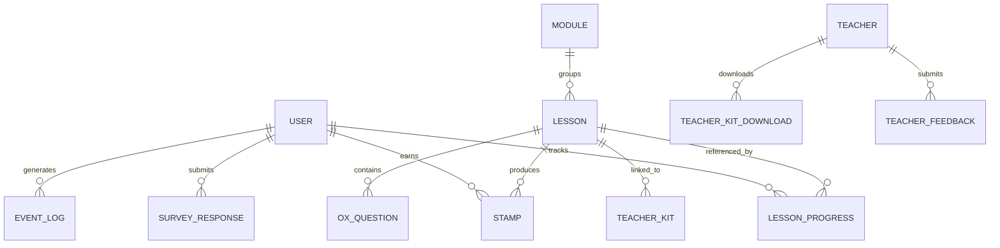

#### 6.2.2 테이블 정의

**USER**

| 필드 | 타입 | 제약 | 설명 |
|---|---|---|---|
| id | UUID | PK | 사용자 고유 ID |
| email | VARCHAR(254) | UNIQUE, NOT NULL | 로그인·알림용 |
| nickname | VARCHAR(40) | NOT NULL | 표시명 |
| role | ENUM('learner','teacher','admin') | NOT NULL | RBAC (REQ-NF-021) |
| accessibility_mode | BOOLEAN | DEFAULT false | 글자 크기·고대비 토글 영속 |
| media_preference | ENUM('video','text','mixed') | DEFAULT 'mixed' | Story 5 매체 선택 |
| password_hash | VARCHAR(255) | NOT NULL | bcrypt (REQ-NF-017) |
| created_at | TIMESTAMP | NOT NULL | |

**LESSON**

| 필드 | 타입 | 제약 | 설명 |
|---|---|---|---|
| lesson_id | VARCHAR(4) | PK, 포맷 `L001`~`L105` | 불변 (REQ-FUNC-033, REQ-NF-052) |
| module_id | VARCHAR(8) | FK → MODULE | |
| order_in_module | INT | NOT NULL | 권장 순서 (강제 아님, ADR-003) |
| title | VARCHAR(200) | NOT NULL | |
| youtube_video_id | VARCHAR(20) | NOT NULL | ADR-005 |
| script | TEXT | NOT NULL | "글로 읽기" 원본 (REQ-FUNC-026) |
| pdf_kit_url | VARCHAR(500) | NOT NULL | 1 레슨 = 1 PDF (원칙 5) |
| revision_last_updated | DATE | NOT NULL | PDF 1페이지 자동 삽입 (REQ-FUNC-015) |
| revision_notes | TEXT | NULL | 개정 이력 |

**LESSON_PROGRESS**

| 필드 | 타입 | 제약 | 설명 |
|---|---|---|---|
| id | UUID | PK | |
| user_id | UUID | FK → USER | |
| lesson_id | VARCHAR(4) | FK → LESSON | |
| last_position_sec | INT | NOT NULL, DEFAULT 0 | 10초 간격 저장 (REQ-FUNC-020) |
| ox_completed | BOOLEAN | DEFAULT false | 전 문항 통과 시 true |
| stamp_earned | BOOLEAN | DEFAULT false | ox_completed=true 시 true (중복 방지 REQ-FUNC-006) |
| updated_at | TIMESTAMP | NOT NULL | |
| — | — | UNIQUE(user_id, lesson_id) | 동일 레슨 중복 행 금지 |

**STAMP**

| 필드 | 타입 | 제약 | 설명 |
|---|---|---|---|
| id | UUID | PK | |
| user_id | UUID | FK → USER | |
| lesson_id | VARCHAR(4) | FK → LESSON | |
| earned_at | TIMESTAMP | NOT NULL | |
| — | — | UNIQUE(user_id, lesson_id) | 중복 스탬프 금지 |

**OX_QUESTION**

| 필드 | 타입 | 제약 | 설명 |
|---|---|---|---|
| id | UUID | PK | |
| lesson_id | VARCHAR(4) | FK → LESSON | |
| question_order | INT | NOT NULL | |
| question_text | TEXT | NOT NULL | |
| correct_answer | BOOLEAN | NOT NULL | O=true, X=false |
| scroll_anchor | VARCHAR(100) | NULL | 오답 시 스크립트 앵커 (REQ-FUNC-036) |

**TEACHER_KIT**

| 필드 | 타입 | 제약 | 설명 |
|---|---|---|---|
| lesson_id | VARCHAR(4) | PK, FK → LESSON | 1 레슨 = 1 KIT |
| pages | INT | NOT NULL | PDF 페이지 수 |
| revision_log_page_url | VARCHAR(500) | NULL | 개정 이력 페이지 위치 |

**TEACHER_KIT_DOWNLOAD**

| 필드 | 타입 | 제약 | 설명 |
|---|---|---|---|
| id | UUID | PK | |
| teacher_id | UUID | FK → USER (role='teacher') | |
| lesson_id | VARCHAR(4) | FK → LESSON | |
| downloaded_at | TIMESTAMP | NOT NULL | |
| revision_at_download | DATE | NOT NULL | 다운로드 시점 버전 |

**TEACHER_FEEDBACK**

| 필드 | 타입 | 제약 | 설명 |
|---|---|---|---|
| id | UUID | PK | |
| teacher_id | UUID | FK → USER | |
| lesson_id | VARCHAR(4) | FK → LESSON | |
| used_in_class | BOOLEAN | NOT NULL | REQ-NF-045 |
| will_reuse | BOOLEAN | NOT NULL | REQ-NF-046 |
| comment | TEXT | NULL | |
| reported_at | DATE | NOT NULL | |

**SURVEY_RESPONSE**

| 필드 | 타입 | 제약 | 설명 |
|---|---|---|---|
| id | UUID | PK | |
| user_id | UUID | FK → USER | |
| survey_id | VARCHAR(40) | NOT NULL | 분기·체감 설문 구분 |
| answers | JSON | NOT NULL | |
| submitted_at | TIMESTAMP | NOT NULL | 분기 1회 제한 |

**EVENT_LOG**

| 필드 | 타입 | 제약 | 설명 |
|---|---|---|---|
| id | BIGSERIAL | PK | |
| timestamp | TIMESTAMP | NOT NULL | |
| user_id | UUID | NULL | 가명처리 후 pseudo_id 병행 컬럼 가능 |
| event_name | VARCHAR(80) | NOT NULL | `lesson.completed` · `ox.submitted` 등 |
| payload_json | JSON | NULL | |
| — | — | INDEX(timestamp, event_name) | 집계 효율 |

보관 정책: `event_log` **90일 이상** (REQ-NF-031), 서버 로그 14일 이상 (REQ-NF-030).

**Prisma 스키마 대응 (C-TEC-003)**: 본 §6.2.2 테이블 정의는 Prisma DSL로 1:1 매핑된다. 핵심 대응 표기는 다음과 같다.

| SQL 제약 | Prisma 표기 | 용도 |
|---|---|---|
| `UNIQUE` | `@unique` / `@@unique([...])` | `Stamp @@unique([userId, lessonId])` ← INV-03 · §1.5.1.1 Option B 멱등 |
| `PRIMARY KEY` | `@id` | `Lesson.lessonId @id` (VARCHAR(4)) |
| `FOREIGN KEY` | `relation()` | `LessonProgress.userId` → `User` |
| `DEFAULT` | `@default(...)` | `accessibilityMode @default(false)` |
| `ENUM` | Prisma enum | `Role { LEARNER TEACHER ADMIN }` |
| `INDEX` | `@@index([...])` | `EventLog @@index([timestamp, eventName])` |
| `TIMESTAMP NOT NULL DEFAULT now()` | `DateTime @default(now())` | `createdAt`·`earnedAt`·`submittedAt` |
| `append-only` | 애플리케이션 레벨 (RLS + Prisma Client 미제공 경로) | INV-08 `EventLog` |

로컬 개발(SQLite)과 배포(Supabase PostgreSQL)는 동일 스키마로 작동하며, `DATABASE_URL` 환경 변수만 전환한다.

#### 6.2.3 Class Diagram (도메인 모델)

6.2.1의 ERD가 저장 관점의 엔터티 관계를 표현한다면, 본 Class Diagram은 **도메인 관점의 행위(메서드)와 제약**을 함께 드러낸다. 구현 관점에서 본 구조는 Prisma 모델·Server Action·Route Handler로 분산 매핑되며(§1.5.1.2), **책임 분배와 불변식(invariants)** 은 구현 언어와 무관하게 유지된다.

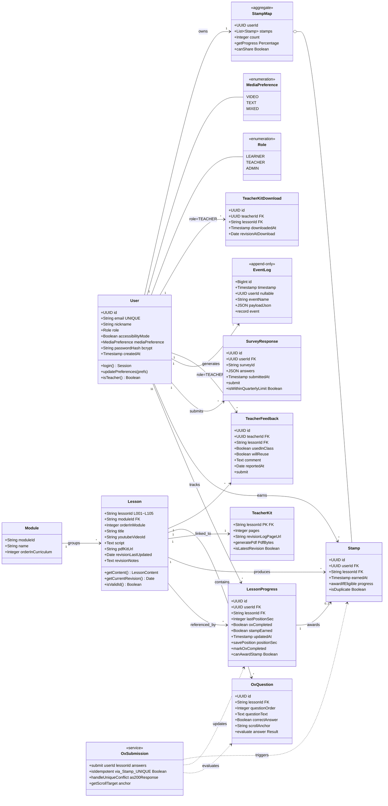

**핵심 불변식 (Class-level Invariants)**

| 불변식 | 설명 | 연결 Requirement |
|---|---|---|
| INV-01 | `Lesson.lessonId` 는 생성 이후 **변경 불가** (`L001`~`L105` 포맷) | REQ-FUNC-033, REQ-NF-052 |
| INV-02 | 1 Lesson = **정확히 1 TeacherKit, 1 youtubeVideoId, 1 script, 1 pdfKitUrl** | REQ-FUNC-034 |
| INV-03 | `Stamp` 는 `(userId, lessonId)` 조합당 **최대 1건** | REQ-FUNC-006 |
| INV-04 | `LessonProgress.stampEarned=true` 는 `oxCompleted=true` 가 전제 | REQ-FUNC-002 |
| INV-05 | `OxSubmission.submit()` 는 `Stamp UNIQUE(user_id, lesson_id)` 제약을 통해 **영구 멱등** (§1.5.1.1 Option B). 동일 입력 재수신 시 UNIQUE 충돌을 200 응답으로 변환 | REQ-FUNC-006 · §1.5.1.1 |
| INV-06 | `User.passwordHash` 는 **bcrypt** 단방향 해시만 허용 | REQ-NF-017 |
| INV-07 | `User.role=LEARNER` 는 `TeacherFeedback`·`TeacherKitDownload` 생성 금지 | REQ-NF-021 |
| INV-08 | `EventLog` 는 **append-only** (수정·삭제 금지) | REQ-NF-031 |
| INV-09 | `SurveyResponse.submit()` 는 분기당 1회 이하 | §6.3 API · REQ-FUNC-003 |
| INV-10 | `StampMap` 은 사용자 자율 선택 허용 (순서 강제 없음) | ADR-003 · REQ-FUNC-038 |

**클래스-요구사항 역추적 요약**

| 클래스 | 주요 연결 REQ-FUNC | 주요 연결 REQ-NF |
|---|---|---|
| User | 029 | 014, 016, 017, 021 |
| Lesson | 033, 034, 035, 037, 038 | 052 |
| LessonProgress | 020, 021, 024, 025 | 010 |
| Stamp, StampMap | 001, 004, 006, 041 | 003 |
| OxQuestion, OxSubmission | 002, 006, 036 | 009 |
| TeacherKit, TeacherKitDownload | 013, 015, 017, 018, 019 | 049 |
| TeacherFeedback | 016 | 045, 046 |
| SurveyResponse | 003 | 043 |
| EventLog | 009, 010, 023 | 031, 040~047 |

#### 6.2.4 Teacher Kit PDF 양식 규격 (REQ-FUNC-013·015·019)

본 규격은 장은혜 페르소나(P14·P13)의 "한국 교사 관행에 이질감 없는 단일 원전" 요건을 충족하기 위해 제정한다. 폰트 라이선스는 ADR-002(CC BY-NC-SA 4.0) 및 프로젝트 공공성 원칙과 정합한다.

**폰트**

| 용도 | 폰트 | 라이선스 | 적용 근거 |
|---|---|---|---|
| 제목·표·OX 문항·라벨 (고딕) | **나눔바른고딕** (Regular / Bold) | **SIL OFL 1.1** (완전 자유) | 한국 공교육 교안 표준. 교사 작업물과의 이질감 0 |
| 본문·스크립트 발췌·해설 (장문) | **나눔명조** (Regular) | **SIL OFL 1.1** | 한국 교재 장문 관행. 세리프체로 가독성 확보 |

폰트 로드: `next/font/google` 로 서브셋(한글 2,350자 + 영문·숫자) 사전 생성 → `@react-pdf/renderer` 의 `Font.register()` 에 정적 참조. Vercel Functions 번들에 폰트 파일 정적 포함 (cold start 영향 최소).

**페이지 규격**

- 용지: **A4**, 여백 상하 20mm · 좌우 18mm
- 페이지 수: **2~3 페이지** (레슨 분량에 따름)
- 색상: **그레이스케일 호환** (인쇄 환경 다변 고려). 포인트 컬러는 CC 라이선스 뱃지 1개로 제한

**페이지 구성**

| 페이지 | 구성 요소 | 폰트 | 요건 |
|---|---|---|---|
| **p.1 머리글** | 레슨 ID (L001~L105) · 제목 · 모듈명 · **개정일 (`revision_last_updated`)** · CC BY-NC-SA 4.0 뱃지 | 나눔바른고딕 Bold 18pt (제목) / Regular 10pt (메타) | REQ-FUNC-015, REQ-FUNC-037 |
| **p.1 학습 목표** | 테두리 박스 안 "이 차시 이해 목표" 2~3줄 | 나눔바른고딕 11pt | 원칙 1 (이해가 먼저) |
| **p.1 영상 접근** | 유튜브 링크 + **QR 코드** + 예상 시청 시간 | 나눔바른고딕 10pt | REQ-FUNC-019 |
| **p.2 본문** | 스크립트 주요 구절 발췌 · 개념 정의 1회 이상 · 한국 맥락 예시 1개 | **나눔명조 11pt** | 원칙 1, REQ-FUNC-008 |
| **p.2~3 OX 문항** | 문항 번호 · 지문 · 정답 · 해설 (`OxQuestion.scroll_anchor` 참조) | 나눔바른고딕 11pt (문항) / 나눔명조 10.5pt (해설) | REQ-FUNC-036 |
| **p. 말미** | **개정 이력** (`revision_notes`) · 출처 · CC BY-NC-SA 4.0 전문 링크 | 나눔바른고딕 9pt | REQ-FUNC-015, 037 |

**렌더링 엔진**: `@react-pdf/renderer` (Vercel Functions 호환). 번들 크기·cold start 유리. 대안으로 `puppeteer-core + @sparticuz/chromium` 을 Stage 0 Alpha 실측 단계에서 병행 검증한다(PLAN §3.2 Story 3 주의 지점 반영).

**금지 사항**: 자극적 색상·광고 요소·금융 상품 언급·외부 로고 삽입 모두 금지 (원칙 3·CON-03).

### 6.3 Detailed Interaction Models

#### 6.3.1 학습자 신규 가입 · 접근성 설정

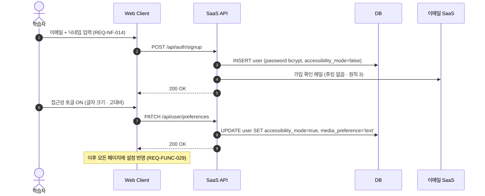

#### 6.3.2 후킹 린터 CI 파이프라인

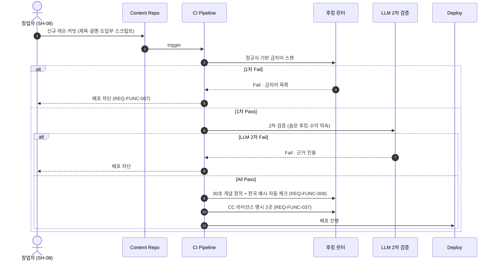

#### 6.3.3 Severity 장애 대응 플로

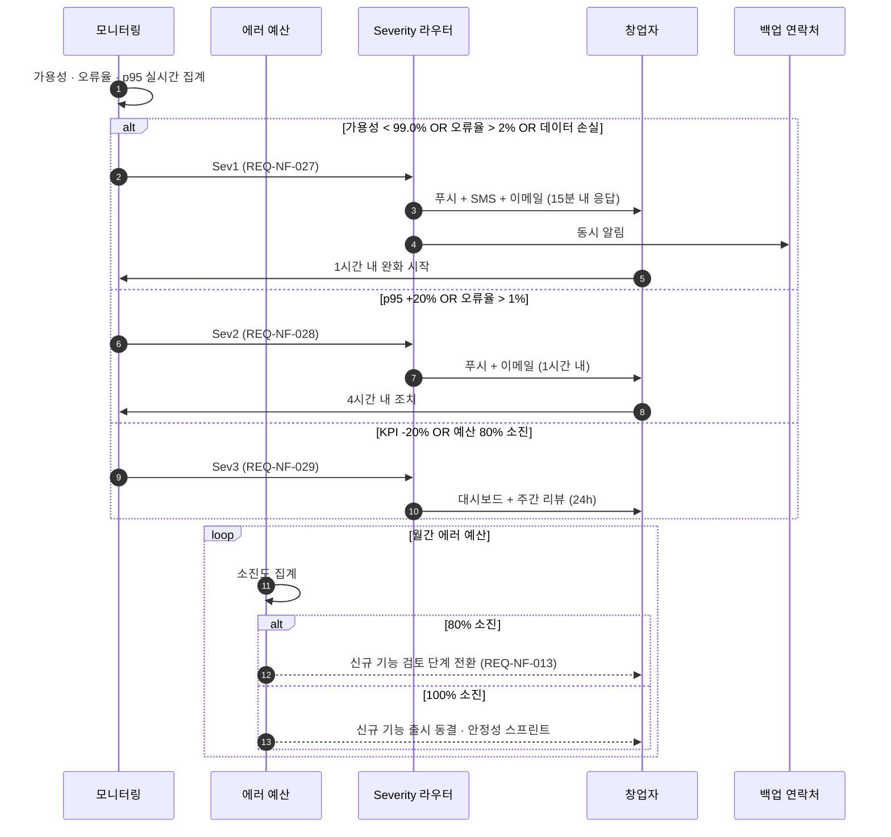

#### 6.3.4 다기기 재생 충돌 (Last-Write-Wins)

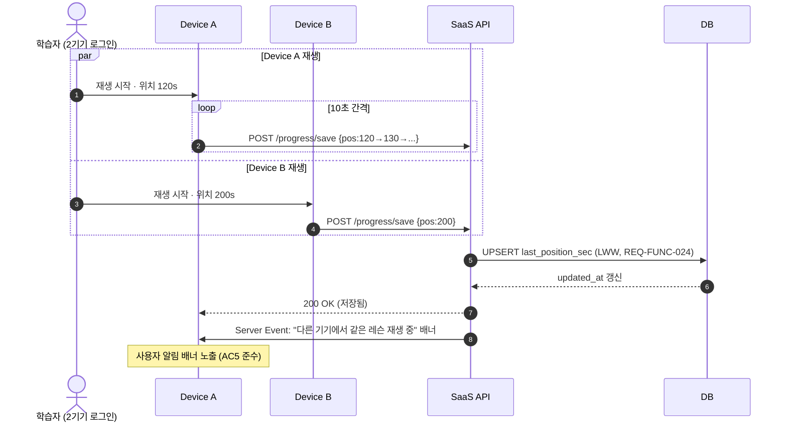

#### 6.3.5 검증 계획 · 실험 (PRD §8 → Appendix)

| 실험 ID | 가설 | 설계 | 통계 | 성공 기준 | 연결 Requirement |
|---|---|---|---|---|---|
| EXP-1 | 스탬프 맵 노출이 10편 완주율 ≥ 2배 | A/B (노출 vs 숨김) | α=0.05, Power 0.8, n=500 이상, 카이제곱 | A군 완주율 2배 + p<0.05 | REQ-FUNC-001, REQ-NF-040 |
| EXP-2 | 후킹 없는 도입부가 이수민 유형 완시청률 ≥ 60% | 유형 매칭 후 전수 관찰 | 단일 비율, α=0.05, n≥200, 95% CI 하한 ≥ 55% | 완시청률 ≥ 60% | REQ-FUNC-009 |
| EXP-3 | 재개 위치 저장이 단편 세션 완주율 유지 | 단편(<8분) vs 전체 | 비율 비교, α=0.05, Power 0.8, 허용 격차 2pp | 단편 완주율 ≥ 8% | REQ-FUNC-023 |
| EXP-4 | "글로 읽기" 전환이 한정숙 유형 완주율 향상 | 매체 선호 매칭 코호트 | 단일 비율, α=0.05, n≥100 | 전환 사용자 완주율 ≥ 15% | REQ-FUNC-026 |

**규정**: 모든 실험은 사전등록(pre-registration) · 자동화 분석 스크립트 · 조기 중단 금지(peeking 방지). 전체 실험은 Public Pilot 단계에서 활성화된다 (§1.2.3).

### 6.4 Validation Plan (파일럿 단계별)

§1.2.3 에서 정의된 4구간 파일럿 구조에 따라 단계별 검증 범위를 정의한다.

| 단계 | 기간 | 대상 | 검증 범위 |
|---|---|---|---|
| **Alpha** | 4주 | 창업자 + 지인 2~3명 | MVP-IN 38건 구현. Story 1·4 축소 E2E. 접근성 axe + Lighthouse CI 통과. |
| **Private Beta** | 6주 | 지인 학습자 10~15 + 지인 교사 2~3 | Story 3 교안 PDF 품질 검증. Resend 뉴스레터 투입. 교사 재사용 의사 1건 확보. |
| **Closed Beta** | 8주 | 학습자 50 + 교사 10 | Story 5 접근성 세부. Story 2 정규식 린터. Gemini 2차 검증 투입. AC 수치 실측 완료. 기준선 4주 확정. |
| **Public Pilot** | 잔여 ~34주 | 자발 유입 전체 | 북극성 KPI (REQ-NF-040) 도달 검증. EXP-1~4 실험 활성. Sentry Severity SLA 엄격 운영. MVP-DEFER 24건 구현. |

### 6.5 경쟁 대안 벤치마크 (기준선 확정 정책 · PRD §8.3)

| 비교 대상 | 지표 | 목표 | 기준선 확정 방법 |
|---|---|---|---|
| ChatGPT 경제 학습 세션 | 10편 상당 누적 학습률 | ≥ 10% | Stage 1 첫 4주 실측 |
| 경제학원론 (맨큐) | 50페이지 이탈률 환산 | ≤ 50% | 파일럿 사전 설문 + 실측 |
| 경제 유튜브 | 10편 이상 누적 시청자 비율 | ≥ 10% | 파일럿 사전 설문 |
| 유료 강의 완강률 | 완강률 | ≥ 10% | 공개 통계 + 실측 |
| EBS 교사 실사용 후기 | 후기 회신율 | ≥ 5% | 첫 4주 실측 |

**정책**: 추정값은 성공 기준의 근거로 사용 금지. 모든 비교 수치는 Stage 1 첫 4주 실측 또는 공식 통계 인용 중 하나만 사용.

### 6.6 리스크 등록부 (PRD §7.3 → SRS 추적)

"위험 노출 시점" 컬럼은 Revision 0.9에서 신규 추가된 것으로, §1.2.3 파일럿 4구간 중 각 리스크가 활성화되는 단계를 명시한다.

| # | 리스크 | 영향 받는 Requirement | 완화책 | 위험 노출 시점 |
|---|---|---|---|---|
| R1 | 유튜브 알고리즘 열위 | REQ-FUNC-039 (뉴스레터) | 비알고리즘 유입 경로 조기 확보 | Public Pilot |
| R2 | 생성형 AI 침투 가속 | REQ-FUNC-001, 034 (구조·체계) | 『체계적 여정』 포지션 외부화 | Public Pilot |
| R3 | 단일 제작자 페이스 붕괴 | REQ-NF-050, 051 | 템플릿 + 외주 편집 | **전 구간 (Alpha부터)** |
| R4 | (해소) Q1-B 원칙 5 충돌 | — | ADR-003으로 구조적 해소 | — |
| R5 | 교사 모드 실사용 < 5% | REQ-FUNC-013~019, REQ-NF-045 | 인디스쿨 파일럿 5명 | Private Beta ~ Public Pilot |
| R6 | 접근성 체크리스트 미충족 | REQ-NF-033~039 | Stage 0 Exit 100% 필수 | **Alpha Exit 직전** |
| R7 | 재정 지속성 확보 실패 | 전체 Scope | 자체 자본 2~3년 + 후원 채널 | Closed Beta 후반 이후 |
| **R8** | **Vercel Hobby "non-commercial" 정책 저촉** (§1.5.1.2 D-TIER) | 전체 배포 경로 | 라이선스 수익 실현 시점에 Vercel Pro 전환 (유료 전환 트리거 #3). Stage 1 파일럿 무료·비영리 운영 구간은 Hobby 허용 범위. | Public Pilot 진입 시 |
| **R9** | **Vercel Serverless Functions cold start** (첫 요청 500ms~2s) | REQ-NF-001, 002, 003, 004 (p95 임계치) | (1) Vercel Cron으로 5분 간격 warm-up ping (§6.1 `/api/cron/warmup`) (2) 랜딩·레슨 페이지는 SSG 우선. Story 2 "첫 30초" 는 유튜브 임베디드라 영향 밖. | **Alpha 배포 직후** |
| **R10** | **Supabase Free 7일 비활성 시 프로젝트 pause** | 전체 DB 의존 Requirement | (1) Vercel Cron 주 1회 `SELECT 1` (§6.1 `/api/cron/supabase-ping`) (2) 일 1회 `pg_dump` → Supabase Storage (RPO 24h · REQ-NF-011). D-TIER 트리거 #1 도달 시 Pro 전환. | **Private Beta 주말 저활성 구간** |

### 6.7 Alpha Exit 체크리스트 (Appendix E · MVP-IN 38건)

본 체크리스트는 §1.2.3 Alpha → Private Beta 진입 게이트의 구체 항목이다. 38개 항목 전부 체크 완료 시 Alpha Exit. 각 항목 옆에 완료 일자를 기록한다. Revision 0.9에서 신설된 섹션.

#### 6.7.1 REQ-FUNC MVP-IN 18건

- [ ] REQ-FUNC-001 스탬프 맵 렌더링
- [ ] REQ-FUNC-002 OX → progress 반영
- [ ] REQ-FUNC-006 Prisma @@unique 멱등 (P2002 → 200 변환)
- [ ] REQ-FUNC-007 후킹 린터 정규식 1차
- [ ] REQ-FUNC-013 교안 PDF 단일 파일 생성 (Private Beta 진입 전)
- [ ] REQ-FUNC-015 개정 이력 자동 삽입
- [ ] REQ-FUNC-019 QR 코드 삽입
- [ ] REQ-FUNC-020 위치 저장 10초 간격
- [ ] REQ-FUNC-021 재개 오차 ≤5초 (기본 복원)
- [ ] REQ-FUNC-022 자막 기본 ON + 차트 자막
- [ ] REQ-FUNC-026 글로 읽기 토글
- [ ] REQ-FUNC-029 글자 크기 14~28px 조절
- [ ] REQ-FUNC-033 lesson_id 스키마 제약
- [ ] REQ-FUNC-034 3매체 NOT NULL
- [ ] REQ-FUNC-035 유튜브 임베디드만
- [ ] REQ-FUNC-036 OX 오답 앵커 스크롤
- [ ] REQ-FUNC-037 CC 라이선스 3곳 명시 (CI)
- [ ] REQ-FUNC-038 자율 선택 허용

#### 6.7.2 REQ-NF MVP-IN 20건

- [ ] REQ-NF-002 LCP p95 ≤1.5s (Lighthouse CI 통과)
- [ ] REQ-NF-006 위치 저장 주기 ≤10s
- [ ] REQ-NF-014 PII 최소 (이메일+닉네임만)
- [ ] REQ-NF-015 결제 정보 수집 금지
- [ ] REQ-NF-017 Supabase Auth 적용
- [ ] REQ-NF-018 TLS 1.2+ (Vercel 자동)
- [ ] REQ-NF-019 세션 관리 (Supabase Auth 기본)
- [ ] REQ-NF-020 외부 폰트 Google Fonts만
- [ ] REQ-NF-021 RBAC 3역할
- [ ] REQ-NF-023 월 인프라 비용 0~10만원
- [ ] REQ-NF-024 외부 도구 월 ≤30만원
- [ ] REQ-NF-026 영상 호스팅 0원 (유튜브)
- [ ] REQ-NF-030 서버 로그 14일
- [ ] REQ-NF-034 색 대비 ≥4.5:1 (axe 통과)
- [ ] REQ-NF-037 키보드 네비게이션 100%
- [ ] REQ-NF-039 글로 읽기 대체 경로 100%
- [ ] REQ-NF-048 레슨 1~105 확장 가능 스키마
- [ ] REQ-NF-050 axe + Lighthouse CI 게이트 2종
- [ ] REQ-NF-052 lesson_id 불변

#### 6.7.3 통합 게이트

- [ ] Story 1 (박지훈 스탬프 맵) E2E 1회 통과
- [ ] Story 4 축소 (오세은 재개 위치) E2E 1회 통과
- [ ] axe-core CI 100% 통과
- [ ] Lighthouse CI LCP p95 ≤1.5s 통과

---

## 부록 Z · 변경 관리

### 변경 이력 (Revision History)

| Revision | Date | Section | Summary |
|---|---|---|---|
| **1.0** | 2026-04-24 | 전체 | 최초 발행 (PRD v0.5 기반 SRS 완비) |
| **1.1** | 2026-04-25 | §3.5, §3.6, §6.2.3 | **Use Case View · Component View · Class Diagram 3종 보완.** UC-01~14 카탈로그와 REQ 연결, 컴포넌트 책임 매트릭스, 도메인 불변식 INV-01~10 추가. 다이어그램 총 8 → 11개. |
| **1.2** | 2026-04-25 | §1.5.2 CON-07, §4.2.4 REQ-NF-023 | **MVP 인프라 비용 상한 재정의.** 연 300~1,000만원 → **월 0~10만원(연 최대 120만원)**. PRD v0.5 §5.4와 수치 불일치 발생 → PRD v0.6 승격 시 원천 문서 정합화 필요. |
| **1.3** | 2026-04-25 | §1.5.1, §1.5.1.1(신설), §3.4.1, §3.6, §4.1.1 REQ-FUNC-006, §5 TC-006, §6.1, §6.2.3 | **ADR-004 Pending Decision 확정 — 멱등성 보장 메커니즘 Option B(DB UNIQUE + 자연 멱등 키) 선택.** `Stamp UNIQUE(user_id, lesson_id)` 제약을 자연 멱등 키로 활용, UNIQUE 충돌을 200 응답으로 변환. 영구 멱등으로 INV-05 충족. 인프라·비용 증분 0. Option A 이전 트리거(모니터링 기준 4종) 사전 등록. |
| **1.4** | 2026-04-25 | §1.5.1, §1.5.1.2(신설), §1.5.2 CON-07, §3.1, §3.2, §3.3, §3.6, §4.2.3 REQ-NF-017, §4.2.4 REQ-NF-023, §4.2.5 REQ-NF-032, §4.2.8 REQ-NF-050, §6.1, §6.2.2, §6.2.4(신설), §6.6 R8·R9·R10 | **ADR-004 Technology Stack 확정 — Next.js App Router + Supabase + Vercel + Vercel AI SDK/Gemini 단일 풀스택.** C-TEC-001~007 + 파생 결정 D-CI(GitHub Actions)·D-AUTH(Supabase Auth)·D-TIER(Hobby+Free 출발) 수록. Teacher Kit PDF 양식 규격(나눔바른고딕·나눔명조, SIL OFL 1.1, A4 2~3p) §6.2.4 신설. Cold start·Supabase pause·PDF 폰트 3건 운영 리스크 R8~R10으로 등재하고 Vercel Cron 완화책 명시. MVP 핵심 사용자 경험 훼손 없음 판정은 별도 Plan 문서 §3에 수록. PRD v0.5 §5.4·§7.4와 일부 수치·결정 불일치는 PRD v0.6 승격 시 정합화 필요. |
| **0.9** | 2026-04-25 | §1.1, §1.2.3(신설), §1.3, §1.4 REF-18(신설), §3.1, §4.1 서두·4.1.1~4.1.8 전체, §4.2.1~4.2.8 전체, §5.3, §6.4, §6.6, §6.7(신설 · Appendix E), 부록 Z | **MVP Implementation Edition — 구현 범위 라벨 병기 + 파일럿 4구간 재정의.** v1.4의 모든 요구사항 범위를 유지하면서 각 REQ 94개(FUNC 42 + NF 52)에 ✅ MVP-IN / 🟡 MVP-SOFT / ⏸️ MVP-DEFER 라벨 병기. 파일럿을 Alpha(4주)/Private Beta(6주)/Closed Beta(8주)/Public Pilot(34주) 4구간으로 세분화(§1.2.3 신설). External Systems(§3.1)에 "투입 시점" 컬럼 추가 — 외부 의존 10→5→6→7→9 단계적 증설. 리스크 등록부(§6.6)에 "위험 노출 시점" 컬럼 추가. Appendix E Alpha Exit 체크리스트(§6.7 MVP-IN 38건) 신설. 본 Revision은 3개월 개발 경험 + 3년차 IT 기획 + 완전 바이브코딩 기반 단일 제작자가 Alpha 4주 내에 실제 구현 가능한 범위를 명확히 한다. 라벨 분류 근거는 REF-18 (MVP 개발목표 적절성 종합 검토 보고서). PRD v0.5 §8.1과 파일럿 단계 수치 불일치는 PRD v0.6 승격 시 정합화 필요. Revision 번호 체계에서 0.9는 "MVP Implementation Edition" 으로, v1.4의 완성형 목표 사양에서 파생된 MVP 실행 전용 버전임을 명시한다. |

### 관리 규정

- 본 SRS는 **Revision 0.9 (MVP Implementation Edition) 기준**이며, 원본 계보는 v1.4 "완성형 목표 사양" 을 유지한다. PRD 개정(분기 단위) 또는 Stage 1 파일럿 실측 결과에 따라 후속 Revision 발행.
- Revision 변경 시 변경 이력을 본 부록에 `Date · Section · Summary` 형식으로 기록.
- 원칙 1·2·3·4 및 Non-Goals 관련 요구사항(예: REQ-NF-015, REQ-FUNC-007, 후킹 린터)은 **변경 불가 항목**. 수정 시 PRD v0.6 승격 선행 필요.
- **MVP 라벨 조정 규정**: ✅ MVP-IN / 🟡 MVP-SOFT / ⏸️ MVP-DEFER 라벨은 Stage 1 실측 또는 MVP-IN 38건 완료 실패 시 재분류 가능하다. 재분류 시 REF-18 보고서 업데이트 또는 신규 근거 문서 발행 필요.

---

**문서 종료**
