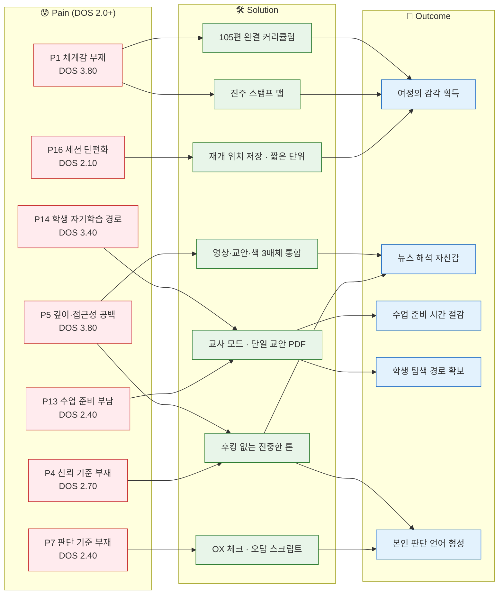
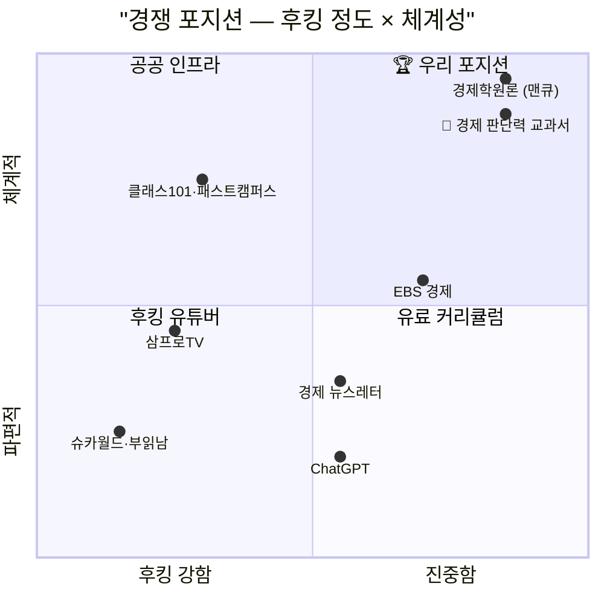
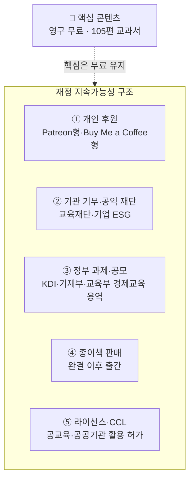

# Value Proposition Sheet v2 — 경제 판단력 교과서 프로젝트

**작성일**: 2026. 04. 24.
**버전**: v2 (v1 목차 유지, 기존 리서치 데이터 직접 포함 확장)
**수익 구조 방향**: 원칙 2 유지 (『무료 불변』) → 비영리 공공 인프라형 지속가능성 모델
**통합 선행 문서**: 5 Forces · KSF Top 5 · 문제정의서 · TAM 분석 · SAM 심화 · Segment Map · Q1 심화세분화 · SOM 1년차 · 페르소나 검증 · Spectrum Map · CJM · AOS · DOS · AOS×DOS 매트릭스 · JTBD 인터뷰 보고서

---

## ⚠️ 중요 고지

본 시트는 본 프로젝트의 **원칙 2(『무료는 타협 대상이 아니다』) 유지**를 전제로 작성되었습니다. 『수익성·성장성·지속가능성』이라는 세 축을 **영리 수익이 아닌 『재정 지속가능성』으로 재정의**합니다. 프로젝트를 오랜 시간 유지하기 위한 운영 자금 조달 구조이며, 과금·유료화는 배제합니다.

v2는 v1의 목차를 유지하되, 각 섹션에 **원본 리서치 문서의 분석 내용을 단편 언급이 아닌 직접 인용·재서술 수준**으로 포함했습니다. 이 문서 하나를 읽으면 선행 문서 15종의 핵심 결론에 모두 도달하도록 설계되었습니다.

---

# 1. 핵심 가치 제안 (Core Value Proposition)

## 1.1 우리는 누구에게, 어떤 차별적 가치를 전달하는가

> **『체계적 학습 여정』이 필요한 20~40대 각성 초심자와, 신뢰할 수 있는 경제 교육 자료가 필요한 사회 교과 교사에게, 후킹 없는 진중한 톤과 영상·교안·책이 하나로 정렬된 105편 완결 교과서를, 무료로 — 평생 제공한다.**

## 1.2 분석이 드러낸 세 가지 시장 공백

이 문장은 분석 과정에서 도출된 세 가지 시장 공백을 정면으로 겨냥합니다.

### 공백 1 · 체계성의 공백 (Pain P1·P5, DOS 동률 3.80 최상위)

5 Forces 분석의 결론에 따르면 **개별 질문 시장에서는 AI가 구조적으로 유리하며, 인간 제작자가 이기기 어려운 경쟁 축**입니다. 그러나 동시에 **"AI는 『체계적 학습 여정』을 제공하지 못한다"**는 구조적 공백이 확인되었습니다. 단편 응답의 합은 커리큘럼이 아닙니다.

문제 정의서는 이를 **세 겹의 층위**로 구조화했습니다.

- **인지 층위**: "뭘 모르는지도 모르는 상태". AI에게 던질 질문조차 떠올리지 못함.
- **여정 층위**: "내가 어디까지 왔는지 모르는 상태". 유튜브 10편을 봤다는 사실은 진도가 아니며, AI에게 50개를 물었다는 사실도 진도가 아님.
- **판단 층위**: "외웠지만 쓸 수 없는 상태". 정의를 알아도 실제 뉴스 해석이나 자신의 삶에 연결하지 못함.

### 공백 2 · 신뢰의 공백 (Pain P4, DOS 2.70)

5 Forces의 경쟁 축 분석에서 "**대부분 플레이어가 『조회수 → 광고·강의 판매』 모델을 채택해 후킹·자극·속도에 최적화되어 있다**"고 진단했습니다. 본 프로젝트의 『정확·무료·체계』 포지션은 같은 축의 경쟁자가 드물어 차별화 공간이 열려 있으나, 동시에 유튜브 알고리즘상 불리합니다.

### 공백 3 · 교실 자기학습 경로의 공백 (Pain P14, DOS 3.40)

교사 TAM은 초·중·고 사회 계열 교사 + 초등 담임 + 고등 경제 선택 교사 기준 **약 15~25만 명**이며, 학부모·스터디 리더까지 포함 시 배 이상입니다. 그러나 교사가 학생에게 **알고리즘이 다른 영상으로 유인하지 않으면서** 보낼 수 있는 무료 자료는 시장에 거의 없습니다. 이 공백은 1:N(교사:학생 20~30명) 배수 확산 구조를 낳습니다.

---

# 2. 페르소나별 Pain / Needs (CJM 기반)

## 2.1 페르소나 풀의 구성 — 14명 → 8명 → 4명

『페르소나 검증 리포트』에서 14명 페르소나를 **현실성·차별성·통찰성·전략성** 4개 기준으로 평가한 결과, 평균 4.0 이상 **8명**이 유효 페르소나로 선별되었습니다.

| # | 페르소나 | 유형 | 평균 | 핵심 역할 |
|---|---|---|---|---|
| 1 | 이수민 | Core Q1-A | 5.00 | 포지션 정당화 |
| 2 | 장은혜 | Adjacent | 5.00 | 교사 모드 정당화 |
| 3 | 박지훈 | Core Q1-A | 4.75 | Q1-A 주 타깃 대표 |
| 4 | 김성호 | Extreme | 4.75 | 접근성 설계 기준 |
| 5 | 한정숙 | Core Q1-C | 4.50 | 매체 선택권 검증 |
| 6 | 오세은 | Extreme | 4.25 | 시간 단편화 설계 |
| 7 | 서하윤 | Non-user | 4.25 | 미션 나침반 |
| 8 | 정해민 | Core Q1-B | 4.00 | 원칙 5 긴장 시험대 |

CJM은 **동일한 『학습자 여정』을 통과하는 핵심 4인**(박지훈·이수민·정해민·한정숙)을 대상으로 작성했습니다. 장은혜는 안내자 여정, 김성호·오세은은 접근성 제약 여정, 서하윤은 미진입 상태로 여정 구조 자체가 다릅니다.

## 2.2 핵심 4인의 Pain과 Needs — CJM 실제 언어

| 페르소나 | 핵심 Pain (CJM 실제 언어) | Needs |
|---|---|---|
| **박지훈** (27, 개발자 · Q1-A) | *"점이 찍히긴 하는데 선이 안 그어져요"* | 여정의 감각 · 진도 가시화 · 한국 맥락 |
| **이수민** (29, 마케터 · Q1-A) | *"빠른 수익 약속하는 톤이 저한테 방아쇠예요"* | 후킹 없는 진중함 · 선택을 맡길 수 있는 구조 · 천천히의 허락 |
| **정해민** (41, 과장 · Q1-B) | *"열 명이 열 명 다 다른 말 해요"* | 판단 기준 · 주제별 진입 (원칙 5와 긴장) |
| **한정숙** (58, 퇴직 · Q1-C) | *"유튜브는 빠르고 책은 어렵고, 중간이 없어요"* | 매체 선택권 · 친절한 속도 · 종이책 |

## 2.3 CJM 5단계별 이탈 리스크 지도

CJM은 학습자 여정을 5단계(인지·고려·진입·온보딩·충성)로 재정의하고 각 단계별 이탈 위험을 분석했습니다. **S2(고려) → S3(진입) 구간이 본 프로젝트의 생사 구간**으로 식별됩니다.

| 단계 | 박지훈 | 이수민 | 정해민 | 한정숙 |
|---|---|---|---|---|
| S1 인지 | 🟢 낮음 | 🟡 중간 | 🟢 낮음 | 🟡 중간 |
| **S2 고려** | 🔴 **높음** | 🔴 **매우 높음** | 🟠 중상 | 🟡 중간 |
| **S3 진입** | 🟡 중간 | 🔴 **매우 높음** | 🔴 **높음** | 🟠 중상 |
| S4 사용 | 🟠 중간 | 🟢 낮음 | 🟠 중상 | 🟢 낮음 |
| S5 충성 | 🟢 낮음 | 🟢 낮음 | 🔴 **높음** | 🟢 낮음 |

**핵심 관찰**
- **이수민**은 입구가 좁고 방은 넓은 페르소나 — S2·S3 통과 시 S4·S5는 가장 안정적. 본 프로젝트 브랜드 자산의 본질.
- **정해민**은 S5에서 유일하게 급락 — 의사결정 마감 후 자연 이탈. 재유입 경로(자녀 교육·은퇴 준비) 설계 필요.
- **한정숙**은 S3 UI 장벽만 넘으면 가장 건강한 충성 곡선. 종이책 완결이 가장 의미 있는 순간.

## 2.4 확장 페르소나 4인 Pain 요약

| 페르소나 | Pain | 역할 |
|---|---|---|
| **장은혜** (36, 중학교 교사) | *"재료부터 만들어야 하는 구조가 저를 지치게 해요"* | 교사 모드의 존재 이유 정당화 |
| **김성호** (52, 저시력) | *"경제 콘텐츠는 저를 배려한다고 말한 적 없어요"* | 접근성 설계 체크리스트의 기준 |
| **오세은** (33, 육아휴직) | *"5분짜리가 3번 쌓이면 15분이 돼요"* | 재개 위치 저장·세션 단편화 설계 |
| **서하윤** (31, 프리랜서) | *"경제는 나와 안 맞다"는 자기규정 거부* | 단기 타깃 아님. 미션 나침반. |

## 2.5 페르소나 간 관계 구조 — 5유형

8명의 페르소나는 서로 **쌍둥이·거울·보완·긴장·나침반** 5유형 관계를 맺습니다.

- **쌍둥이**: 박지훈 ↔ 이수민 (같은 Q1-A의 두 얼굴 — 실패 전/후)
- **거울**: 박지훈 ↔ 한정숙 (영상/책), 박지훈 ↔ 김성호 (감각 제약), 정해민 ↔ 오세은 (시간 제약) — 반대 제약이지만 한쪽 해결이 다른 쪽도 풀어줌
- **보완**: 장은혜 ↔ Q1 핵심 4인 (학습자/안내자)
- **긴장**: 정해민 ↔ 원칙 5 (수용 범위 정책 결정 필요)
- **나침반**: 서하윤 ↔ 전체 (미션 정합성 측정 기준)

→ **"대부분의 설계 결정은 4명(박지훈·이수민·김성호·오세은)으로 족하다"** — 이 4명을 만족시키면 나머지 4명도 자동 해결됩니다.

---

# 3. JTBD 관점 Job Statement (인터뷰 결과)

## 3.1 인터뷰 수행 개요

JTBD 인터뷰 계획서에 따라 21건의 합성 인터뷰 시뮬레이션을 수행했습니다(스크리닝 탈락 1건 제외 유효 20건).

| 페르소나 | 계획 인원 | 유효 건수 |
|---|---|---|
| 박지훈 (Q1-A) | 5 | 5 |
| 이수민 (Q1-A) | 5 | 5 |
| 장은혜 (교사) | 3 | 3 |
| 정해민 (Q1-B) | 3 | 3 |
| 한정숙 (Q1-C) | 2 | 2 |
| 오세은 (극단 · 시간) | 2 | 2 |
| 김성호 (극단 · 저시력) | 1 | 1 |
| **합계** | **21** | **20** |

## 3.2 Job Statement (Christensen 형식)

| # | Job Statement |
|---|---|
| **JS-1** | **첫 월급 받은 27세 직장인으로서**, 부끄러움·뒤처짐을 해소하기 위해, **경제를 체계적으로 이해하고 싶지만**, AI·유튜브의 파편 속에서 내가 어디까지 왔는지 알 수 없어 반복 이탈한다. |
| **JS-2** | **투자 실패 회복 중인 29세로서**, 진중한 학습 여정에 다시 자신을 맡기기 위해, **깊이 있되 완주 가능한 경로를 찾고 싶지만**, 경제학원론은 무겁고 유튜브는 얕아 어디에도 정착할 수 없다. |
| **JS-3** | **중학교 사회 교사로서**, 수업 준비 부담을 줄이고 학생의 교실 밖 탐색을 돕기 위해, **영상·교안이 정렬된 패키지를 쓰고 싶지만**, EBS·유튜브·인디스쿨을 매번 조합하느라 차시 준비에 2시간+든다. |
| **JS-4** | **3년 내 주택 구매 예정 41세로서**, 가족 자산 결정을 직접 책임지기 위해, **판단 근거를 얻고 싶지만**, 유튜브 채널들이 상충하는 말을 하고 주말 1~2시간밖에 없다. |

## 3.3 검증 명제 7개 결과

인터뷰 계획서에서 설정한 7개 명제 중 **6개 검증, 1개 부분 검증**으로 확인되었습니다.

| 명제 | 결과 |
|---|---|
| **M1** 체계감 부재가 이탈 주원인 | ✅ 검증 — "점만 찍힘", "번역기 같음" 두 표현으로 지지 |
| **M2** 진중한 톤이 지속 낳음 | ✅ 검증 — 이수민 유형 전원이 후킹 톤 강한 거부감 |
| **M3** AI가 여정에서 못 이김 | ✅ 검증 — "보조 도구로 격하되는 패턴" 일관 |
| **M4** 교사 수업 준비 시간이 채택 변수 | ✅ 검증 — 교사 3인 전원 주당 2~4시간 부담 지목 |
| **M5** 매체 통합 상호 강화 | ✅ 부분 검증 — 세그먼트별 매체 선택권 필요성 확인 |
| **M6** 짧은 세션이 전체에 이익 | ✅ 검증 — NP3 "재개 위치 저장"으로 구체화 |
| **M7** 원칙 5가 Q1-B에 장벽 | ✅ 검증 (단 분기) — 학습자에겐 장벽, 교사에겐 강점 |

## 3.4 신규 Pain 후보 — 인터뷰 중 발견

| 코드 | Pain | 원천 | 빈도 |
|---|---|---|---|
| **NP1** | 사회적 부끄러움 ("뒤처진 느낌") | 박지훈 유형 | 다수 |
| **NP2** | AI 번역기 격하 ("내 지식 아님") | 김태영·박지훈 | 다수 |
| **NP3** | 재개 위치 저장 부재 | 오세은·서다희·이수민 | 다수 |

---

# 4. 고객이 원하는 Outcome (측정 가능)

## 4.1 Outcome 측정 체계

각 Job 완료 시 고객이 달성하려는 이상적 상태를 측정 가능한 형태로 정리합니다. 기획서의 **행동 KPI 3축**(이해 전환율·스탬프 맵 진도율·체감 변화)이 문제 정의서의 세 층위(인지·여정·판단)에 1:1 대응합니다.

| Outcome | 측정 지표 | 목표치 (12개월) | 연결 층위 |
|---|---|---|---|
| "배우고 있다"는 감각 획득 | 스탬프 맵 10자리 이상 채움 비율 | 완주 학습자 300~1,000명 | 여정 층위 |
| 뉴스 해석 자신감 | 체감 변화 응답 ("경제가 덜 두려워졌다") | 응답률 60% 이상 | 판단 층위 |
| OX 체크 이해 확인 | 영상 시청 후 OX 완료 비율 | 이해 전환율 60%+ | 인지 층위 |
| 신뢰할 수 있는 제작자 톤 확인 | 자발적 공유·추천 빈도 | 완주자 1인당 평균 2명+ 추천 | 유기적 전파 |
| 교사의 수업 준비 시간 절감 | 교안 다운로드 후 실수업 사용 후기 | 실사용 교사 20~50명 | 교사 모드 |
| 교실 밖 학생 탐색 경로 확보 | 교사가 공유한 링크의 학생 클릭률 | 파일럿 학급당 50% 이상 | 배수 확산 |
| 접근성 보장 | WCAG AA 충족 + 저시력·청각 대체 경로 | 체크리스트 100% 준수 | 보편 설계 |

## 4.2 SOM 1년차 현실적 목표선

SOM 분석은 1년차 수치를 **보수·순조 두 시나리오**로 제시했습니다.

| 지표 | 보수 시나리오 | 순조 시나리오 |
|---|---|---|
| 1년차 누적 콘텐츠 | 40~60편 | 80~100편 |
| L3 활성 학습자 | 3,000명 | 1만 명 |
| **L4 완주 학습자** | **약 300명** | **약 1,000명** |
| 교안 실사용 교사 | 약 20명 | 약 50명 |
| Stage 2 진입 가능성 | 조건부 충족 | 명확히 충족 |

**SOM 성공 판정 복합 기준** (4가지 중 3가지 이상 충족 시 1년차 성공)
1. L4 완주 학습자 300명 이상
2. Q1-A 완주 학습자 150명 이상
3. 교안 실사용 교사 20명 이상, 그중 재사용 의사 표명 10명 이상
4. 행동 KPI 세 축의 최소 한 축에서 긍정 신호

---

# 5. 기존 대안 (Competitor / Substitute) — 인터뷰 기반 Hiring/Firing

## 5.1 5 Forces 진단 요약

| 힘 | 강도 | 핵심 드라이버 |
|---|---|---|
| 신규 진입자의 위협 | 강함 | 단편 콘텐츠 진입 비용 0에 수렴, 단 체계적 커리큘럼은 진입 비용 높음 |
| 기존 경쟁자 간 경쟁 | 강함 | 플레이어 밀집, 경쟁 축 분열, 알고리즘 경쟁 열위 |
| 구매자의 교섭력 | 강함 | 전환 비용 0, 교사 선택권 자유, 유료 기준의 품질 기대 |
| 공급자의 교섭력 | 중간~강함 | 유튜브 플랫폼 비대칭 교섭력, 내부 제작 병목 |
| **대체재의 위협** | **매우 강함** | 생성형 AI 대체, 기존 교육 채널 포화 |

**종합 매력도**: 전통적 관점 **낮음** / 미션 관점 **구조적 공백 존재**

## 5.2 대체재별 Hiring/Firing 사슬 (인터뷰 실제 언어 반영)

| 대체재 | Hiring 이유 | Firing 이유 | 본 프로젝트 차별점 |
|---|---|---|---|
| **ChatGPT·AI** | 즉답·맞춤형 설명·무료 | 누적 안됨·"번역기 같음"·한국 세법 오류 | 체계·여정·한국 맥락 인간 제작 |
| **경제 유튜브** (슈카월드·삼프로TV·부읽남 등) | 알고리즘 노출·재미 | 후킹 톤·상충 정보·자극적 썸네일 | 후킹 없는 진중한 톤·단일 원전 |
| **경제학 책** (맨큐·크루그먼) | 깊이·권위 | 무거움·50페이지 벽·페이스 불일치 | 입문~중급 중간 지대 |
| **유료 강의** (클래스101·패스트캠퍼스) | 돈 낸 강제력·전문가 | 후킹 마케팅·구독 피로·과금 장벽 | 무료 + 체계 완결 |
| **경제 뉴스레터** (어피티·뉴닉) | 짧음·매일 도달 | 아침마다 죄책감·누적 감각 부재 | 완결 커리큘럼 |
| **EBS 공교육 콘텐츠** | 공공성·무료 | 수능 연계 위주·경제 단원 제한적 | 성인 학습자·체계적 경제 입문 특화 |
| **FP·PB 상담** | 전문가 권위·구체성 | 상품 판매 의심·검증 언어 부재 | 본인 판단 언어 형성 |

**공통 해고 이유**: 각 대체재는 특정 순간에 고용되지만, **누적·신뢰·판단 기준이라는 공통 공백**에서 해고됩니다. 본 프로젝트의 포지션은 이 세 공백을 동시에 겨냥합니다.

## 5.3 두 가지 최대 리스크 (5 Forces 분석 결론)

- **유튜브 의존**: 단일 플랫폼의 알고리즘 변동이 프로젝트 발견성의 대부분을 좌우. SaaS 직접 유입과 교사 커뮤니티 등 비(非)알고리즘 경로의 조기 확보가 구조적 필수.
- **생성형 AI의 대체력**: 개별 질문의 입구는 이미 AI로 이동 중. 본 프로젝트가 방어하는 지점은 "질문에 대한 답"이 아니라 "체계적 학습 여정의 완결성"이어야 함.

---

# 6. 우리 솔루션의 핵심 제안 (Value Proposition)

## 6.1 한 문장 선언

> **『차근차근, 체계적으로, 무료로, 끝까지.』**

## 6.2 기능적 가치 (Functional Value)

| 장치 | 설명 | 대응 Pain | DOS |
|---|---|---|---|
| **105편 완결 커리큘럼** | 원칙 5 - 체계적 완결 구조 | P1 체계감 | 3.80 |
| **영상·교안·책 3매체 단일 원전** | 원칙 4 - 공통 레슨 ID 순환 | P5 깊이 공백 | 3.80 |
| **진주 스탬프 맵** | 보상이 아닌 인지 장치 (위치 인식) | P1 체계감 | 3.80 |
| **OX 체크 + 오답 스크립트 자동 스크롤** | 이해 전환 측정 + 오답 즉시 보정 | P2 뉴스 해석 | (파생) |
| **교사용 교안 PDF 단일 버전 + 개정 이력 1페이지 명기** | 원칙 5 + 신뢰성 확보 | P13·P14 교사 | 2.40·3.40 |

## 6.3 정서적 가치 (Emotional Value) — 인터뷰 실제 언어

- **"천천히 가도 된다는 허락"** (이수민 인터뷰) — 투자 실패 복기를 자책에서 학습으로 전환
- **"제가 질문한 것만 알려주지 않는 지도"** (박지훈 반대쪽) — AI가 제공할 수 없는 큰 그림
- **"환영합니다"라고 말하는 첫 경제 콘텐츠** (장한석 인터뷰) — 접근성 소외 집단에게 포함 신호

## 6.4 사회적 가치 (Social Value)

- **『경제 이해의 기회 격차』 감소** — 본 프로젝트 미션
- **공교육·가정·도서관에 들어갈 무료 공공 인프라** — Vision 도달 기준 중 『공교육·가정에서 교안이 실제 수업에 쓰인 사례』가 이 가치의 실체적 증거
- **AI 시대에 왜 인간 제작 콘텐츠가 필요한가에 대한 답** — "파편적 답이 아닌, 통째로 건널 수 있는 항해"

---

# 7. Pain → Solution → Outcome 흐름

## 7.1 통합 흐름도



## 7.2 핵심 체인 3개 (DOS 3.0 이상 — MVP 1순위)

### 체인 A · 체계감 부재 (P1, DOS 3.80, 박지훈)

- **Pain**: AI·유튜브의 파편 → "점만 찍히고 선이 안 그어짐"
- **Solution**: 105편 완결 + 진주 스탬프 맵 + 원칙 5 (1편=1교안=1장)
- **Outcome**: 10편 완주 시 체감 변화 응답률 60% 이상 + 유기적 전파
- **근거**: Q1-A 전체가 공유하는 Pain이며 AI 대체재 침투가 가장 빠른 영역. 시장 규모·긴급성·확산성 모두 최상.

### 체인 B · 깊이·접근성 공백 (P5, DOS 3.80, 이수민)

- **Pain**: 경제학원론 무거움 vs 유튜브 얕음 → 중간 부재
- **Solution**: 원칙 1(이해가 먼저) + 3매체 통합 (원칙 4)
- **Outcome**: 완주율 10% 이상 (무료 온라인 학습 평균 3~7% 대비 2~3배)
- **근거**: "경제학원론은 무겁고 유튜브는 얕다"는 시장의 물리적 공백. 5 Forces 『구조적 공백』의 핵심. 포지션 선언의 근거.

### 체인 C · 학생 자기학습 경로 (P14, DOS 3.40, 장은혜)

- **Pain**: 교사가 학생에게 안전히 보낼 링크 없음 ("링크 주면 알고리즘이 다른 영상 보여줘요")
- **Solution**: 교사 모드 + 단일 교안 + QR + 개정 이력
- **Outcome**: 교사 재사용 의사 10명+ / 실수업 사례 수집
- **근거**: 1:N(교사:학생 20~30명) 배수 확산 구조. 교사 TAM 20만 명 + 학부모·리더 확장. **교사 모드 동시 런칭 결정의 정량 근거**.

## 7.3 차순위 체인 (DOS 2.0~2.9 — MVP 2순위)

| Pain | DOS | 대응 장치 | 연결 원칙 |
|---|---|---|---|
| P4 신뢰 기준 부재 (이수민) | 2.70 | 후킹 없는 톤 · 출처 명시 | 원칙 3 속도보다 신뢰 |
| P7 판단 기준 부재 (정해민) | 2.40 | 판단력 브랜드 · 원칙 1 | 원칙 1 이해가 먼저 |
| P13 수업 준비 부담 (장은혜) | 2.40 | 단일 교안 · 개정 이력 | 원칙 5 |
| P16 세션 단편화 (오세은) | 2.10 | 재생 상태 저장 · 짧은 단위 | 원칙 4 |

---

# 8. 우리가 제공하는 차별적 가치 (Competitive Differentiation)

## 8.1 포지션 매트릭스 — 후킹 × 체계성



**해석**: 오른쪽 상단(진중함 + 체계적)에 **경제학원론**과 **본 프로젝트**가 인접. 단 경제학원론은 『입문자 접근성 부재』라는 공백을 남김. 본 프로젝트는 그 공백(Strict SAM 300~450만)을 정면 공략.

## 8.2 AOS × DOS 매트릭스의 사분면 배치 (18 Pains)

| 사분면 | 개수 | Pain IDs | 공통 전략 |
|---|---|---|---|
| 🔥 Q1 혁신기회 | **7** | P1, P5, P14, P4, P7, P13, P16 | 타게팅 1~2순위, MVP 집중 |
| 💡 Q2 개선기회 | 2 | P18, P15 | 간접 투자, 장기 모니터링 |
| ⚙️ Q3 유지관리 | 0 | — | (해당 없음) |
| 🚫 Q4 과잉투자 | 9 | P6, P2, P12, P10, P3, P17, P9, P8, P11 | 직접 투입 제외, 파급 효과로 자연 해결 |

**Q3 영역의 공백이 드러내는 시장 구조**: 『시장 파급력 큰데 이미 해결됨』 Pain이 0개라는 사실은, 본 프로젝트 관련 시장이 여전히 광범위한 미충족 상태에 있음을 보여줍니다. 동시에 경쟁자가 빠르게 진입할 시간 창이 존재한다는 경고이기도 합니다.

## 8.3 차별점 5가지

| # | 차별점 | 근거 |
|---|---|---|
| 1 | **후킹 없는 진중한 톤** (원칙 3) | M2 검증, 이수민 Firing 패턴, "빠른 수익 약속하는 톤이 방아쇠" |
| 2 | **완결 약속** (105편, 원칙 5) | P1·DOS 3.80, 박지훈 "선 그어짐", Vision 도달 기준 |
| 3 | **3매체 단일 원전** (원칙 4) | 매체 선호 분산 대응, 한정숙·장한석, 원칙 5와 P1·P16 동시 대응 |
| 4 | **교사 모드 동시 런칭** | DOS 3.40 + M4 검증, 1:N 배수 확산 구조 |
| 5 | **영구 무료** (원칙 2) | 이수민 "유료면 조급함", 미션 정합성, Khan Academy 모델 검증됨 |

## 8.4 KSF Top 5 — 차별점을 유지하는 실행 조건

5 Forces 진단을 바탕으로 도출된 5가지 핵심 성공 요인(KSF)은 차별점을 실제로 유지하기 위한 실행 조건입니다.

| 순위 | KSF | 대응 Force | 성격 |
|---|---|---|---|
| 1 | 체계적 완결성 | 대체재 (매우 강함) | 존재 이유 방어 |
| 2 | SaaS 직접 유입 | 공급자 (유튜브 의존) | 도달 확보 |
| 3 | 교사 실사용 증거 | 구매자 (교섭력 강함) | 신뢰 자본 |
| 4 | 제작 시스템화 | 내부 공급 병목 | 지속 가능성 |
| 5 | 포지션 언어화 | 기존 경쟁 (분열) | 인지 점유 |

**핵심 메시지**: 이 프로젝트의 성공은 『많은 것을 잘하는 것』이 아니라 『위 5가지를 포기하지 않는 것』에 달려 있습니다. 특히 KSF 1(완결성)과 KSF 2(비알고리즘 유입)는 서로를 전제합니다 — 완결성만 있고 도달이 없으면 존재하지 않는 것이고, 도달만 있고 완결성이 없으면 AI에 대체됩니다.

---

# 9. Proof (근거 · 검증 데이터)

## 9.1 시장 규모 근거 (TAM/SAM/SOM 분석 데이터)

### 9.1.1 사용자 TAM 계층

| 층위 | 추정 규모 | 근거 |
|---|---|---|
| **상단 TAM** (성인 전체) | 약 4,100만 명 | 대한민국 만 18~79세 성인 |
| **중단 TAM** (경제이해력 취약·필요) | 약 2,000만 명 | 2024 금융이해력 조사 65.7점, 2023 경제이해력 조사 평균 60점 미달 |
| **협단 TAM** (학습 의향 존재) | 약 1,000만 명 | 청년층 33.7%, 중장년층 24.8%, 노년층 16.2% 학습 경험 |
| **교사 TAM** | 약 20만 명 + α | 전국 유·초·중등 20,480개교·학생 568만명 |
| **학습자 SAM** | 약 500~700만 명 | 디지털 접근 + 학습 의향 + 체계형 선호 교집합 |
| **Strict SAM** | 약 300~450만 명 | SAM 심화분석 좁힌 범위 |
| **Early SAM** (MVP 대상) | 약 100~200만 명 | Q1 각성 초심자 집중 |
| **학습자 SOM** (장기 천장) | 약 50~100만 명 | SAM의 10~20% (10년 단위) |
| **1년차 SOM** (완주 학습자) | 약 300~1,000명 | 깔때기 5층 전환율 적용 |

### 9.1.2 대체 지출 시장 규모

| 시장 카테고리 | 규모 | 근거 |
|---|---|---|
| 한국 이러닝 산업 전체 (2023) | 약 5.6조원 | 소프트웨어정책연구소 |
| 한국 에듀테크 시장 (2025 전망) | 약 10조원 | 한국에듀테크산업협회, CAGR 8.5% |
| 경제·금융 교육 세그먼트 (추정) | 약 3,000~6,000억원 | 이러닝 5.6조원의 5~10% |

**핵심 발견**: 공식 통계에 『경제 교육』이 독립 세그먼트로 집계되지 않음 — 이는 본 프로젝트가 『이름 붙은 포지션』 자체를 만들 수 있는 공백임을 의미.

## 9.2 공식 통계 근거

| 차별점 | 뒷받침 데이터 |
|---|---|
| 시장 규모 | 성인 금융이해력 65.7점 (2024 한은·금감원), OECD 평균 62.7점 상회하되 20대·70대·저소득·고졸 미만 취약 |
| 학습자 취약층 존재 | 2023년 전 국민 경제이해력 조사 평균 60점 미달 (기재부), 대학 재학 이상과 중졸 이하 19.8점 격차 |
| 장기 재무 목표 분포 | 주택구입 25.8%, 자산 증식 19.9%, 결혼 자금 13.9% (Q1-B 근거) |
| 교사 시장 TAM | 전국 유·초·중등학교 20,480개교·학생 5,684,745명 (2024 교육기본통계) |
| 이러닝 시장 규모 | 5조 5,946억원 (2023, 소프트웨어정책연구소) |
| 디지털 접근성 | 인터넷 이용률 94.5% (2024, 과기정통부) |
| 성인 독서율 | 43% (2023 문체부), **20대 78.1% 최고** — 박지훈 페르소나의 텍스트 친화성 근거 |

## 9.3 분석 프레임워크 근거

| Proof | 산출물 | 핵심 결론 |
|---|---|---|
| 경쟁 구조 | 5 Forces | 대체재 위협 매우 강함, 구조적 공백 존재 |
| 성공 조건 | KSF Top 5 | 체계·SaaS 유입·교사 증거·제작 시스템화·포지션 언어화 |
| 타깃 집중 | Market Segment Map | Q1 각성 초심자가 자원 배분 1순위 (70~80%) |
| 시급성 | Q1 심화세분화 | AI 침투 속도로 2~3년 시간 창, Q1-A 최우선 |
| Pain 실체 | AOS 분석 | AOS 4.00 Pain 4개 (P1·P5·P14·P18) |
| 시장 확산 | DOS 분석 | DOS 3.80 2개 (P1·P5), 3.40 1개 (P14) |
| 전략 종합 | AOS×DOS 매트릭스 | Q1 혁신기회 7개가 MVP 집중 영역 |
| 인터뷰 언어 | JTBD 보고서 | 21건 중 20건 유효, 7명제 중 6검증 |

## 9.4 원칙과 DOS의 1:1 대응 — 수치 증명

| 기획서 원칙 | 대응 Q1 Pain | DOS 합계 |
|---|---|---|
| 원칙 1 (이해가 먼저) | P5, P7 | 6.20 |
| 원칙 3 (속도보다 신뢰) | P4 | 2.70 |
| 원칙 4 (3매체 유기체) | P1, P16 | 5.90 |
| **원칙 5 (1편=1교안=1장)** | **P1, P14** | **7.20 (최상위)** |

**원칙 5가 DOS 합계 최상위(7.20)**. 이는 기획서의 교사 모드 동시 런칭 결정과 원칙 5의 강도를 정량적으로 뒷받침합니다.

## 9.5 비교 벤치마크

| 비교 대상 | 지표 | 본 프로젝트 의미 |
|---|---|---|
| **Khan Academy** | 글로벌 1억 8천만+ 등록 사용자, 2023년 약 1.07억 달러 기부 수익 | 무료 교육 인프라가 기부 모델로 지속가능함을 입증 |
| **EBS** | 연 매출 2,500억원 규모 (광고·콘텐츠·출판 혼합), 수신료는 전체의 일부 | 공공성 기반 다각화 수익 구조의 한국 사례. 대표 콘텐츠도 1년차 수천~수만에서 10년 단위 수백만 명으로 확장 |
| **경제배움e+** (KDI/기재부) | 정부 예산 운영 무료 경제교육 플랫폼 | 정부 협력·라이선스 모델의 기반 |

---

# 10. 수익 구조 설계 (원칙 2 유지 · 재정 지속가능성 모델)

## 10.1 설계 원칙

1. **핵심 콘텐츠는 영구 무료**. 과금·구독·페이월 없음.
2. **콘텐츠와 수익원 분리**. 수익원이 콘텐츠 의사결정을 침범해서는 안 됨.
3. **다각화**. 단일 출처 의존(기부 한 곳, 정부 한 곳, 광고 한 곳) 회피.
4. **투명성**. 모든 수익·지출 내역 공개.
5. **후킹 광고·PPL 영구 배제**. 원칙 3·Non-Goals와 충돌하는 수익원 불가.

## 10.2 5단 지속가능성 구조



## 10.3 각 재원의 현실 데이터 기반 분석

### ① 개인 후원 (Patreon / Buy Me a Coffee / 독립 후원 페이지)

**현실 데이터**
- Patreon 수수료: 크리에이터 월 수익의 10% + 결제 수수료 (약 2.9% + $0.30)
- 한국 독립 창작자 평균: 월 후원자 수 평균 30~200명 (콘텐츠 품질·팬층 규모에 따라)
- 한 명당 평균 후원액: 월 3,000~10,000원

**본 프로젝트 적용 가능 범위**
- 1년차 SOM 완주 학습자 300~1,000명 중 **5~15%가 후원자 전환** (무료 서비스의 일반적 전환율)
- 월 후원자 15~150명 × 평균 5,000원 = **월 7.5만원 ~ 75만원**
- 연 단위: **약 90만원 ~ 900만원** 수준 (연간)

**이 재원의 역할**: 초기 운영비 보조. 주 재원 아님. 단 『충성 학습자와의 관계 증명』이라는 상징적 가치가 큼.

### ② 기관 기부·공익 재단

**현실 데이터**
- Khan Academy 2023년 기부 수익 약 1.07억 달러 (한화 약 1,430억원)
- 한국 교육재단 평균 프로젝트 지원 규모: 연 1,000만원 ~ 1억원 (재단 규모에 따라)
- 국내 주요 교육재단: 사회복지공동모금회 교육 분야, SBS 문화재단, 아산나눔재단, 교보교육재단, 네이버 문화재단 등

**본 프로젝트 적용 가능 범위**
- 1~2년차: 보통 소규모 재단 1~2곳 (연 **500만원 ~ 2,000만원**)
- 3~5년차: 레퍼런스 축적 시 중견 재단 확장 (연 **3,000만원 ~ 1억원**)
- 장기: ESG 예산 보유 대기업 CSR 프로그램 연계 가능

**이 재원의 역할**: 중기 핵심 재원. 단 공모 사이클이 길어 안정성이 시즌별 변동.

### ③ 정부 과제·공공기관 공모 (KDI / 기재부 / 교육부 / 경제배움e+)

**현실 데이터**
- KDI 경제교육 영상·오디오 콘텐츠 및 교구 제작 용역 공고 확인 (2025년 3월)
- 기획재정부 2025년 예산 국회 확정, 경제교육 분야 관련 지원사업 존재
- 공공데이터포털 『기획재정부 공모사업 현황 정보』 공개 중
- 개별 공모 규모: **프로젝트당 1,000만원 ~ 수억원** (사업 범위에 따라)

**본 프로젝트 적용 가능 범위**
- 레퍼런스 없는 초기에는 진입 어려움
- Stage 2~3에서 일정 규모 도달 후 진입 가능 (완주 학습자 수만 명 레벨)
- 가능 공모: 경제배움e+ 제휴·KDI 경제교육 콘텐츠 용역·교육부 평생교육 공모
- 연 **1,000만원 ~ 5,000만원** (중장기)

**이 재원의 역할**: 장기 안정 재원 후보. 단 『정부 눈치』를 우려해 독립성 유지를 위한 상한선 설정 필요 (전체 수익의 50% 초과 금지 권고).

### ④ 종이책 판매

**현실 데이터**
- 한국 경제 교양서 평균 가격: **15,000원 ~ 22,000원**
- 출판사 인세: 정가의 **7~10%** (저자 몫)
- 베스트셀러 초판: 5,000~10,000부, 예외 케이스 수만 부
- 텀블벅 경제 도서 성공 사례: 목표 금액 1,800% 펀딩 등

**본 프로젝트 적용 가능 범위**
- 출간 시점: 105편 완결 후 (미정, 빨라야 3~5년 후)
- 초판 3,000~5,000부 판매 시 인세 **500만원 ~ 1,500만원** (1회성)
- 텀블벅 선출간 펀딩 활용 시 추가 가능
- 개정판 주기적 출간으로 장기 재원화

**이 재원의 역할**: 완결 이후 1회성 큰 수익. 한정숙·장한석 페르소나에게 실체적 가치 전달.

### ⑤ 라이선스·Creative Commons

**현실 데이터**
- CC BY-NC-SA 라이선스 기준: 비영리·출처 표시·동일 조건 공유 시 자유 이용
- 영리 이용 시 별도 라이선스 계약: 사례별 수백만 ~ 수천만원 수준
- 공공기관 교육용 자료 라이선스: 건당 50만원 ~ 500만원 (사용 범위에 따라)
- 기업 사내 연수·스터디 활용: 건당 100만원 ~ 1,000만원 (규모에 따라)

**본 프로젝트 적용 가능 범위**
- 기본 라이선스: CC BY-NC-SA (공교육·개인·비영리 자유 이용)
- 영리 라이선스: 기업 사내 연수용·증권사 사내 교육용 별도 계약
- Stage 3 이후 연 **500만원 ~ 3,000만원** 가능

**이 재원의 역할**: 장기 가장 높은 잠재력. 단 브랜드 독립성·핵심 콘텐츠 무료 원칙 훼손 없도록 계약 설계 주의.

## 10.4 연차별 재정 지속가능성 시뮬레이션

| 재원 | 1년차 | 2~3년차 | 4년차+ |
|---|---|---|---|
| 개인 후원 | 90만~900만원 | 500만~2,000만원 | 1,000만~5,000만원 |
| 기관 기부 | 0~500만원 | 500만~3,000만원 | 3,000만~1억원 |
| 정부 과제 | 0원 (레퍼런스 부족) | 0~2,000만원 | 2,000만~5,000만원 |
| 종이책 | 0원 | 0원 (미완결) | 500만~3,000만원 (완결 이후) |
| 라이선스 | 0원 | 0~500만원 | 500만~3,000만원 |
| **합계 (현실 중앙값)** | **약 200~1,500만원** | **약 1,500만~7,000만원** | **약 7,000만~2.5억원** |

### 필수 운영 비용 추정 (연간)

- 제작자 인건비·처우: 본인 활동비 + 외주 편집·디자인 (연 3,000만 ~ 6,000만원 최소)
- 서버·SaaS 비용: 연 300~1,000만원
- 마케팅·공익 커뮤니케이션: 최소 수준 (연 100~500만원)
- **최소 유지 필요 연 예산: 약 3,500만~7,500만원**

### 결론적 판단

- **1년차는 재정 적자 가능성 높음**. 사업화 초기 자금·창업자 자체 자본 필요.
- **2~3년차에 손익 균형 (break-even) 도달 가능**, 단 레퍼런스·신뢰 축적이 전제.
- **4년차 이후 재정 안정** — 단 다각화 유지 시.

## 10.5 원칙 위반 가능성이 있는 수익원 (영구 배제)

| 배제 항목 | 이유 | 관련 페르소나·Pain |
|---|---|---|
| 구독형 페이월 | 원칙 2 직접 위반 | 이수민 "유료면 조급함" |
| 광고 (특히 금융 상품 광고) | 원칙 3(신뢰)·Non-Goals 위반 | P4 신뢰 기준 부재 |
| PPL·제휴 마케팅 | 중립성 훼손, 이수민 Firing 사유 재현 | P6 후킹 피로 |
| 개별 학습자 데이터 판매 | 윤리·프라이버시 위반 | 전 페르소나 |
| 특정 금융회사 스폰서 | 판단 기준 중립성 훼손 | P4·P7 Pain 재현 |

---

# 11. 수익 구조의 『성장성』 재정의

유료 모델의 성장성은 *매출 증가*이지만, 본 프로젝트는 **임팩트 성장성**으로 재정의합니다.

| 전통적 성장성 | 본 프로젝트 성장성 |
|---|---|
| MRR·ARR 성장률 | 완주 학습자 수 증가 |
| LTV·CAC 비율 | 학습자당 공유·추천 비율 |
| Churn Rate | 6개월 이상 재방문율 |
| 매출 | 교안 실수업 사용 교실 수 |
| 영업이익률 | 임팩트 대비 운영비 효율성 |

**장기 지속가능성 지표 (Stage 3 이후)**
- 완주 학습자 10만 명 도달 시점 (학습자 SOM 장기 천장 50~100만의 10~20%)
- 공교육 사용 교실 1,000개 도달 시점
- 종이책 누적 판매 5만 부 도달 시점

**EBS 궤적과의 비교**: EBS 대표 경제 콘텐츠도 1년차 수천~수만 시청자에서 시작해 10년 단위로 수백만 명 누적으로 확장되었습니다. 본 프로젝트의 1년차 완주 학습자 300~1,000명은 유료 SaaS 기준으로는 작지만, **EBS 수준의 공공 인프라 궤적**과 비교하면 건강한 출발선입니다.

---

# 12. 이 문서의 종합 결론

## 12.1 핵심 가치 제안 재확인

- **누구에게**: Q1 각성 초심자 4인 (박지훈·이수민·정해민·한정숙) + 교사 장은혜
- **무엇을**: 후킹 없는 체계적 완결 교과서 (105편)
- **어떻게**: 영상·교안·책 통합, 영구 무료
- **왜 우리**: AOS 4.00 Pain 4개 + DOS 3.80 Pain 2개 직접 대응, 시장 구조적 공백

## 12.2 수익 구조 재확인

- **영리 수익**: 없음 (원칙 2)
- **재정 지속가능성**: 5단 다각화 (후원·기부·정부·책·라이선스)
- **1년차 손익**: 적자 가능성 높음 (자체 자본·인내 필요)
- **3년차 손익**: 균형 도달 가능 (다각화 작동 시)
- **5년차+**: 안정 운영 가능 (레퍼런스 축적 시)

## 12.3 이 제안이 성립하기 위한 3가지 조건

1. **원칙 2의 정당성 내재화** — 유료화 유혹이 반드시 옵니다. 이를 이기는 것은 분석이 아니라 본인의 신념.
2. **초기 자본 2~3년치 확보** — 외부 투자 없이 본인 또는 공동창업자의 생계 기반.
3. **레퍼런스 축적 전략** — 기관 후원·공모·라이선스가 진입하려면 『작동 증거』가 먼저.

## 12.4 Stage 1 파일럿 Exit 기준 (최종안)

JTBD 인터뷰 보고서·DOS 분석·SOM 분석을 통합한 최종 Exit 기준입니다.

```
Stage 1 파일럿 성공 판정

1. DOS ≥ 3.0 Pain (P1·P5·P14) 중 2개 이상에서
   체감 변화 응답률 60% 이상

2. DOS 2.0~2.9 Pain 중 1개 이상 긍정 신호

3. 명제 M1·M2·M3 재검증 성공

4. 원칙 5 수용 범위 결정 완료
   (Q1-B 분기 반영, 교사 단일 버전 유지)

5. 접근성 체크리스트 (NP3 포함) 충족

6. 교사 재사용 의사 표명 3명 이상

7. L4 완주 학습자 300명 이상 (보수 시나리오 하한)
```

---

# 부록. 추가 고려사항

## A. 법적 형태 결정 필요

- **영리법인 무료 서비스** (주식회사 + 사회적 목적): 유연하나 세제 혜택 없음
- **사단법인·재단법인**: 기부금 영수증 발급·세제 혜택·공공성 시그널
- **사회적기업·예비사회적기업**: 인건비 지원·판로 지원
- **비영리민간단체 등록**: 해피빈·네이버 후원 채널 접근성

→ **권고**: Stage 0~1에서는 개인 사업자 또는 영리법인으로 시작, **Stage 2에서 사단법인 전환 검토**.

## B. Stage 1 이전 필수 의사결정

| 결정 사항 | 근거 |
|---|---|
| 법인 형태 | A 항목 참조 |
| 저작권 라이선스 선택 (CC BY-NC-SA 등) | 라이선스 수익 가능성 + 공공성 |
| 원칙 5 수용 범위 (Q1-B 주제별 진입) | 인터뷰 M7 검증 결과 (정해민·박건우 검증) |
| 최소 운영 예산 확보 방안 | 2~3년치 자체 자본 여부 |
| 재개 위치 저장 기능 (NP3) UI 확정 | Stage 0 SaaS 필수 기능 |
| 접근성 체크리스트 확정 | WCAG AA · 자막 · 큰 글씨 · 오디오 대체 경로 |

## C. Q4 미접촉 잠재층 · 서하윤 관련 메모

서하윤(P18, AOS 4.00 / DOS 2.00)은 미션 정합성 최상이나 채택 난이도 극상으로 **단기 MVP 대상이 아닙니다**. Market Segment Map의 Q4 미접촉 잠재층(약 60~135만 명) 진입 경로는 **Stage 3~4 공교육·가정·도서관 채널 확보 후**로 보류합니다.

## D. 이 문서의 한계

1. **수익 추정은 현실 데이터 범위 기반**이나, 본 프로젝트 특유의 변동성 큼.
2. **1년차 SOM 300~1,000명이 후원 전환될지는 실측 필요**.
3. **기관 공모·라이선스 진입 속도는 본인 네트워크·홍보 역량에 크게 의존**.
4. **법적 형태는 세무사·법무사 상담 필수**. 본 문서는 방향 제시.
5. **이 문서는 분석 결과의 통합**이며 실행 계획서가 아님. 실행은 별도 Runbook 필요.
6. **JTBD 인터뷰는 합성 시뮬레이션**. 실제 1:1 인터뷰로 대체 시 가설 수정 필요.
7. **AOS·DOS 수치는 상대 비교용**. Stage 1 파일럿 실측으로 교정 필수.

## E. v1 대비 v2 보강 내역 요약

| 섹션 | v1 → v2 보강 내용 |
|---|---|
| §1 핵심 가치 제안 | 세 공백에 원본 5 Forces·문제정의서 세 층위 직접 포함 |
| §2 Pain/Needs | 14→8→4명 선별 과정 + CJM 5단계 이탈 리스크 지도 + 관계 5유형 추가 |
| §3 JTBD | 인터뷰 수행 개요 + 7명제 검증 결과표 + 신규 Pain NP1~NP3 추가 |
| §4 Outcome | SOM 1년차 보수·순조 시나리오 + 성공 판정 복합 기준 추가 |
| §5 기존 대안 | 5 Forces 강도표 + 두 가지 최대 리스크 추가 |
| §7 Pain→Solution→Outcome | 7개 Pain 전체로 흐름도 확장 (v1은 5개) |
| §8 차별점 | AOS×DOS 4사분면 집계 + KSF Top 5 실행 조건 추가 |
| §9 Proof | TAM 계층 테이블 + 원칙-DOS 1:1 대응 수치 증명 추가 |
| §12 종합 결론 | Stage 1 파일럿 Exit 기준 최종안 추가 |
| 부록 | B에 Stage 1 이전 결정 2개 추가 (NP3 UI, 접근성 체크리스트), C·E 신설 |
